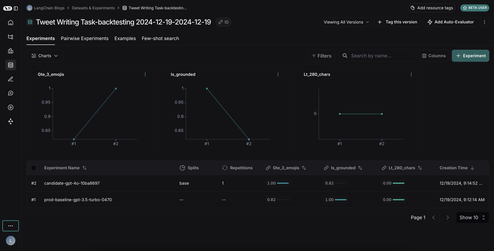

# Run backtests on a new version of an agent

Deploying your application is just the beginning of a continuous improvement process.
After you deploy to production, you'll want to refine your system by enhancing prompts, language models, tools, and architectures.
Backtesting involves assessing new versions of your application using historical data and comparing the new outputs to the original ones.
Compared to evaluations using pre-production datasets, backtesting offers a clearer indication of whether the new version of your application is an improvement over the current deployment. 

Here are the basic steps for backtesting:

1. Select sample runs from your production tracing project to test against.
2. Transform the run inputs into a dataset and record the run outputs as an initial experiment against that dataset.
3. Execute your new system on the new dataset and compare the results of the experiments.

This process will provide you with a new dataset of representative inputs, which you can version and use for backtesting your models.

:::info Ground truth data
Often, you won't have definitive "ground truth" answers available.
In such cases, you can manually label the outputs or use evaluators that don't rely on reference data.
If your application allows for capturing ground-truth labels, for example by allowing users to leave feedback, we strongly recommend doing so.
:::

## Setup

### Configure the environment

Install and set environment variables. This guide requires `langsmith>=0.2.4`.

:::info Optional LangChain usage

For convenience we'll use the LangChain OSS framework in this tutorial, but the LangSmith functionality shown is framework-agnostic.

:::

```bash
pip install -U langsmith langchain langchain-anthropic langchainhub emoji
```

```python
import getpass
import os

# Set the project name to whichever project you'd like to be testing against
project_name = "Tweet Writing Task"
os.environ["LANGSMITH_PROJECT"] = project_name
os.environ["LANGSMITH_TRACING"] = "true"
if not os.environ.get("LANGSMITH_API_KEY"):
    os.environ["LANGSMITH_API_KEY"] = getpass.getpass("YOUR API KEY")

# Optional. You can swap OpenAI for any other tool-calling chat model.
os.environ["OPENAI_API_KEY"] = "YOUR OPENAI API KEY"
# Optional. You can swap Tavily for the free DuckDuckGo search tool if preferred.
# Get Tavily API key: https://tavily.com
os.environ["TAVILY_API_KEY"] = "YOUR TAVILY API KEY"
```

### Define the application

For this example lets create a simple Tweet-writing application that has access to some internet search tools:

```python
from langchain.chat_models import init_chat_model
from langgraph.prebuilt import create_react_agent
from langchain_community.tools import DuckDuckGoSearchRun, TavilySearchResults
from langchain_core.rate_limiters import InMemoryRateLimiter

# We will use GPT-3.5 Turbo as the baseline and compare against GPT-4o
gpt_3_5_turbo = init_chat_model(
    "gpt-3.5-turbo",
    temperature=1,
    configurable_fields=("model", "model_provider"),
)

# The instrucitons are passed as a system message to the agent
instructions = """You are a tweet writing assistant. Given a topic, do some research and write a relevant and engaging tweet about it.
- Use at least 3 emojis in each tweet
- The tweet should be no longer than 280 characters
- Always use the search tool to gather recent information on the tweet topic
- Write the tweet only based on the search content. Do not rely on your internal knowledge
- When relevant, link to your sources
- Make your tweet as engaging as possible"""

# Define the tools our agent can use

# If you have a higher tiered Tavily API plan you can increase this
rate_limiter = InMemoryRateLimiter(requests_per_second=0.08)

# Use DuckDuckGo if you don't have a Tavily API key:
# tools = [DuckDuckGoSearchRun(rate_limiter=rate_limiter)]
tools = [TavilySearchResults(max_results=5, rate_limiter=rate_limiter)]

agent = create_react_agent(gpt_3_5_turbo, tools=tools, state_modifier=instructions)
```

### Simulate production data

Now lets simulate some production data:

```python
fake_production_inputs = [
    "Alan turing's early childhood",
    "Economic impacts of the European Union",
    "Underrated philosophers",
    "History of the Roxie theater in San Francisco",
    "ELI5: gravitational waves",
    "The arguments for and against a parliamentary system",
    "Pivotal moments in music history",
    "Big ideas in programming languages",
    "Big questions in biology",
    "The relationship between math and reality",
    "What makes someone funny",
]

agent.batch(
    [{"messages": [{"role": "user", "content": content}]} for content in fake_production_inputs],
)
```

## Convert Production Traces to Experiment

The first step is to generate a dataset based on the production _inputs_.
Then copy over all the traces to serve as a baseline experiment.

### Select runs to backtest on

You can select the runs to backtest on using the `filter` argument of `list_runs`.
The `filter` argument uses the LangSmith [trace query syntax](/reference/data_formats/trace_query_syntax) to select runs.

```python
from datetime import datetime, timedelta, timezone
from uuid import uuid4
from langsmith import Client
from langsmith.beta import convert_runs_to_test

# Fetch the runs we want to convert to a dataset/experiment
client = Client()

# How we are sampling runs to include in our dataset
end_time = datetime.now(tz=timezone.utc)
start_time = end_time - timedelta(days=1)
run_filter = f'and(gt(start_time, "{start_time.isoformat()}"), lt(end_time, "{end_time.isoformat()}"))'
prod_runs = list(
    client.list_runs(
        project_name=project_name,
        is_root=True,
        filter=run_filter,
    )
)
```

### Convert runs to experiment

`convert_runs_to_test` is a function which takes some runs and does the following:

1. The inputs, and optionally the outputs, are saved to a dataset as Examples.
2. The inputs and outputs are stored as an experiment, as if you had run the `evaluate`
   function and received those outputs.

```python
# Name of the dataset we want to create
dataset_name = f'{project_name}-backtesting {start_time.strftime("%Y-%m-%d")}-{end_time.strftime("%Y-%m-%d")}'
# Name of the experiment we want to create from the historical runs
baseline_experiment_name = f"prod-baseline-gpt-3.5-turbo-{str(uuid4())[:4]}"

# This converts the runs to a dataset + experiment
convert_runs_to_test(
    prod_runs,
    # Name of the resulting dataset
    dataset_name=dataset_name,
    # Whether to include the run outputs as reference/ground truth
    include_outputs=False,
    # Whether to include the full traces in the resulting experiment
    # (default is to just include the root run)
    load_child_runs=True,
    # Name of the experiment so we can apply evalautors to it after
    test_project_name=baseline_experiment_name
)
```

Once this step is complete, you should see a new dataset in your LangSmith project
called "Tweet Writing Task-backtesting TODAYS DATE", with a single experiment like so:


## Benchmark against new system

Now we can start the process of benchmarking our production runs against a new system.

### Define evaluators

First let's define the evaluators we will use to compare the two systems.
Note that we have no reference outputs, so we'll need to come up with evaluation metrics that only require the actual outputs.

```python
import emoji
from pydantic import BaseModel, Field
from langchain_core.messages import convert_to_openai_messages

class Grade(BaseModel):
    """Grade whether a response is supported by some context."""
    grounded: bool = Field(..., description="Is the majority of the response supported by the retrieved context?")

grounded_instructions = f"""You have given somebody some contextual information and asked them to write a statement grounded in that context.

Grade whether their response is fully supported by the context you have provided. \
If any meaningful part of their statement is not backed up directly by the context you provided, then their response is not grounded. \
Otherwise it is grounded."""
grounded_model = init_chat_model(model="gpt-4o").with_structured_output(Grade)

def lt_280_chars(outputs: dict) -> bool:
    messages = convert_to_openai_messages(outputs["messages"])
    return len(messages[-1]['content']) <= 280
    
def gte_3_emojis(outputs: dict) -> bool:
    messages = convert_to_openai_messages(outputs["messages"])
    return len(emoji.emoji_list(messages[-1]['content'])) >= 3
    
async def is_grounded(outputs: dict) -> bool:
    context = ""
    messages = convert_to_openai_messages(outputs["messages"])
    for message in messages:
        if message["role"] == "tool":
            # Tool message outputs are the results returned from the Tavily/DuckDuckGo tool
            context += "\n\n" + message["content"]
    tweet = messages[-1]["content"]
    user = f"""CONTEXT PROVIDED:
    {context}

    RESPONSE GIVEN:
    {tweet}"""
    grade = await grounded_model.ainvoke([
        {"role": "system", "content": grounded_instructions},
        {"role": "user", "content": user}
    ])
    return grade.grounded
```

### Evaluate baseline

Now, let's run our evaluators against the baseline experiment.

```python
baseline_results = await client.aevaluate(
    baseline_experiment_name,
    evaluators=[lt_280_chars, gte_3_emojis, is_grounded],
)
# If you have pandas installed can easily explore results as df:
# baseline_results.to_pandas()
```

### Define and evaluate new system

Now, let's define and evaluate our new system.
In this example our new system will be the same as the old system, but will use GPT-4o instead of GPT-3.5.
Since we've made our model configurable we can just update the default config passed to our agent:

```python
candidate_results = await client.aevaluate(
    agent.with_config(model="gpt-4o"),
    data=dataset_name,
    evaluators=[lt_280_chars, gte_3_emojis, is_grounded],
    experiment_prefix="candidate-gpt-4o",
)
# If you have pandas installed can easily explore results as df:
# candidate_results.to_pandas()
```

## Comparing the results

After running both experiments, you can view them in your dataset:



The results reveal an interesting tradeoff between the two models:

1. GPT-4o shows improved performance in following formatting rules, consistently including the requested number of emojis
2. However, GPT-4o is less reliable at staying grounded in the provided search results

To illustrate the grounding issue: in [this example run](https://smith.langchain.com/public/be060e19-0bc0-4798-94f5-c3d35719a5f6/r/07d43e7a-8632-479d-ae28-c7eac6e54da4), GPT-4o included facts about Abū Bakr Muhammad ibn Zakariyyā al-Rāzī's medical contributions that weren't present in the search results. This demonstrates how it's pulling from its internal knowledge rather than strictly using the provided information.

This backtesting exercise revealed that while GPT-4o is generally considered a more capable model, simply upgrading to it wouldn't improve our tweet-writer. To effectively use GPT-4o, we would need to:
- Refine our prompts to more strongly emphasize using only provided information
- Or modify our system architecture to better constrain the model's outputs

This insight demonstrates the value of backtesting - it helped us identify potential issues before deployment.


