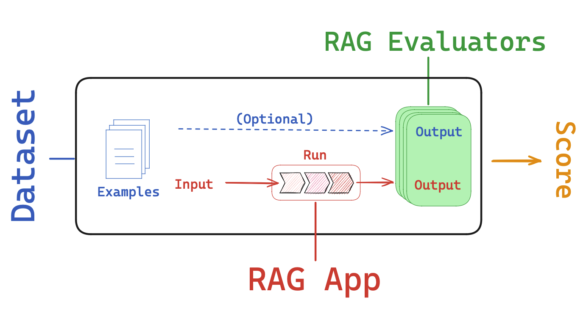
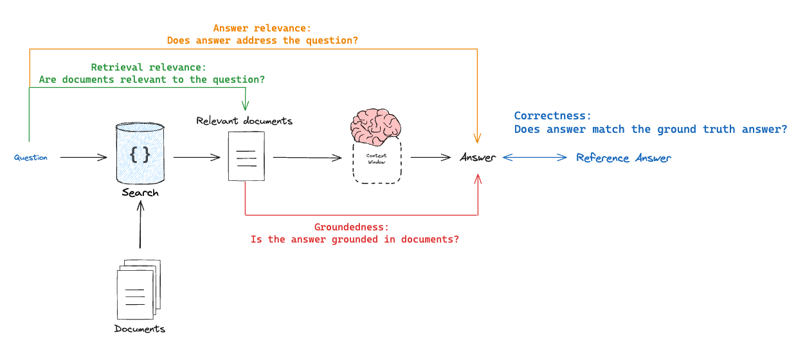

# RAG Evaluations

We will walk through the evaluation workflow for RAG (retrieval augmented generation).

## Overview

We will discuss each piece of the workflow below.



## Dataset

Here is a dataset of [LCEL (LangChain Expression Language)](https://python.langchain.com/v0.1/docs/expression_language/) related questions that we will use.

This dataset was created using csv upload in the LangSmith UI:

https://smith.langchain.com/public/730d833b-74da-43e2-a614-4e2ca2502606/d

Here, we ensure that API keys for OpenAI as well as LangSmith are set.

```python
import getpass
import os

def _set_env(var: str):
    if not os.environ.get(var):
        os.environ[var] = getpass.getpass(f"{var}: ")

_set_env("OPENAI_API_KEY")
os.environ["LANGCHAIN_TRACING_V2"] = "true"
os.environ["LANGCHAIN_ENDPOINT"] = "https://api.smith.langchain.com" # Update appropriately for self-hosted installations or the EU region
_set_env("LANGCHAIN_API_KEY")
```

```python
### Dataset name

# Clone dataset
client = Client()
dataset = client.clone_public_dataset(
    "https://smith.langchain.com/public/730d833b-74da-43e2-a614-4e2ca2502606/d"
)

dataset_name = "LCEL-QA"
```

## Task

Here is a chain that will perform RAG on [LCEL (LangChain Expression Language)](https://python.langchain.com/v0.1/docs/expression_language/) docs.

We will be using LangChain strictly for creating the retriever and retrieving the relevant documents.

The overall pipeline does not use LangChain; LangSmith works regardless of whether or not your pipeline is built with LangChain.

Here, we return the retrieved documents as part of the final answer.

However, below we will show that this is not required (using evaluation of intermediate steps).

See our [RAG-From-Scratch](https://github.com/langchain-ai/rag-from-scratch) repo and tutorial video series for more on this.

```python
### INDEX

from bs4 import BeautifulSoup as Soup
from langchain_community.vectorstores import Chroma
from langchain_openai import OpenAIEmbeddings
from langchain_community.document_loaders.recursive_url_loader import RecursiveUrlLoader
from langchain_text_splitters import RecursiveCharacterTextSplitter

# Load docs
url = "https://python.langchain.com/v0.1/docs/expression_language/"
loader = RecursiveUrlLoader(
    url=url, max_depth=20, extractor=lambda x: Soup(x, "html.parser").text
)
docs = loader.load()

# Split into chunks
text_splitter = RecursiveCharacterTextSplitter(chunk_size=4500, chunk_overlap=200)
splits = text_splitter.split_documents(docs)

# Embed and store in Chroma
vectorstore = Chroma.from_documents(documents=splits, embedding=OpenAIEmbeddings())

# Index
retriever = vectorstore.as_retriever()
```

```python
### RAG bot

import openai
from langsmith import traceable
from langsmith.wrappers import wrap_openai

class RagBot:

    def __init__(self, retriever, model: str = "gpt-4-0125-preview"):
        self._retriever = retriever
        # Wrapping the client instruments the LLM
        self._client = wrap_openai(openai.Client())
        self._model = model

    @traceable()
    def retrieve_docs(self, question):
        return self._retriever.invoke(question)

    @traceable()
    def invoke_llm(self, question, docs):
        response = self._client.chat.completions.create(
            model=self._model,
            messages=[
                {
                    "role": "system",
                    "content": "You are a helpful AI code assistant with expertise in LCEL."
                    " Use the following docs to produce a concise code solution to the user question.\n\n"
                    f"## Docs\n\n{docs}",
                },
                {"role": "user", "content": question},
            ],
        )

        # Evaluators will expect "answer" and "contexts"
        return {
            "answer": response.choices[0].message.content,
            "contexts": [str(doc) for doc in docs],
        }

    @traceable()
    def get_answer(self, question: str):
        docs = self.retrieve_docs(question)
        return self.invoke_llm(question, docs)

rag_bot = RagBot(retriever)
```

```python
response = rag_bot.get_answer("How to build a RAG chain in LCEL?")
response["answer"][:150]
```

Define a function that will:

1. Take a dataset `example`
2. Extract the relevant key (e.g., `question`) from the `example`
3. Pass it to the RAG chain
4. Return the relevant output values from the RAG chain

```python
def predict_rag_answer(example: dict):
    """Use this for answer evaluation"""
    response = rag_bot.get_answer(example["input_question"])
    return {"answer": response["answer"]}

def predict_rag_answer_with_context(example: dict):
    """Use this for evaluation of retrieved documents and hallucinations"""
    response = rag_bot.get_answer(example["input_question"])
    return {"answer": response["answer"], "contexts": response["contexts"]}
```

## Evaluator

There are at least 4 types of RAG eval that users are typically interested in.

1. **Response vs reference answer**

- `Goal`: Measure "_how similar/correct is the RAG chain answer, relative to a ground-truth answer_"
- `Mode`: Uses ground truth (reference) answer supplied through a dataset
- `Judge`: Use LLM-as-judge to assess answer correctness.

2. **Response vs input**

- `Goal`: Measure "_how well does the generated response address the initial user input_"
- `Mode`: Reference-free, because it will compare the answer to the input question
- `Judge`: Use LLM-as-judge to assess answer relevance, helpfulness, etc.

3. **Response vs retrieved docs**

- `Goal`: Measure "_to what extent does the generated response agree with the retrieved context_"
- `Mode`: Reference-free, because it will compare the answer to the retrieved context
- `Judge`: Use LLM-as-judge to assess faithfulness, hallucinations, etc.

4. **Retrieved docs vs input**

- `Goal`: Measure "_how good are my retrieved results for this query_"
- `Mode`: Reference-free, because it will compare the question to the retrieved context
- `Judge`: Use LLM-as-judge to assess relevance



### **Response vs reference answer**

Here is an example prompt that we can use:

https://smith.langchain.com/hub/langchain-ai/rag-answer-vs-reference

Here is the a video from our LangSmith evaluation series for reference:

https://youtu.be/lTfhw_9cJqc?feature=shared

Here is our evaluator function:

- `run` is the invocation of `predict_rag_answer`, which has key `answer`
- `example` is from our eval set, which has keys `input_question` and `output_answer`
- We extract these values and pass them into our grader

```python
from langchain import hub
from langchain_openai import ChatOpenAI

# Grade prompt
grade_prompt_answer_accuracy = prompt = hub.pull("langchain-ai/rag-answer-vs-reference")

def answer_evaluator(run, example) -> dict:
    """
    A simple evaluator for RAG answer accuracy
    """

    # Get question, ground truth answer, RAG chain answer
    input_question = example.inputs["input_question"]
    reference = example.outputs["output_answer"]
    prediction = run.outputs["answer"]

    # LLM grader
    llm = ChatOpenAI(model="gpt-4-turbo", temperature=0)

    # Structured prompt
    answer_grader = grade_prompt_answer_accuracy | llm

    # Run evaluator
    score = answer_grader.invoke({"question": input_question,
                                  "correct_answer": reference,
                                  "student_answer": prediction})
    score = score["Score"]

    return {"key": "answer_v_reference_score", "score": score}
```

Now, we kick off evaluation:

- `predict_rag_answer`: Takes an `example` from our eval set, extracts the question, passes to our RAG chain
- `answer_evaluator`: Passes RAG chain answer, question, and ground truth answer to an evaluator

```python
from langsmith import evaluate

experiment_results = evaluate(
    predict_rag_answer,
    data=dataset_name,
    evaluators=[answer_evaluator],
    experiment_prefix="rag-answer-v-reference",
    metadata={"version": "LCEL context, gpt-4-0125-preview"},
)
```

### **Response vs input**

Here is an example prompt that we can use:

https://smith.langchain.com/hub/langchain-ai/rag-answer-helpfulness

The information flow is similar to above, but we simply look at the `run` answer versus the `example` question.

```python
# Grade prompt
grade_prompt_answer_helpfulness = prompt = hub.pull("langchain-ai/rag-answer-helpfulness")

def answer_helpfulness_evaluator(run, example) -> dict:
    """
    A simple evaluator for RAG answer helpfulness
    """

    # Get question, ground truth answer, RAG chain answer
    input_question = example.inputs["input_question"]
    prediction = run.outputs["answer"]

    # LLM grader
    llm = ChatOpenAI(model="gpt-4-turbo", temperature=0)

    # Structured prompt
    answer_grader = grade_prompt_answer_helpfulness | llm

    # Run evaluator
    score = answer_grader.invoke({"question": input_question,
                                  "student_answer": prediction})
    score = score["Score"]

    return {"key": "answer_helpfulness_score", "score": score}
```

```python
experiment_results = evaluate(
    predict_rag_answer,
    data=dataset_name,
    evaluators=[answer_helpfulness_evaluator],
    experiment_prefix="rag-answer-helpfulness",
    metadata={"version": "LCEL context, gpt-4-0125-preview"},
)
```

### **Response vs retrieved docs**

Here is an example prompt that we can use:

https://smith.langchain.com/hub/langchain-ai/rag-answer-hallucination

Here is the a video from our LangSmith evaluation series for reference:

https://youtu.be/IlNglM9bKLw?feature=shared

```python
# Prompt
grade_prompt_hallucinations = prompt = hub.pull("langchain-ai/rag-answer-hallucination")

def answer_hallucination_evaluator(run, example) -> dict:
    """
    A simple evaluator for generation hallucination
    """

    # RAG inputs
    input_question = example.inputs["input_question"]
    contexts = run.outputs["contexts"]

    # RAG answer
    prediction = run.outputs["answer"]

    # LLM grader
    llm = ChatOpenAI(model="gpt-4-turbo", temperature=0)

    # Structured prompt
    answer_grader = grade_prompt_hallucinations | llm

    # Get score
    score = answer_grader.invoke({"documents": contexts,
                                  "student_answer": prediction})
    score = score["Score"]

    return {"key": "answer_hallucination", "score": score}
```

```python
experiment_results = evaluate(
    predict_rag_answer_with_context,
    data=dataset_name,
    evaluators=[answer_hallucination_evaluator],
    experiment_prefix="rag-answer-hallucination",
    metadata={"version": "LCEL context, gpt-4-0125-preview"},
)
```

### **Retrieved docs vs input**

Here is an example prompt that we can use:

https://smith.langchain.com/hub/langchain-ai/rag-document-relevance

Here is the a video from our LangSmith evaluation series for reference:

https://youtu.be/Fr_7HtHjcf0?feature=shared

```python
# Grade prompt
grade_prompt_doc_relevance = hub.pull("langchain-ai/rag-document-relevance")

def docs_relevance_evaluator(run, example) -> dict:
    """
    A simple evaluator for document relevance
    """

    # RAG inputs
    input_question = example.inputs["input_question"]
    contexts = run.outputs["contexts"]

    # LLM grader
    llm = ChatOpenAI(model="gpt-4-turbo", temperature=0)

    # Structured prompt
    answer_grader = grade_prompt_doc_relevance | llm

    # Get score
    score = answer_grader.invoke({"question":input_question,
                                  "documents":contexts})
    score = score["Score"]

    return {"key": "document_relevance", "score": score}
```

```python
experiment_results = evaluate(
    predict_rag_answer_with_context,
    data=dataset_name,
    evaluators=[docs_relevance_evaluator],
    experiment_prefix="rag-doc-relevance",
    metadata={"version": "LCEL context, gpt-4-0125-preview"},
)
```

## Evaluating intermediate steps

Above, we returned the retrieved documents as part of the final answer.

However, we will show that this is not required.

We can isolate them as intermediate chain steps.

See detail on isolating intermediate chain steps [here](../how_to_guides/evaluate_on_intermediate_steps).

Here is the a video from our LangSmith evaluation series for reference:

https://youtu.be/yx3JMAaNggQ?feature=shared

```python
from langsmith.schemas import Example, Run
from langsmith import evaluate

def document_relevance_grader(root_run: Run, example: Example) -> dict:
    """
    A simple evaluator that checks to see if retrieved documents are relevant to the question
    """

    # Get specific steps in our RAG pipeline, which are noted with @traceable decorator
    rag_pipeline_run = next(
        run for run in root_run.child_runs if run.name == "get_answer"
    )
    retrieve_run = next(
        run for run in rag_pipeline_run.child_runs if run.name == "retrieve_docs"
    )
    contexts = "\n\n".join(doc.page_content for doc in retrieve_run.outputs["output"])
    input_question = example.inputs["input_question"]

    # LLM grader
    llm = ChatOpenAI(model="gpt-4-turbo", temperature=0)

    # Structured prompt
    answer_grader = grade_prompt_doc_relevance | llm

    # Get score
    score = answer_grader.invoke({"question":input_question,
                                  "documents":contexts})
    score = score["Score"]

    return {"key": "document_relevance", "score": score}

def answer_hallucination_grader(root_run: Run, example: Example) -> dict:
    """
    A simple evaluator that checks to see the answer is grounded in the documents
    """

    # RAG input
    rag_pipeline_run = next(
        run for run in root_run.child_runs if run.name == "get_answer"
    )
    retrieve_run = next(
        run for run in rag_pipeline_run.child_runs if run.name == "retrieve_docs"
    )
    contexts = "\n\n".join(doc.page_content for doc in retrieve_run.outputs["output"])

    # RAG output
    prediction = rag_pipeline_run.outputs["answer"]

    # LLM grader
    llm = ChatOpenAI(model="gpt-4-turbo", temperature=0)

    # Structured prompt
    answer_grader = grade_prompt_hallucinations | llm

    # Get score
    score = answer_grader.invoke({"documents": contexts,
                                  "student_answer": prediction})
    score = score["Score"]

    return {"key": "answer_hallucination", "score": score}

experiment_results = evaluate(
    predict_rag_answer,
    data=dataset_name,
    evaluators=[document_relevance_grader, answer_hallucination_grader],
    metadata={"version": "LCEL context, gpt-4-0125-preview"},
)
```
