# Manage datasets in the application

:::tip Recommended Reading
Before diving into this content, it might be helpful to read the following:

- [Concepts guide on evaluation and datasets](../../evaluation/concepts/index#datasets-and-examples)

:::

The easiest way to interact with datasets is directly in the LangSmith app. Here, you can create and edit datasets and example.

## Create a new dataset and add examples manually

To get started, you can create a new datasets by heading to the "Datasets and Testing" section of the application and clicking on "+ New Dataset".

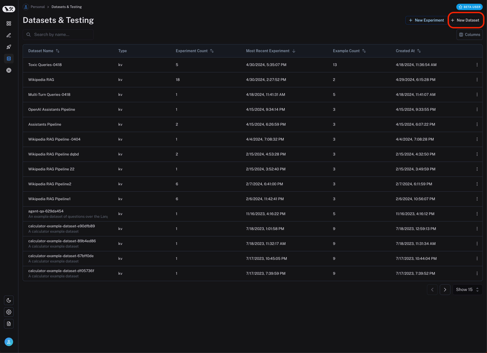

Then, enter the relevant dataset details, including a name, optional description, and dataset type. Please see the [concepts](../../evaluation/concepts/index#datasets-and-examples) for more information on dataset types. For most flexibility, the key-value dataset type is recommended.

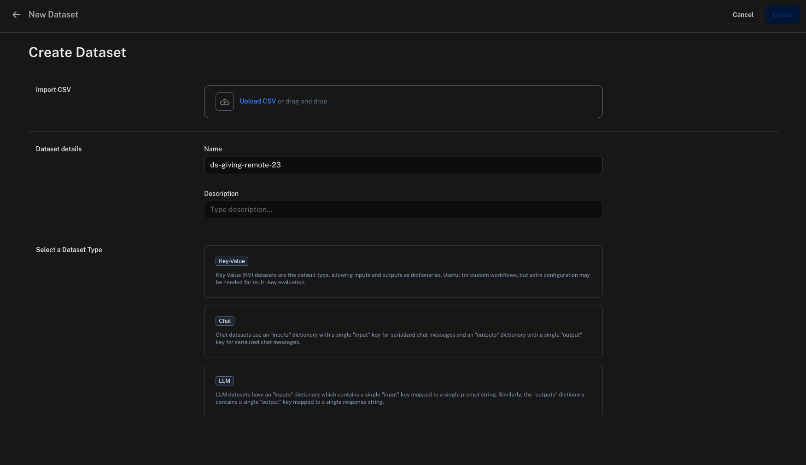

You can then add examples to the dataset by clicking on "Add Example". Here, you can enter the input and output as JSON objects.

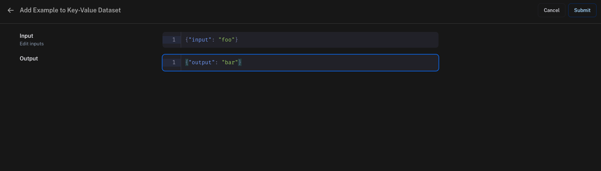

## Dataset schema validation

If you are creating a key-value dataset, you may optionally define a schema for your dataset. All examples you create will be validated against this schema.

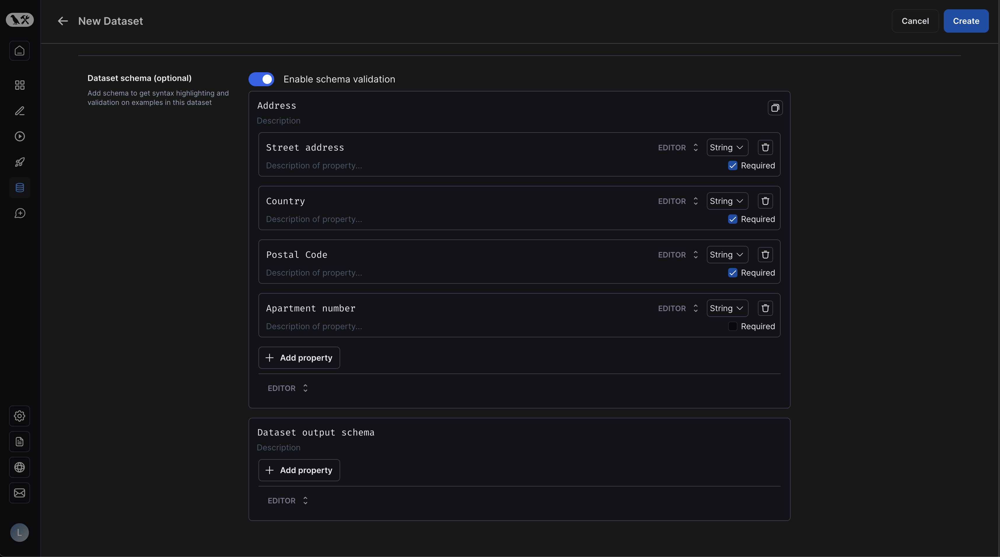

Dataset schemas are defined with standard [JSON schemas](https://json-schema.org/). If you would rather manually enter raw JSON, click "Editor" at the bottom of the schema editor and then select "JSON".

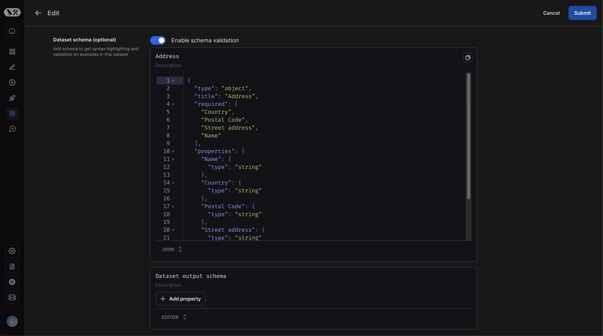

If you have defined a schema for your dataset, you will get easy validation when creating new examples:

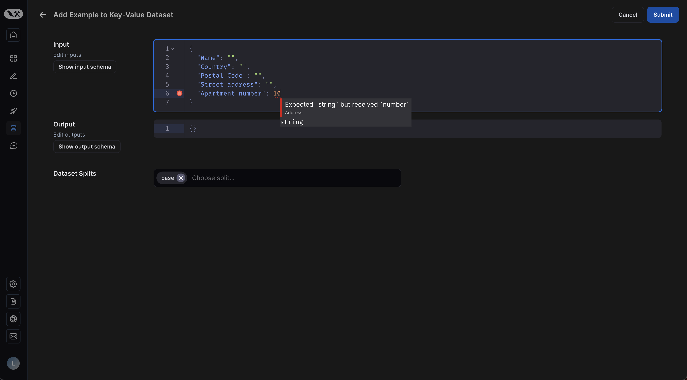

## Add inputs and outputs from traces to datasets

We typically construct datasets over time by collecting representative examples from debugging or other runs. To do this, we first filter the traces to find the ones we want to add to the dataset. Then we add the inputs and outputs from these traces to the dataset.

You can do this from any 'run' details page by clicking the 'Add to Dataset' button in the top right-hand corner.

:::tip
An extremely powerful technique to build datasets is to drill-down into the most interesting traces, such as traces that were tagged with poor user feedback, and add them to a dataset.
For tips on how to filter traces, see the [filtering traces](../monitoring/filter_traces_in_application) guide.
:::

:::tip automations

You can use [automations](../monitoring/rules) to automatically add traces to a dataset based on certain conditions. For example, you could add all traces that have a certain tag to a dataset.

:::

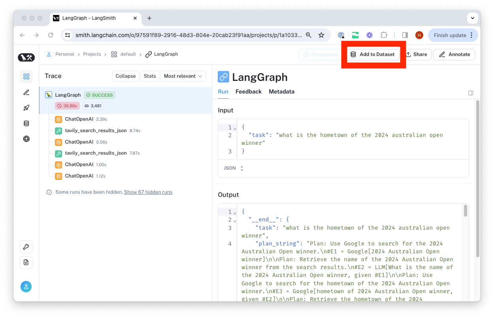

From there, we select the dataset to organize it in and update the ground truth output values if necessary.

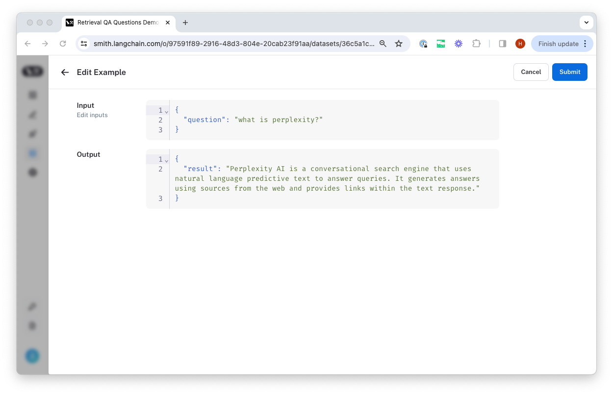

## Upload a CSV file to create a dataset

The easiest way to create a dataset from your own data is by clicking the 'upload a CSV dataset' button on the home page or in the top right-hand corner of the 'Datasets & Testing' page.

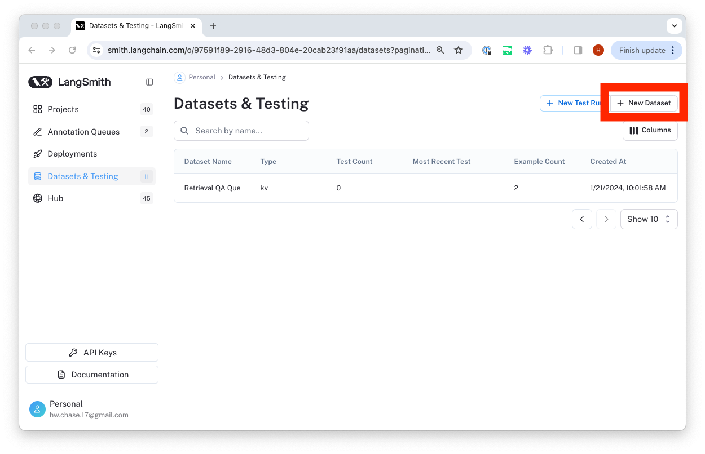

Select a name and description for the dataset, and then confirm that the inferred input and output columns are correct.

## Generate synthetic examples

For a dataset with a specified schema, you can generate synthetic examples to enhance your dataset.

1. **Select few-shot examples**: Choose a set of examples to guide the LLM's generation. You can manually select these examples from your dataset or use the automatic selection option.
2. **Specify the number of examples**: Enter the number of synthetic examples you want to generate.
3. **Configure API Key**: Ensure your OpenAI API key is entered at the "API Key" link.
   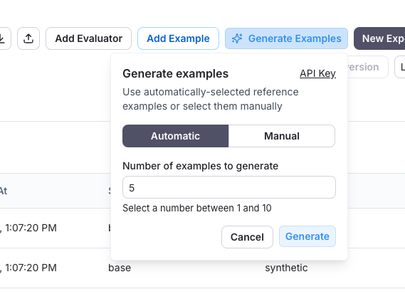

After clicking "Generate," the examples will appear on the page. You can choose which examples to add to your dataset, with the option to edit them before finalizing.
Each example will be validated against your specified dataset schema and tagged as "synthetic" in the source metadata.
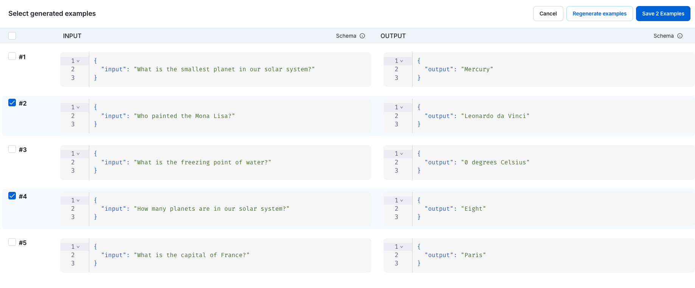

## Export a dataset

You can export your LangSmith dataset to CSV or OpenAI evals format directly from the web application.

To do so, click "Export Dataset" from the homepage.
To do so, select a dataset, click on "Examples", and then click the "Export Dataset" button at the top of the examples table.

This will open a modal where you can select the format you want to export to.

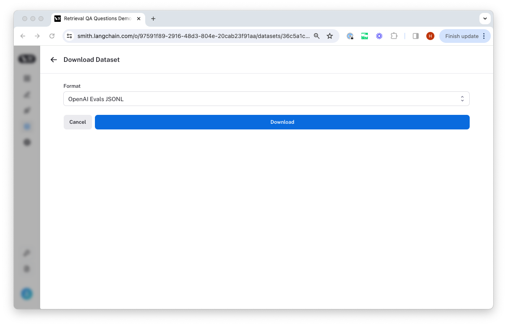

## Create and manage dataset splits

Dataset splits are divisions of your dataset that you can use to segment your data. For example, it is common
in machine learning workflows to split datasets into training, validation, and test sets. This can be useful
to prevent overfitting - where a model performs well on the training data but poorly on unseen data. In evaluation
workflows, it can be useful to do this when you have a dataset with multiple categories that you may want to evaluate
separately; or if you are testing a new use case that you may want to include in your dataset in the future, but want
to keep separate for now. Note that the same effect can be achieved manually via metadata - but we expect splits
to be used for higher level organization of your dataset to split it into separate groups for evaluation, whereas
metadata would be used more for storing information on your examples like tags and information about its origin.

In machine learning, it is best practice to keep your splits separate (each example belongs to exactly one split).
However, we allow you to select multiple splits for the same example in LangSmith because it can make sense for
some evaluation workflows - for example, if an example falls into multiple categories on which you may want to
evaluate your application.

In order to create and manage splits in the app, you can select some examples in your dataset and click "Add to Split". From the resulting popup menu,
you can select and unselect splits for the selected examples, or create a new split.

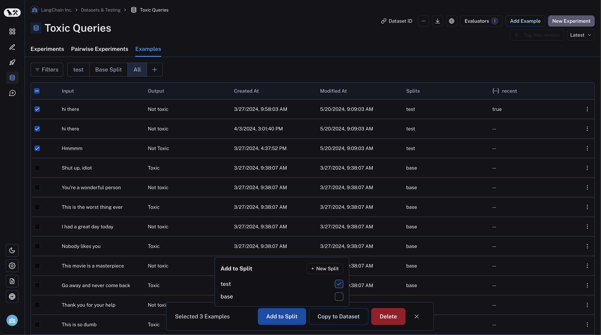

## Edit example metadata

You can add metadata to your examples by clicking on an example and then clicking on the "Metadata" tab in the side pane.
From this page, you can update/delete existing metadata, or add new metadata. You may use this to store information about
your examples, such as tags or version info, which you can [then filter by when you call `list_examples` in the SDK](/how_to_guides/datasets/manage_datasets_programmatically#list-examples-by-metadata).

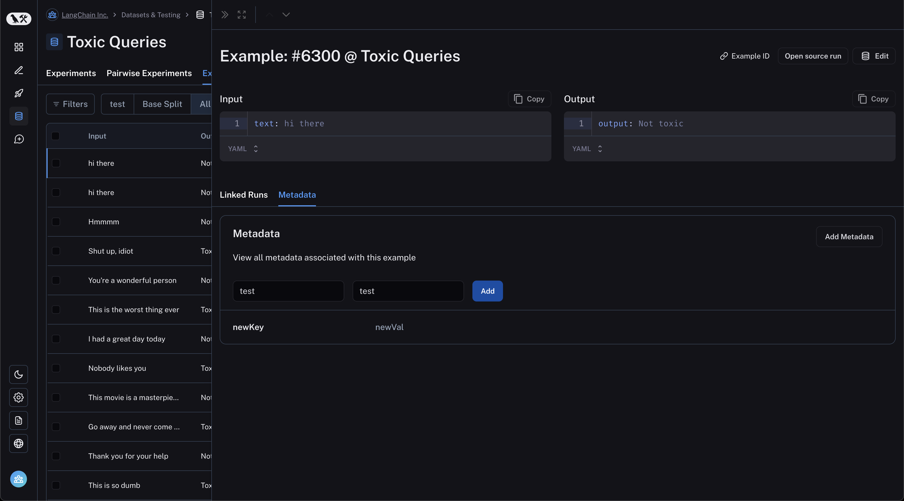

## Filter examples

You can filter examples by metadata key/value or full-text search. To filter examples, click "Filter" in the top left of the table:

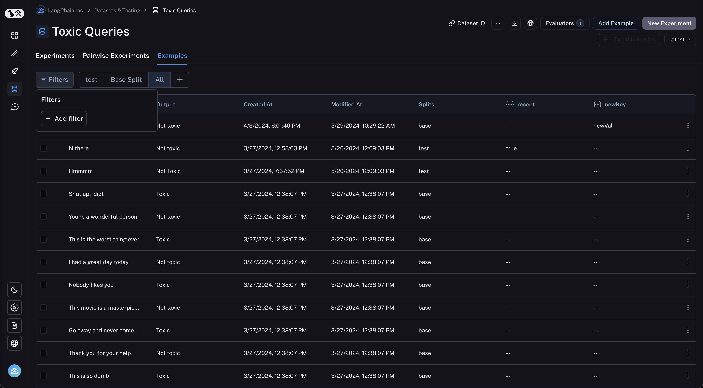

Next, click "Add filter" and select "Full Text" or "Metadata" from the resulting dropdown. You may add multiple filters, and only examples that satisfy all of the
filters will be displayed in the table.

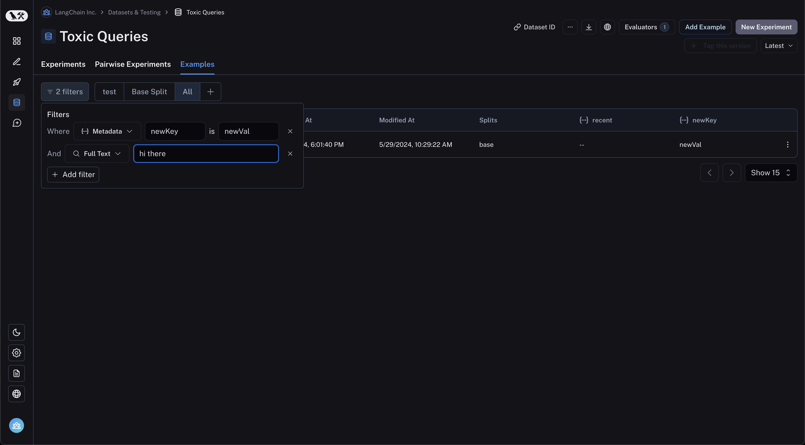
