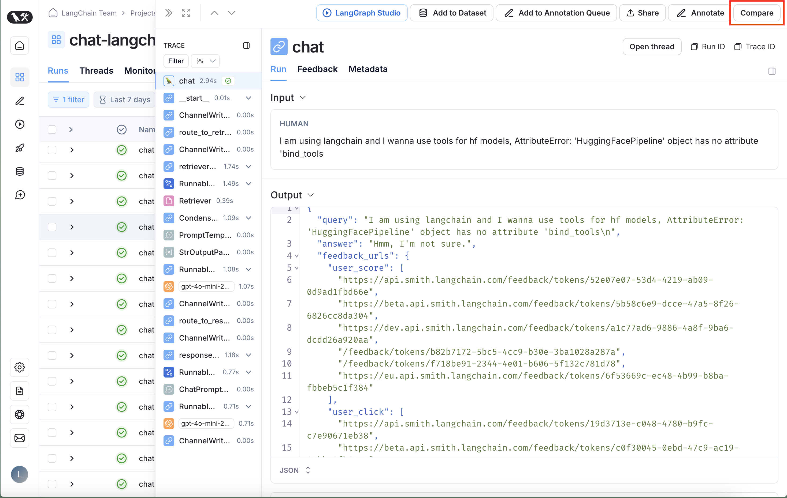
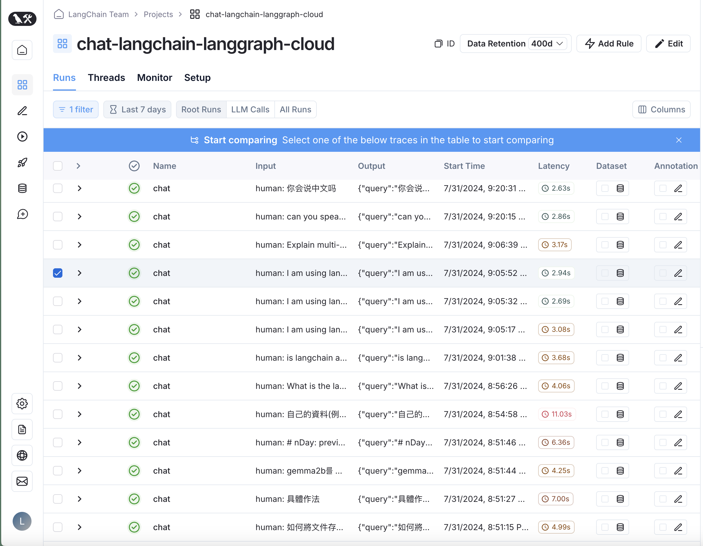
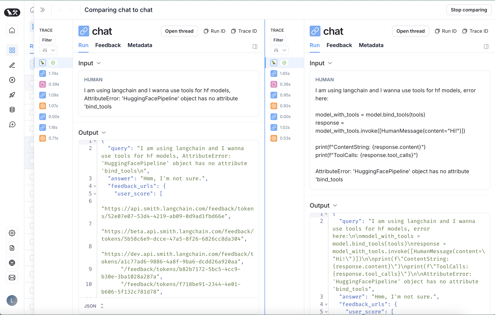

import { RegionalUrl } from "@site/src/components/RegionalUrls";

# Compare traces

To compare traces, click on the **Compare** button in the upper right hand side of any trace view.

This will show the trace run table. Select the trace you want to compare against original trace.

The pane will open with both traces selected in a side by side comparison view.

To stop comparing, close the pane or click on **Stop comparing** in the upper right hand side of the pane.
