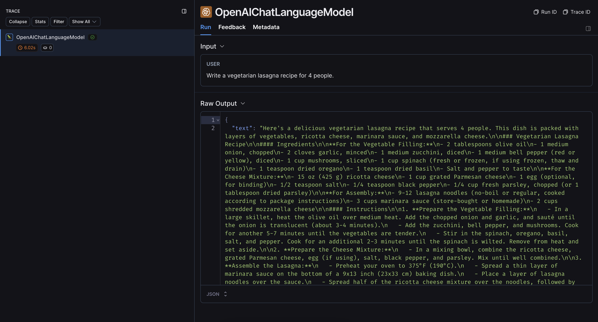

import { ConfigureSDKEnvironmentCodeTabs } from "@site/src/components/QuickStart";
import { CodeTabs } from "@site/src/components/InstructionsWithCode";

# Trace with the Vercel AI SDK (JS/TS only)

:::note beta
This feature is currently in beta while Vercel rolls out official telemetry support.
:::

You can use LangSmith to trace runs from the [Vercel AI SDK](https://sdk.vercel.ai/docs/introduction) using
the special `wrapAISDKModel` method. The important detail is that you must wrap the Vercel model wrapper
rather than of the top-level `generateText` or `generateStream` calls.

This guide will walk through an example.

:::note
The `wrapAISDKModel` method is only available in `langsmith` JS SDK version `>=0.1.40`.
:::

### 0. Installation

Install the Vercel AI SDK. We use their OpenAI integration for the code snippets below, but you can use any of their
other options as well.

<CodeTabs
  groupId="client-language"
  tabs={[
    {
      value: "typescript",
      label: "yarn",
      language: "bash",
      content: `yarn add ai @ai-sdk/openai`,
    },
    {
      value: "npm",
      label: "npm",
      language: "bash",
      content: `npm install ai @ai-sdk/openai`,
    },
    {
      value: "pnpm",
      label: "pnpm",
      language: "bash",
      content: `pnpm add ai @ai-sdk/openai`,
    },
  ]}
/>

### 1. Configure your environment

<ConfigureSDKEnvironmentCodeTabs />

### 2. Log a trace

Once you've set up your environment, wrap an initialized Vercel model as shown below:

```ts
import { wrapAISDKModel } from "langsmith/wrappers/vercel";
import { openai } from "@ai-sdk/openai";
import { generateText } from "ai";

const vercelModel = openai("gpt-4o-mini");

const modelWithTracing = wrapAISDKModel(vercelModel);

const { text } = await generateText({
  model: modelWithTracing,
  prompt: "Write a vegetarian lasagna recipe for 4 people.",
});

console.log(text);
```

An example trace from running the above code [looks like this](https://smith.langchain.com/public/fbd12847-9485-43cf-a0a3-82c0b3318594/r):



If you are using a streaming method, LangSmith will trace chunks as a single aggregated response:

```ts
import { wrapAISDKModel } from "langsmith/wrappers/vercel";
import { openai } from "@ai-sdk/openai";
import { streamText } from "ai";

const vercelModel = openai("gpt-4o-mini");

const modelWithTracing = wrapAISDKModel(vercelModel);

const { textStream } = await streamText({
  model: modelWithTracing,
  prompt: "Write a vegetarian lasagna recipe for 4 people.",
});

for await (const chunk of textStream) {
  ...
}
```

An example trace from running the above code will look the same as the above one from `generateText`.
