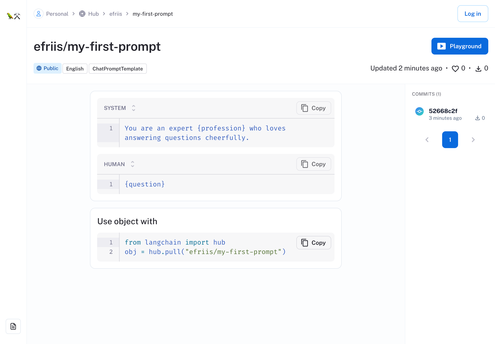
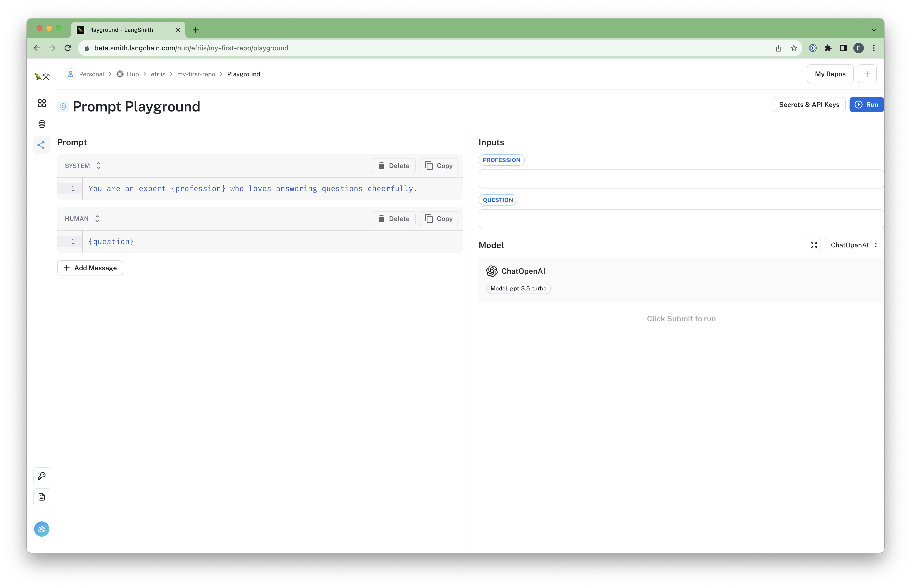
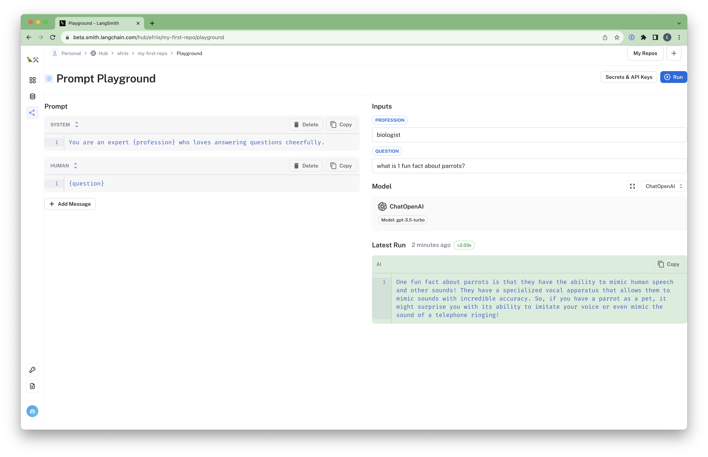
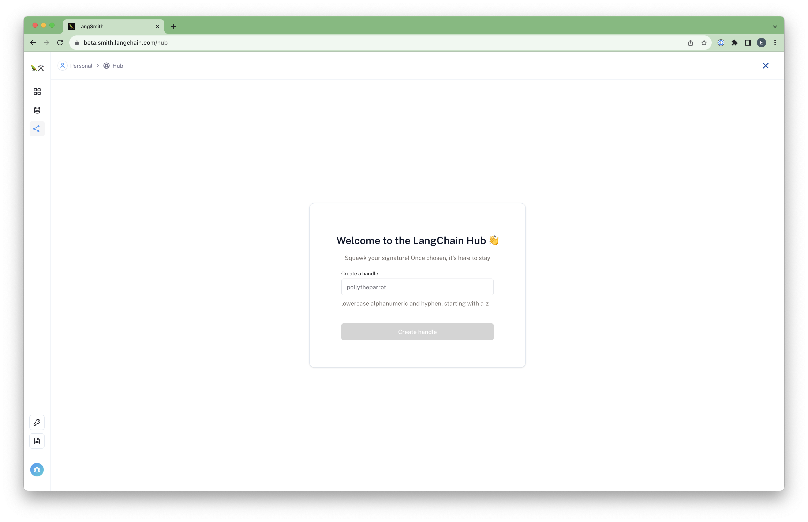
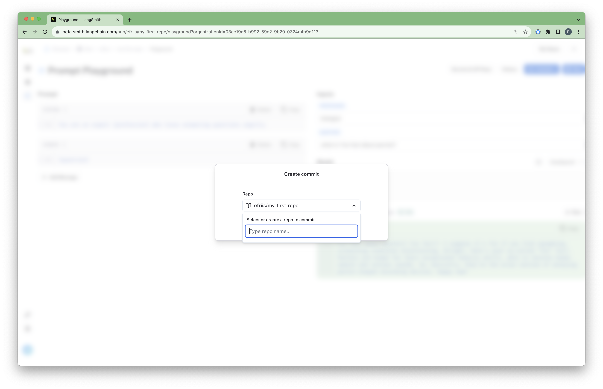

# Quick Start

:::tip Public Features
Some hub features can be used without logging in [here](https://smith.langchain.com/hub)! However, creating and modifying prompts requires a non-waitlisted account.
:::

The steps in this guide will acquaint you with LangChain Hub:

1. Browse the hub for a prompt of interest
2. Try out a prompt in the playground
3. Log in and set a handle
4. Modify the prompt in the playground and commit it back to the hub

## 1. Browse the hub for a prompt of interest

You can access the public view of the hub directly at [https://smith.langchain.com/hub](https://smith.langchain.com/hub).

From this screen, you can browse prompts that others have published.

On the left side, you can filter by different **tags**, such as types of prompts (Chat vs. Regular), use cases, or models they're designed to be used with (llama-2 vs. gpt-4).

If you see a prompt that looks interesting, you can either click into its page, or you can jump straight to using it in the playground with the "Try it" button.

## 2. Try out a prompt in the playground

For this example, we'll use the following prompt: [https://smith.langchain.com/hub/langchain/my-first-repo](https://smith.langchain.com/hub/efriis/my-first-repo)

To start, you can get a sense of what the prompt does just by looking at it (this one is pretty straightforward).
Below the contents of the prompt, you can see a code snippet of how to use it in Python. For more information on
using hub prompts from code, finish this guide and check out the developer guides in [Python](dev-setup-py) or [TypeScript](dev-setup-ts).

Next, let's try out the object in the playground by clicking the [playground button](https://smith.langchain.com/hub/efriis/my-first-repo/playground) in the top-right.

The playground should look like this:

On the left, we see an editable view of our Chat Prompt.

To the right, we can configure our inputs and model, and above that, you can add API Keys for OpenAI or Anthropic (the 2 playground-supported models for now).

Let's try it out! First, fill out your OpenAI API Key in "Secrets", and fill out a profession (e.g. biologist) and question (e.g. "what is 1 fun fact about parrots?"). Now click "Run"!
The output should look something like this:

## 3. Log in and set a handle (Login Required, One-Time Setup)

Now that we've tried out a prompt, let's log in and set a handle. This will allow us to commit changes to the prompt back to the hub under our own user!

First, let's click that "Login" button in the top-right and log in. If you find yourself on the waitlist, you can enter your access code if you have one, or hang tight! We're letting people off every week.

Second, go to the [hub home](https://smith.langchain.com/hub). If you haven't set a handle yet, you'll be prompted to do so:

Once you've set a handle, you'll be able to commit changes to prompts back to the hub under your user!

## 4. Modify the prompt in the playground and commit it back to the hub (Login Required)

Staying on [efriis/my-first-repo's playground](https://smith.langchain.com/hub/efriis/my-first-repo/playground), let's make some changes and commit it back to a
repository under your user. To start, let's modify the prompt to change the style of the response. Instead of answering "cheerfully," pick a new adverb (e.g. "angrily").

Once you've run it, we can commit it directly to a new prompt under your user. Click the "Commit" button in the top-right, and you should see a modal like this:

**Note:** you may have to return to the repo page and click the "Playground" button in order to see the "Commit" button.

Here, you can create a new repo called `my-first-prompt` and use this as a first commit! Once you've done that, you'll be redirected to your new prompt.
