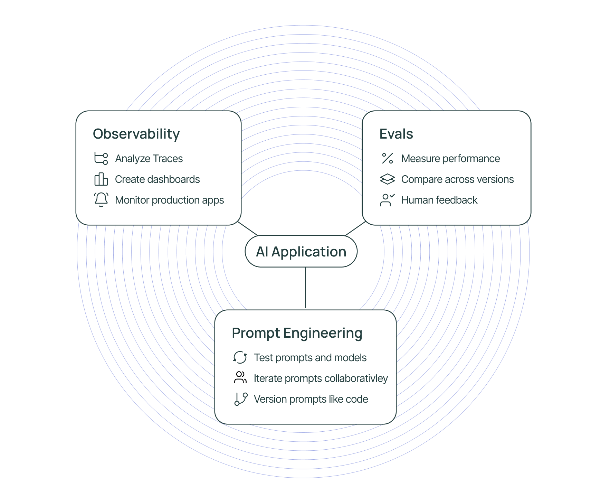

# Get started with LangSmith

**LangSmith** is a platform for building production-grade LLM applications.
It allows you to closely monitor and evaluate your application, so you can ship quickly and with confidence.

  

    
  

  

    <h3 style={{ color: '#1a73e8', marginTop: 0 }}>[Observability](./observability)</h3>

    Analyze traces in LangSmith and configure metrics, dashboards, alerts based on these.

    <h3 style={{ color: '#1a73e8', marginTop: 0 }}>[Evals](./evaluation)</h3>

    Evaluate your application over production traffic — score application performance and get human feedback on your data.

    <h3 style={{ color: '#1a73e8', marginTop: 0 }}>[Prompt Engineering](./prompt_engineering/quickstarts/quickstart_ui)</h3>

    Iterate on prompts, with automatic version control and collaboration features.

  

:::tip LangSmith + LangChain OSS

LangSmith is framework-agnostic — it can be used with or without LangChain's open source frameworks [`langchain`](https://python.langchain.com) and [`langgraph`](https://langchain-ai.github.io/langgraph/).

If you are using either of these, you can enable LangSmith tracing with a single environment variable.
For more see the how-to guide for [setting up LangSmith with LangChain](./observability/how_to_guides/trace_with_langchain) or [setting up LangSmith with LangGraph](https://docs.smith.langchain.com/observability/how_to_guides/tracing/trace_with_langgraph).
:::

## Observability

Observability is important for any software application, but especially so for LLM applications. LLMs are non-deterministic by nature, meaning they can produce unexpected results. This makes them trickier than normal to debug.

This is where LangSmith can help! LangSmith has LLM-native observability, allowing you to get meaningful insights from your application. LangSmith’s observability features have you covered throughout all stages of application development - from prototyping, to beta testing, to production.

- Get started by [adding tracing](./observability) to your application.
- [Create dashboards](./observability/how_to_guides/dashboards) to view key metrics like RPS, error rates and costs.

## Evals

The quality and development speed of AI applications depends on high-quality evaluation datasets and metrics to test and optimize your applications on. The LangSmith SDK and UI make building and running high-quality evaluations easy.

- Get started by [creating your first evaluation](./evaluation).
- Quickly assess the performance of your application using our [off-the-shelf evaluators](https://docs.smith.langchain.com/evaluation/how_to_guides/prebuilt_evaluators) as a starting point.
- [Analyze results](./evaluation/how_to_guides#analyzing-experiment-results) of evaluations in the LangSmith UI and [compare results](https://docs.smith.langchain.com/evaluation/how_to_guides/compare_experiment_results) over time.
- Easily collect [human feedback](./evaluation/how_to_guides#annotation-queues-and-human-feedback) on your data to improve your application.

## Prompt Engineering

While traditional software applications are built by writing code, AI applications involve writing prompts to instruct the LLM on what to do. LangSmith provides a set of tools designed to enable and facilitate prompt engineering to help you find the perfect prompt for your application.

- Get started by [creating your first prompt](./prompt_engineering/how_to_guides/create_a_prompt).
- Iterate on models and prompts using the [Playground](./prompt_engineering/how_to_guides#playground).
- [Manage prompts programmatically](./prompt_engineering/how_to_guides/manage_prompts_programatically) in your application.
- [Prompt management best practices](./prompt_engineering/tutorials/best_practices)
