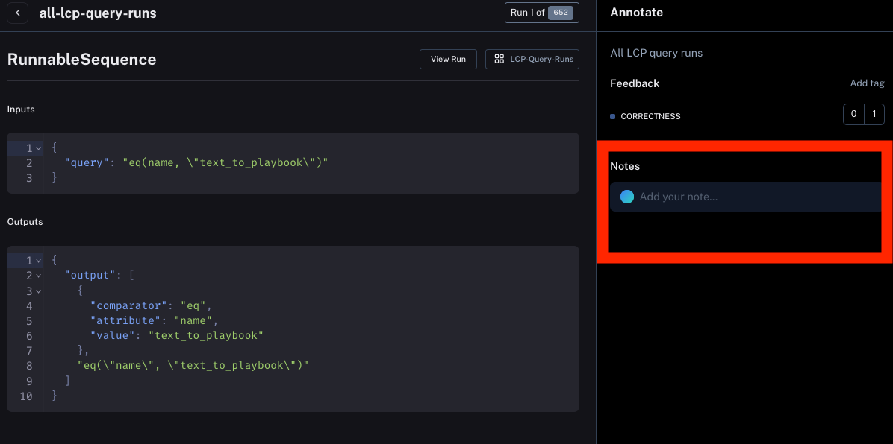
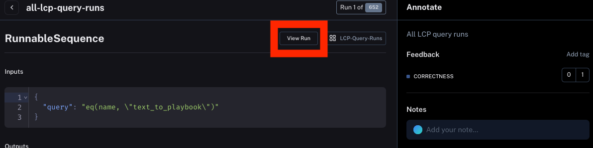
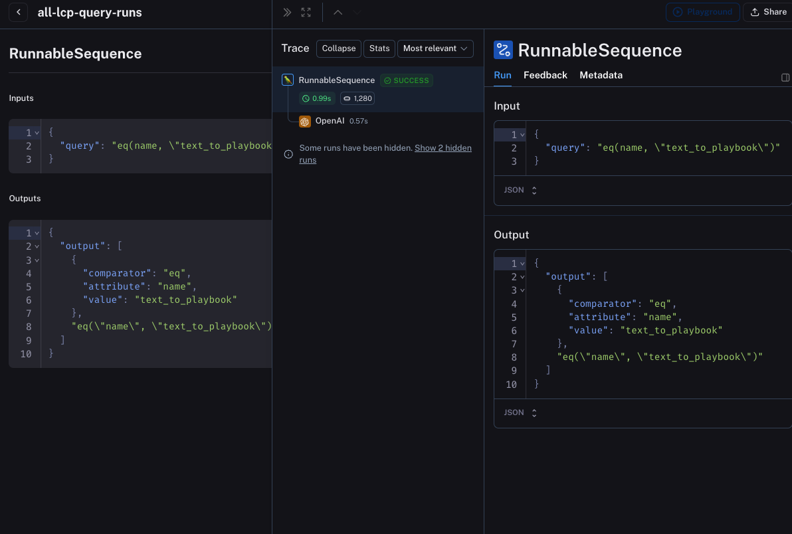
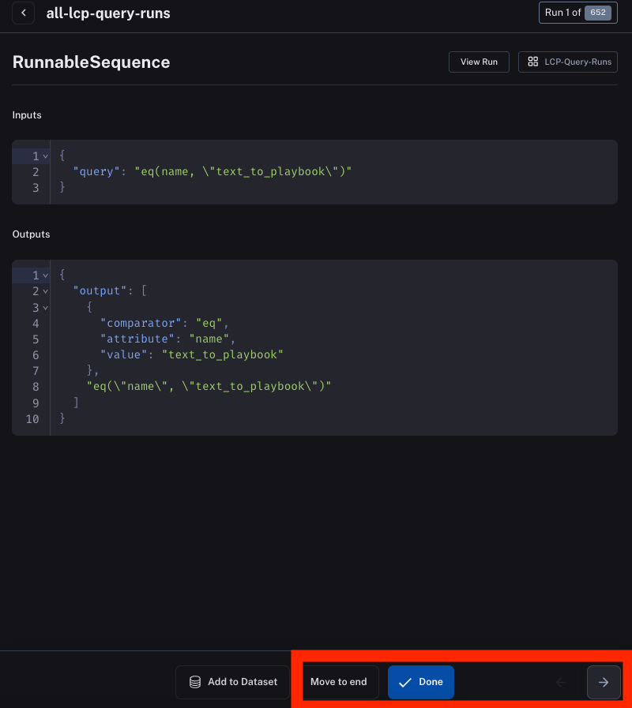

# How to use annotation queues

Annotation queues are a user friendly way to quickly cycle through and annotate data.

## How to view annotation queues

You can see what annotation queues your organization has by navigating to there on the left-hand sidebar.

## How to add feedback

You can leave feedback by clicking the `Add tag` button in the upper right hand corner

## How to leave a note

You can also leave free form feedback in the form of a note.

## How to see the trace of the run

By default, you only see the inputs and outputs of the high level run.
You can see the full trace by clicking `View Run`

This will open up a side panel with the full run

## How to cycle through a queue

You can move through a queue in a few ways. Buttons for these are all at the bottom

`Move to end` moves the datapoint you are currently viewing to the end of the queue

`Done` marks a datapoint as done and removes it from the queue

The `->` and `<-` buttons allow you move the next (or the prior) datapoint in the queue.