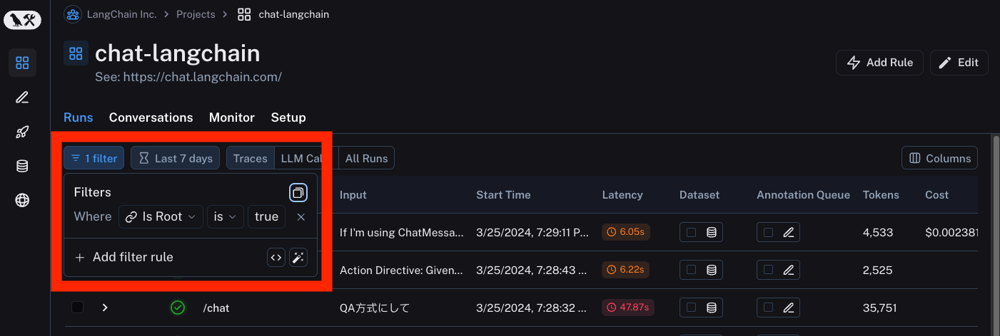
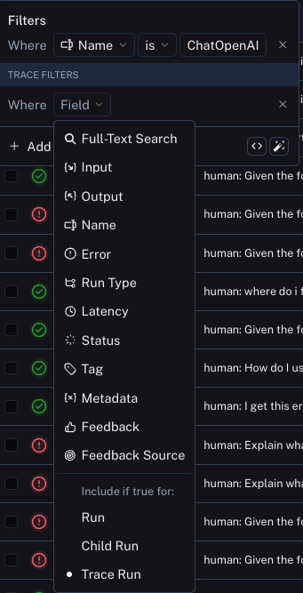
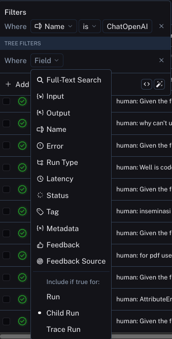
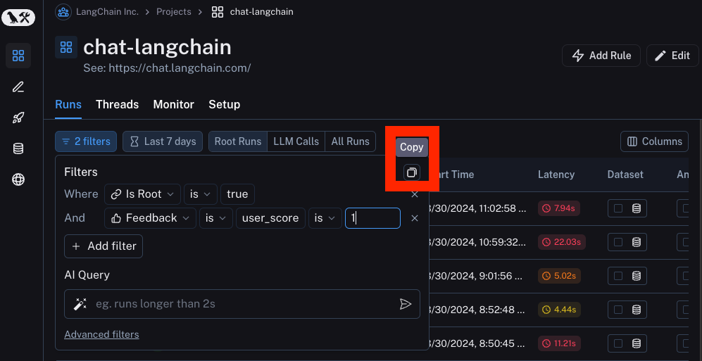

# How to filter

This page contains a series of guides for how to filter runs.
Being able to accurately filter runs is important for both manual inspection as well as setting up automations.

## How to create a filter

There are two ways to create a filter.
First, you can create a filter from the high level nav bar. By default there is one filter applied: `IsRoot` is `true`. This restricts all runs to be top level traces.

You can also define a filter from the `Filter Shortcuts` on the sidebar. This contains commonly used filters.

## How to filter for sub runs

In order to filter for sub runs, you first need to remove the default filter of `IsRoot` is `true`. After that, you can apply any filter you wish. A common way to do this is to filter by name for sub runs.
This relies on good naming for all parts of your pipeline - see [here](/tracing/faq/customizing_trace_attributes#customizing-the-run-name) for more details on how to do that.

## How to filter for sub runs whose parent traces have some attribute

A common concept is to filter for sub runs whose parent traces have some attribute. An example is filtering for sub runs of a particular type whose parent trace has positive (or negative) feedback associated with it.

In order to do this, first set up a filter for sub runs (per the above section). After that, you can then add another filter rule. You can then click the `Advanced Filters` link all the way at the bottom of the filter. This will open up a new modal where you can add `Trace filters`. These filters will apply to the traces of all the parent runs of the individual runs you've already filtered for.

## How to filter for runs whose child runs have some attribute

This is the opposite of the above. You may want to search for runs who have specific types of sub runs. An example of this could be searching for all traces that had a sub run with name `Foo`. This is useful when `Foo` is not always called, but you want to analyze the cases where it is.

In order to do this, you can click on the `Advanced Filters` link all the way at the bottom of the filter. This will open up a new modal where you can add `Tree filters`. This will make the rule you specific apply to all child runs of the individual runs you've already filtered for.

## How to copy the filter

Sometimes you may want to copy a filter that you have constructed. You may way to do this to share it with a co-worker, reuse it in the future, or use it in the SDK.

In order to copy the filter, you can first create it in the UI. From there, you can click the copy button in the upper right hand corner. If you have constructed tree or trace filters, you can also copy those.

This will give you a string like `and(eq(is_root, true), and(eq(feedback_key, "user_score"), eq(feedback_score, 1)))`

## How to manually specify a raw query

If you have copied a previous filter (see above) you may want to manually specify that raw query in a future session. You may also find it easier to modify this filter than to use the UI.

In order to do this, you can click on `Advanced filters` on the bottom. From there you can paste a raw query into the appropriate box.

Note that this will add that query to the existing queries, not overwrite it.

## How to use `AI Query` to auto-generate a query

Sometimes figuring out the exact query to specify can be difficult! In order to make it easier, we've added a `AI Query` functionality. With this, you can type in the filter you want to construct in natural language and it will convert it into a valid query.

For example: "All runs longer than 10 seconds"

Note that this is an experimental feature and may not work for all queries.

