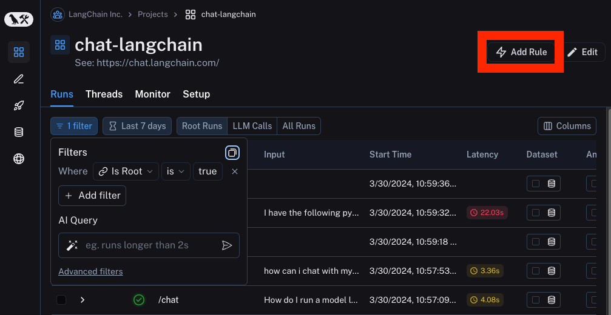
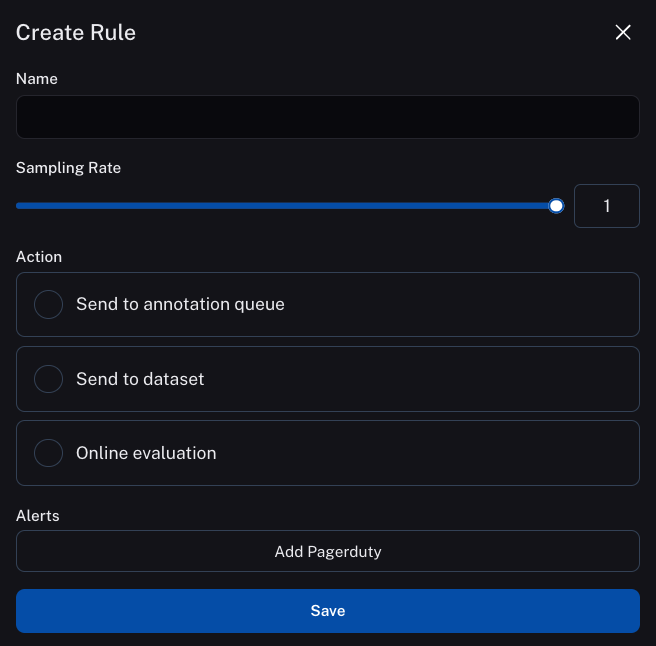

# How to use online evaluation

One of the actions you can set up as part of an automation is online evaluation. This involves running an automatic evaluator on the on a set of runs, then attaching a feedback tag and score to each run.

Currently, we provide support for specifying a prompt template, a model, and a set of criteria to evaluate the runs on.

## How to set up online evaluation

The way to configure online evaluation is to first set up an [automation](/monitoring/faq/automations).

From here, you can can select `Online Evaluation` from the list of possible actions

## How to configure online evaluation

When selection `Online Evaluation` as an action in an automation, you are presented with a panel from which you can configure online evaluation.

You can configure the model, the prompt template, and the criteria

### The model

You can choose any model available in the dropdown.

### The prompt template

You can customize the prompt template to be whatever you want.
The prompt template is a LangChain prompt template - this means that anything in `{...}` is treated as a variable to format.
There are two permitted variables: `input` and `output`, corresponding to the input and output of the run you are evaluating

### The criteria

An evaluator will attach arbitrary metadata tags to a run. These tags will have a name and a value. You can configure this in the `Criteria` section.
The names and the descriptions of the fields will be passed in to the prompt.

## How to set API keys

Online evaluation uses LLMs. In order to set the API keys to use for these invocations, navigate to the `Settings -> Secrets -> Add secret` page and add any API keys there.

