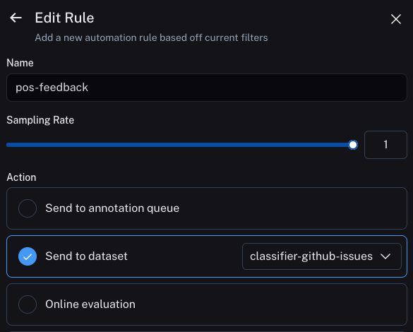
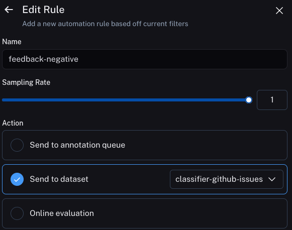

# Optimizing a Classifier

This tutorial walks through optimizing a classifier based on user a feedback.
Classifiers are great to optimize because its generally pretty simple to collect the desired output, which makes it easy to create few shot examples based on user feedback.
That is exactly what we will do in this example.

## The objective

In this example, we will build a bot that classify GitHub issues based on their title.
It will take in a title and classify it into one of many different classes.
Then, we will start to collect user feedback and use that to shape how this classifier performs.

## Getting started

To get started, we will first set it up so that we send all traces to a specific project.
We can do this by setting an environment variable:

```python
import os
os.environ["LANGCHAIN_PROJECT"] = "classifier"
```

We can then create our initial application. This will be a really simple function that just takes in a GitHub issue title and tries to label it.

```python
import openai
from langsmith import traceable, Client
import uuid

client = openai.Client()

available_topics = [
    "bug",
    "improvement",
    "new_feature",
    "documentation",
    "integration",
]

@traceable(
    run_type="chain",
    name="Classifier",
)
def topic_classifier(
    topic: str
):
    return client.chat.completions.create(
        model="gpt-3.5-turbo",
        messages=[{"role": "user", "content": f"Classify the type of issue as one of {','.join(available_topics)}\n\nIssue: {topic}"}],
    ).choices[0].message.content
```

We can then start to interact with it.
When interacting with it, we will generate the LangSmith run id ahead of time and pass that into this function.
We do this so we can attach feedback later on.

Here's how we can invoke the application:

```python
run_id = uuid.uuid4()
topic_classifier(
    "fix bug in LCEL",
    langsmith_extra={"run_id": run_id}
)
```

Here's how we can attach feedback after.
We can collect feedback in two forms.

First, we can collect "positive" feedback - this is for examples that the model got right.


```python
ls_client = Client()
run_id = uuid.uuid4()

topic_classifier(
    "fix bug in LCEL",
    langsmith_extra={"run_id": run_id}
)

ls_client.create_feedback(
    run_id,
    key="user-score",
    score=1.0,
)
```

Next, we can focus on collecting feedback that corresponds to a "correction" to the generation.
In this example the model will classify it as a bug, whereas I really want this to be classified as documentation.

```python
ls_client = Client()

run_id = uuid.uuid4()
topic_classifier(
    "fix bug in documentation",
    langsmith_extra={"run_id": run_id}
)

ls_client.create_feedback(
    run_id,
    key="correction",
    correction="documentation"
)
```

## Set up automations

We can now set up automations to move examples with feedback of some form into a dataset.
We will set up two automations, one for positive feedback and the other for negative feedback.

The first will take all runs with positive feedback and automatically add them to a dataset.
The logic behind this is that any run with positive feedback we can use as a good example in future iterations.



The second will take all runs with a correction and add them to the same dataset.
The logic here is that we can use the correction on these examples as a good example in future iterations.



## Updating the application

We can now update our code to pull down the dataset we are sending runs to.
We can use the datapoints in that dataset as few shot examples.
We will need some logic to check if the example has a correction associated with it or not.
This is important because if it does then we will want to use that as the example, otherwise we can