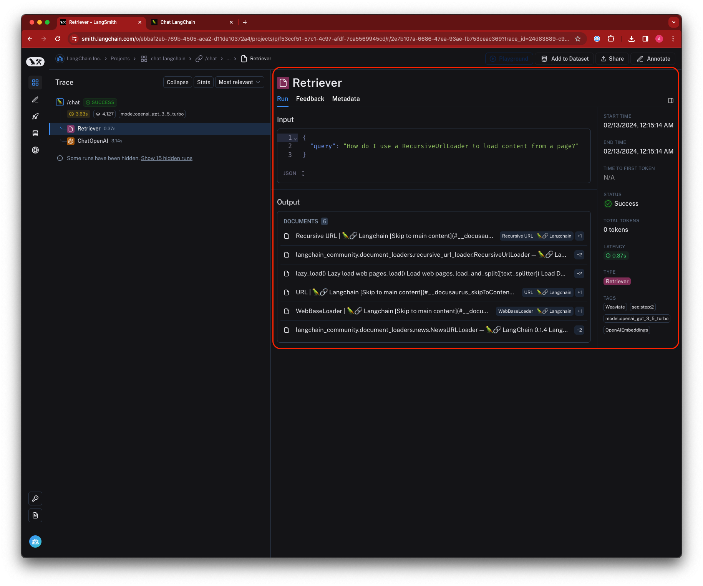
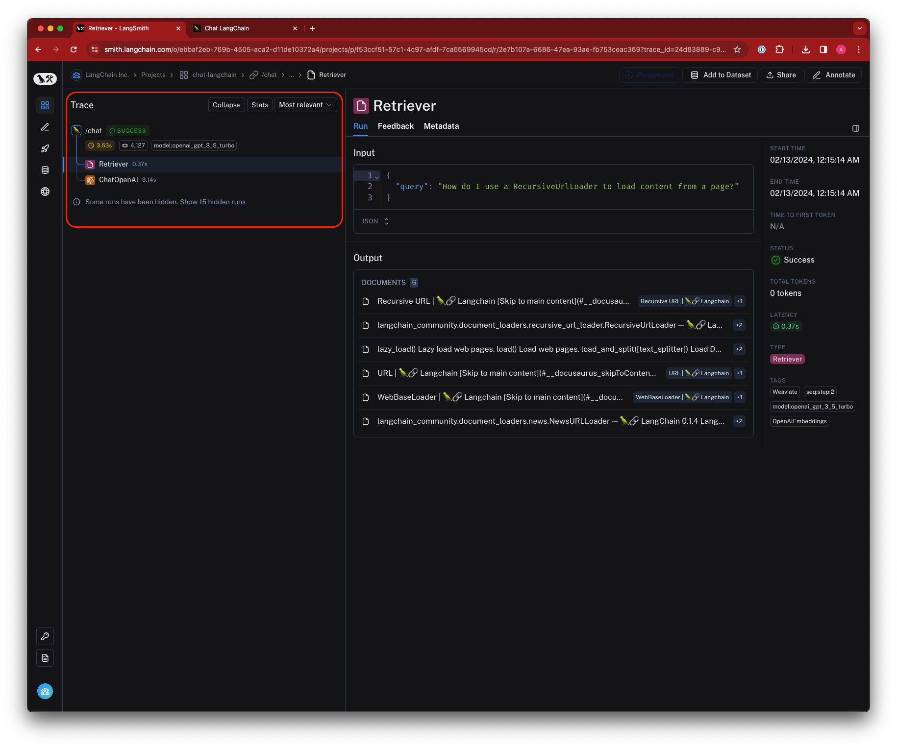
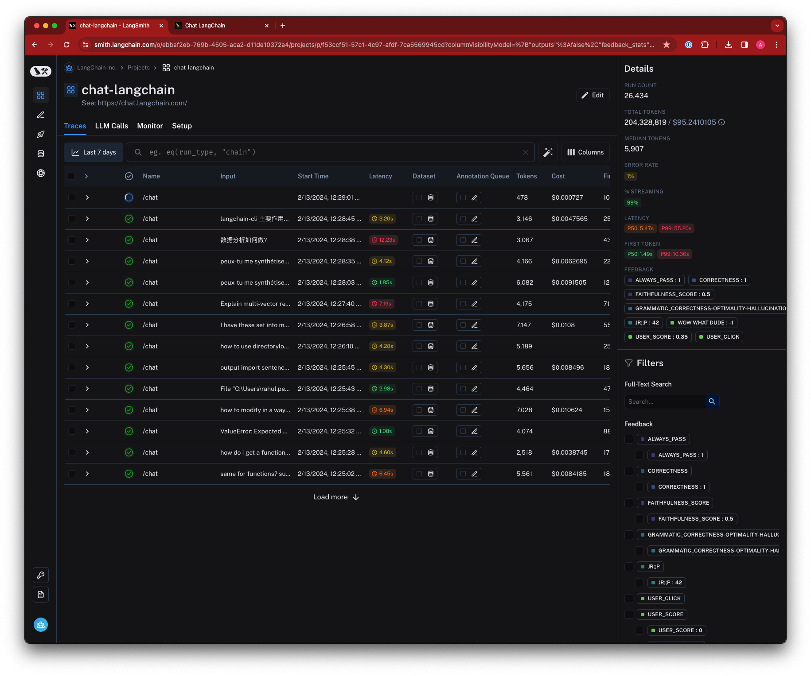
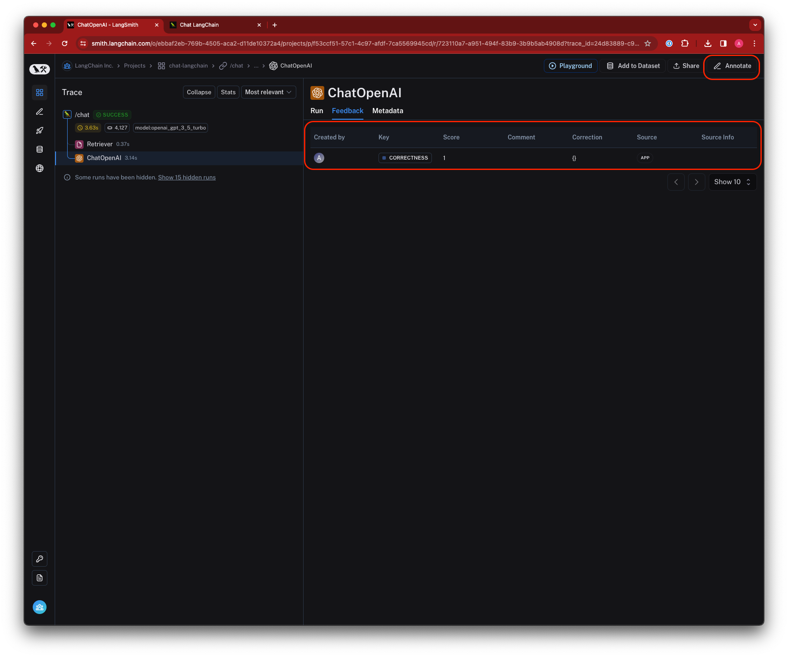
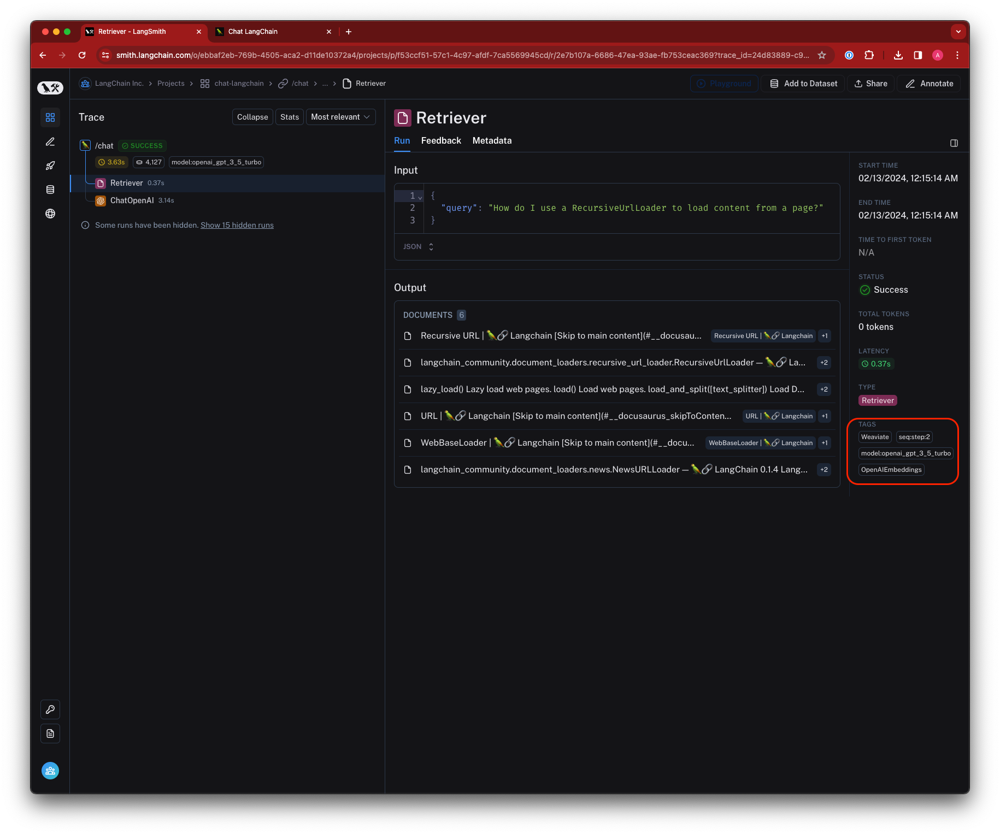
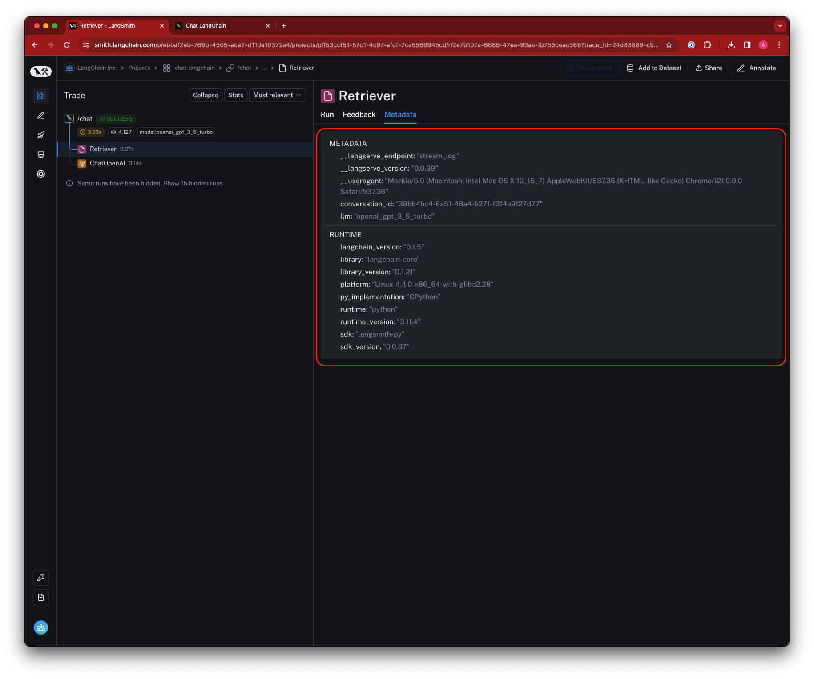

import { RegionalUrl } from "@site/src/components/RegionalUrls";
import ThemedImage from "@theme/ThemedImage";

# Concepts

This conceptual guide covers topics that are important to understand when logging traces to LangSmith. A `Trace` is essentially a series of steps that your application takes to go from input to output. Each of these individual steps is represented by a `Run`. A `Project` is simply a collection of traces. The following diagram displays these concepts in the context of a simple RAG app, which retrieves documents from an index and generates an answer.

<ThemedImage
  alt="LangSmith Primitives"
  sources={{
    light: require("./static/primitives.png").default,
    dark: require("./static/primitives-dark.png").default,
  }}
/>

  Primitive datatypes in LangSmith

## Runs

A `Run` is a span representing a single unit of work or operation within your LLM application. This could be anything from single call to an LLM or chain, to a prompt formatting call, to a runnable lambda invocation. If you are familiar with [OpenTelemetry](https://opentelemetry.io/), you can think of a run as a span.

To learn more about how runs are stored in the application, see [this reference guide](../reference/data_formats/run_data_format).

## Traces

A `Trace` is a collection of runs that are related to a single operation. For example, if you have a user request that triggers a chain, and that chain makes a call to an LLM, then to an output parser, and so on, all of these runs would be part of the same trace. If you are familiar with [OpenTelemetry](https://opentelemetry.io/), you can think of a LangSmith trace as a collection of spans. Runs are bound to a trace by a unique trace ID.

## Projects

A `Project` is a collection of traces. You can think of a project as a container for all the traces that are related to a single application or service. You can have multiple projects, and each project can have multiple traces.

## Feedback

`Feedback` allows you to score an individual run based on certain criteria.
Each feedback entry consists of a feedback tag and feedback score, and is bound to a run by a unique run ID.
Feedback can currently be continuous or discrete (categorical), and you can reuse feedback tags across different runs within an organization.

Collecting feedback on runs can be done in a number of ways:

1. [Sent up along with a trace](/evaluation/how_to_guides/human_feedback/attach_user_feedback) from the LLM application
2. Generated by a user in the app [inline](/evaluation/how_to_guides/human_feedback/annotate_traces_inline) or in an [annotation queue](../how_to_guides/human_feedback/annotation_queues)
3. Generated by an automatic evaluator during [offline evaluation](/evaluation/how_to_guides/evaluation/evaluate_llm_application)
4. Generated by an [online evaluator](./how_to_guides/monitoring/online_evaluations)

To learn more about how feedback is stored in the application, see [this reference guide](../reference/data_formats/feedback_data_format).

## Tags

`Tags` are collections of strings that can be attached to runs. They are used to categorize runs and make it easier to search for them in the LangSmith UI. Tags can be used to filter runs in the LangSmith UI, and can be used to group runs together for analysis. [Learn how to attach tags to your traces](../how_to_guides/tracing/add_metadata_tags)

## Metadata

`Metadata` is a collection of key-value pairs that can be attached to runs. Metadata can be used to store additional information about a run, such as the version of the application that generated the run, the environment in which the run was generated, or any other information that you want to associate with a run.
Similar to tags, you can use metadata to filter runs in the LangSmith UI, and can be used to group runs together for analysis. [Learn how to add metadata to your traces](../how_to_guides/tracing/add_metadata_tags)

## Data storage and retention

For traces ingested on or after Wednesday, May 22, 2024, LangSmith (SaaS) retains trace data for a maximum of 400 days past the date and time the trace was inserted into the LangSmith trace database.

After 400 days, the traces are permanently deleted from LangSmith, with a limited amount of metadata be retained for the purpose of showing accurate statistics such as historic usage and cost.

:::note
If you wish to keep tracing data longer than the data retention period, you can add it to a dataset. A dataset allows you to store the trace inputs and outputs (e.g., as a key-value dataset), and will persist indefinitely, even after the trace gets deleted.
:::

## Deleting traces from LangSmith

If you wish to remove a trace from LangSmith sooner than the expiration date, LangSmith supports deleting traces via deleting a project.

This can be accomplished:

- in the LangSmith UI via the "Delete" option on the Project's overflow menu
- via the <RegionalUrl text='Delete Tracer Sessions' type='api' suffix='/redoc#tag/tracer-sessions/operation/delete_tracer_session_api_v1_sessions__session_id__delete' /> API endpoint
- via `delete_project()` (Python) or `deleteProject()` (JS/TS) in the LangSmith SDK

LangSmith does not support self-service deletion of individual traces at this time.

If you have a need to delete a single trace (or set of traces) from LangSmith project before its expiration date, please have your account owner reach out to [LangSmith Support](mailto:support@langchain.dev) with your organization ID and trace IDs.
