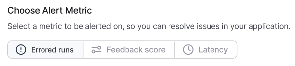
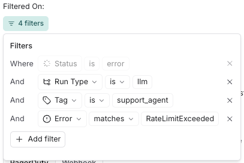
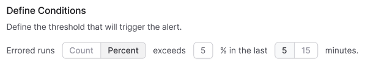
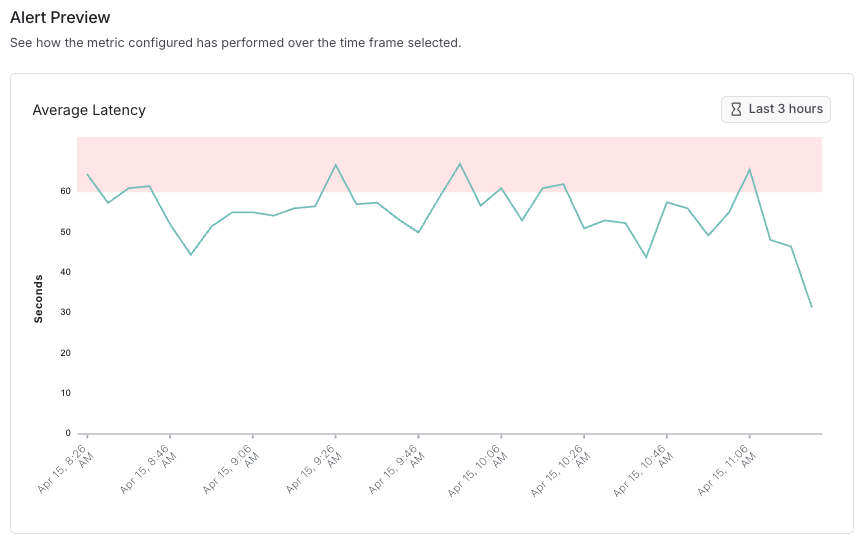

# Alerts in LangSmith

:::tip Private Beta

This is feature is currently in private beta. If interested, please express interest in the <a href="https://langchaincommunity.slack.com/archives/C079K4ECBN2">\#feature-requests</a> channel in the LangChain Community Slack.

:::

## Overview

Effective observability in LLM applications requires proactive detection of failures, performance degradations, and regressions. LangSmith's alerts feature helps identify critical issues such as:

- API rate limit violations from model providers
- Latency increases for your application
- Application changes that affect feedback scores reflecting end-user experience

Alerts in LangSmith are project-scoped, requiring separate configuration for each monitored project.

## Configuring an alert

### Step 1: Navigate To Create Alert

First navigate to the Tracing project that you would like to configure alerts for. Click **+ New Alert** in the top right hand corner of the page to set up an alert.

### Step 2: Select Metric Type

 

LangSmith offers threshold-based alerting on three core metrics:

| Metric Type        | Description                                    | Use Case                                                                                                                                                                 |
| ------------------ | ---------------------------------------------- | ------------------------------------------------------------------------------------------------------------------------------------------------------------------------ |
| **Errored Runs**   | Tracks root runs with error status             | Monitors for failures in application traces.                                                                                                                             |
| **Feedback Score** | Measures average feedback score metrics        | Tracks feedback from application users or <a href="./online_evaluations">automated evaluation rules</a> to track regressions in prompts or switching models / providers. |
| **Run Latency**    | Measures average end-to-end run execution time | Identifies performance bottlenecks from switching models / providers or code regressions.                                                                                |

Additionally, for **Errored Runs** and **Run Latency**, you can define filters to narrow down the runs that trigger alerts. For example, you might create an error alert filter for all `llm` runs tagged with `support_agent` that encounter a `RateLimitExceeded` error.

### Step 2: Define Alert Conditions

Alert conditions consist of several components:

- **Aggregation Method**: Average, Percentage, or Count
- **Comparison Operator**: `>=`, `<=`, or exceeds threshold
- **Threshold Value**: Numerical value triggering the alert
- **Aggregation Window**: Time period for metric calculation (currently choose between 5 or 15 minutes)
- **Feedback Key** (Feedback Score alerts only): Specific feedback metric to monitor

 

**Example:** The configuration shown above would generate an alert when more than 5% of runs within the past 5 minutes result in errors.

You can preview alert behavior over a historical time window to understand how many datapoints—and which ones—would have triggered an alert at a chosen threshold (indicated in red). For example, setting an average latency threshold of 60 seconds for a project lets you visualize potential alerts, as shown in the image below.

### Step 3: Configure Notification Channel

LangSmith supports the following notification channels:

1. [PagerDuty Integration](./alerts_pagerduty.mdx)
2. [Webhook Notifications](./alerts_webhook.mdx)

Select the appropriate channel to ensure notifications reach the responsible team members.

## Best Practices

- Adjust sensitivity based on application criticality
- Start with broader thresholds and refine based on observed patterns
- Ensure alert routing reaches appropriate on-call personnel
