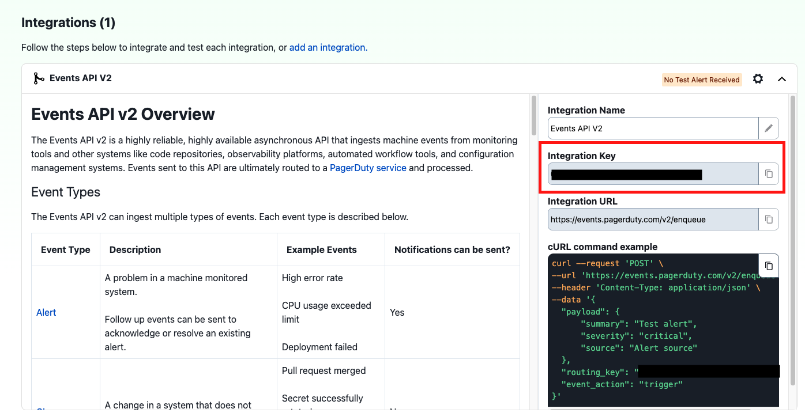

# Configuring PagerDuty Integration for LangSmith Alerts

:::tip Private Beta

This is associated with the LangSmith Alerts feature which is currently in private beta. If interested, please express interest in the <a href="https://langchaincommunity.slack.com/archives/C079K4ECBN2">\#feature-requests</a> channel in the langchain community slack.

:::

## Overview

This guide walks through the process of configuring PagerDuty as a notification channel for LangSmith alerts using PagerDuty's <a href="https://developer.pagerduty.com/docs/events-api-v2-overview">Events API v2</a>. This integration allows critical LLM application issues to trigger PagerDuty incidents, enabling rapid response through your established incident management workflow.

## Prerequisites

- An active PagerDuty account with administrator access
- Appropriate service-level permissions in PagerDuty

Additionally, if on a custom deployment of LangSmith, make sure there are no firewall settings blocking egress traffic from LangSmith services.

## Integration Steps

### Step 1: Create a Service in PagerDuty

1. Log in to your PagerDuty account
2. Navigate to **Services → Service Directory**
3. Click **+ New Service**
4. Complete the following fields:
   - **Name**: Provide a descriptive name (e.g., "LangSmith Monitoring")
   - **Description**: Add details about the monitored application
   - **Escalation Policy**: Select the appropriate team escalation policy
   - **Integration Type**: Select "Events API V2"
5. Click **Add Service** to create the service

### Step 2: Obtain Integration Key

After creating the service, you'll need to retrieve the Integration Key:

1. From the **Service Directory** under the Service dropdown, locate and click on your newly created service
2. Select the **Integrations** tab
3. Find the "Events API V2" integration
4. Copy the **Integration Key** (a 32-character alphanumeric string)

### Step 3: Configure LangSmith Alert with PagerDuty

1. In the notification section of your alert in LangSmith, select **PagerDuty**
2. Paste the **Integration Key** from Step 2 into the designated field
3. Configure additional notification options:
   - **Severity**: Maps to PagerDuty incident priority
4. Send a test alert by clicking **Send Test Alert**
5. Verify the incident is triggered by PagerDuty and contains relevant LangSmith alert information

## Troubleshooting

If incidents aren't being created in PagerDuty:

- Verify the Integration Key is entered correctly in LangSmith
- Ensure the PagerDuty service is active and not in maintenance mode
- Check that your PagerDuty account has Events API v2 enabled
- Review network connectivity if your LangSmith instance is behind a firewall

## Additional Resources

- [PagerDuty Events API v2 Documentation](https://developer.pagerduty.com/docs/events-api-v2/overview/)
- [PagerDuty Integration Guide](https://support.pagerduty.com/docs/services-and-integrations)
- [LangSmith Alerts Documentation](./alerts.mdx)
