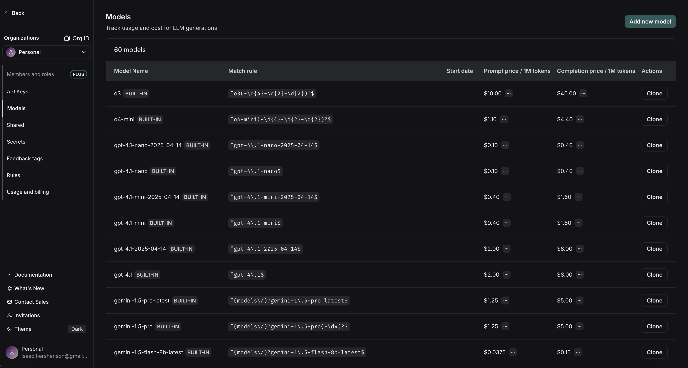

import {
  CodeTabs,
  PythonBlock,
  TypeScriptBlock,
} from "@site/src/components/InstructionsWithCode";
import { RegionalUrl } from "@site/src/components/RegionalUrls";
import priceEntry from "./static/new_price_map_entry.png";

# Calculate token-based costs for traces

:::info Recommended Reading

- [Providing token counts for LLM runs (spans)](./log_llm_trace#provide-token-and-cost-information)

:::

LangSmith allows you to track token-based costs for LLM runs.
The costs are rolled up to the trace and project level.

There are two ways costs can be tracked:

1. Derived from token counts and model prices
2. Directly specified as part of the run data

In most cases it is easier to include token counts in the run data and specify model pricing in LangSmith.
LangSmith assumes that costs are linear in token counts, broken down by token type.
For the few models with non-linear pricing (e.g., above X input tokens the per-token price changes), we recommend computing costs client-side and sending them as part of the run data.

## Send token counts

For LangSmith to accurately derive costs for an LLM run, you need to provide token counts:

- If you are using the LangSmith Python or TS/JS SDK with OpenAI or Anthropic models, the [built-in wrappers](./annotate_code#wrap-the-openai-client) will automatically send up token counts, model provider and model name data to LangSmith.
- If you are using the LangSmith SDK's with other model providers, you should carefully read through [this guide](./log_llm_trace#manually-provide-usage-information).
- If you are using LangChain Python or TS/JS, token counts, model provider, and model name are automatically sent up to LangSmith for most chat model integrations. If there is a chat model integration that is missing token counts and for which the underlying API includes token counts in the model response, please open a GitHub issue in the [LangChain repo](https://github.com/langchain-ai/langchain).

If token counts are not explicitly specified, LangSmith will approximate the token counts of the LLM messages using `tiktoken`.

## Specify model name

LangSmith reads the LLM model name from the `ls_model_name` field in [run metadata](./add_metadata_tags).
The [SDK built-in wrappers](./annotate_code#wrap-the-openai-client) and any LangChain integrations will automatically handle specifying this metadata for you.

## Set model prices

To compute costs from token counts and model names, we need to know the per-token prices for the model you're using.
LangSmith has a <RegionalUrl text='model pricing table' suffix='/settings/workspaces/models' /> for this.
The table comes with pricing information for most OpenAI, Anthropic, and Gemini models.
You can add prices for other models, or overwrite pricing for default models.

You can specify prices for prompt (input) and completion (output) tokens. If needed you can provide a more detailed breakdown of prices.
For example, some model providers have different pricing for multimodal or cached tokens.



Hovering over the `...` next to the prompt/completion prices shows you the price breakdown by token type. You can see, for example, if `audio` and `image` prompt tokens have different prices versus default text prompt tokens.

To create a _new entry_ in the model pricing map, click on the `Add new model` button in the top right corner.


Here, you can specify the following fields:

- `Model Name`: The human-readable name of the model.
- `Match Pattern`: A regex pattern to match the model name. This is used to match the value for `ls_model_name` in the run metadata.
- `Prompt (Input) Price`: The cost per 1M input tokens for the model. This number is multiplied by the number of tokens in the prompt to calculate the prompt cost.
- `Completion (Output) Price`: The cost per 1M output tokens for the model. This number is multiplied by the number of tokens in the completion to calculate the completion cost.
- `Prompt (Input) Price Breakdown` (Optional): The breakdown of price for each different type of prompt token, e.g. `cache_read`, `video`, `audio`, etc.
- `Completion (Output) Price Breakdown` (Optional): The breakdown of price for each different type of completion token, e.g. `reasoning`, `image`, etc.
- `Model Activation Date` (Optional): The date from which the pricing is applicable. Only runs after this date will apply this model price.
- `Provider` (Optional): The provider of the model. If specified, this is matched against `ls_provider` in the run metadata.

Once you have set up the model pricing map, LangSmith will automatically calculate and aggregate the token-based costs for traces based on the token counts provided in the LLM invocations.

## Cost formula

The cost for a run is computed greedily from most-to-lease specific token type.
Suppose we set a price of $2 per 1M prompt tokens with a detailed price of $1 per 1M `cache_read` prompt tokens, and $3 per 1M completion tokens.
If we uploaded the following usage metadata:

```python
{
  "input_tokens": 20,
  "input_token_details": {"cache_read": 5},
  "output_tokens": 10,
  "output_token_details": {},
  "total_tokens": 30,
}
```

then we'd compute the token costs as follows:

```python
# A.K.A. prompt_cost
# Notice that we compute the cache_read cost and then for any
# remaining input_tokens we apply the default input price.
input_cost = 5 * 1e-6 + (20 - 5) * 2e-6  # 3.5e-5
# A.K.A. completion_cost
output_cost = 10 * 3e-6  # 3e-5
total_cost = input_cost + output_cost  # 6.5e-5
```

## Send costs directly

If you are tracing an LLM call that returns token cost information, are tracing an API with a non-token based pricing scheme,
or otherwise have accurate information around costs at runtime, you may instead populate a `usage_metadata`
dict while tracing rather than relying on LangSmith's built-in cost calculations.

See [this guide](./log_llm_trace#manually-provide-usage-information) to learn how to manually provide cost information for a run.
