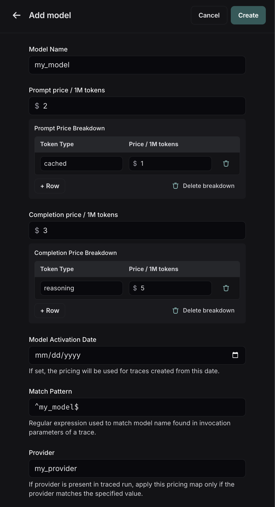
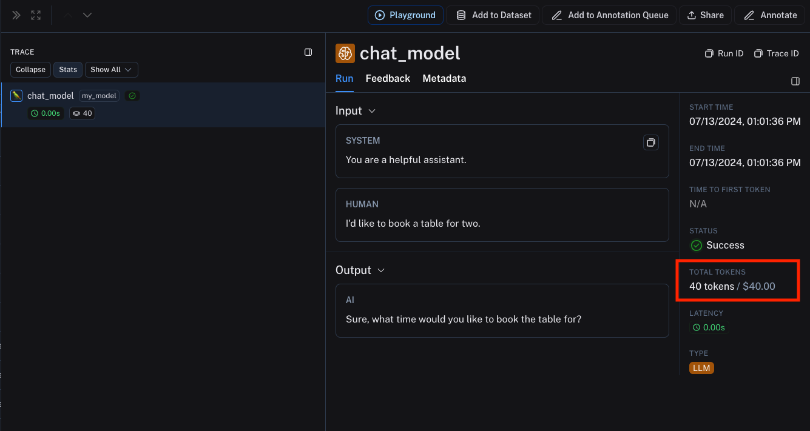

import {
  CodeTabs,
  PythonBlock,
  TypeScriptBlock,
} from "@site/src/components/InstructionsWithCode";
import { RegionalUrl } from "@site/src/components/RegionalUrls";

# Calculate token-based costs for traces

:::tip Recommended Reading
Before diving into this content, it might be helpful to read the following:

- [Providing token counts for LLM runs (spans)](./log_llm_trace#manually-provide-token-counts)

:::

LangSmith allows you to track costs for traces based on the number of tokens used for LLM invocations.
The costs are rolled up to the trace level and project level.

## Send token count data to LangSmith

For LangSmith to accurately calculate token-based costs, you need to provide the token counts for each LLM invocation in the trace, along with sending up `ls_provider` and `ls_model_name` in the run metadata.

- If you are using the LangSmith Python or TS/JS SDK, you should carefully read through the [this guide](./log_llm_trace).
- If you are using LangChain Python or TS/JS, _`ls_provider` and `ls_model_name` along with token counts are automatically sent up to LangSmith_.

:::note

If `ls_model_name` is not present in `extra.metadata`, other fields might be used from the `extra.metadata` for estimating token counts and calculating cost. The following fields are used in the order of precedence:

1. `metadata.ls_model_name`
2. `invocation_params.model`
3. `invocation_params.model_name`
4. `invocation_params.model_id` (for costs only)
5. `invocation_params.model_path` (for costs only)
6. `invocation_params.endpoint_name` (for costs only)

:::

## Configure token price information

Once you are sending up the correct token count information to LangSmith, you must ensure the model you are using has price information in LangSmith.
You can see which models have price information for them by heading to the <RegionalUrl text='model pricing map' suffix='/settings/workspaces/models' />.
Here, you can set the cost per token for each model and provider combination. This information is scoped to a workspace. There are a number of models that LangSmith prepopulates with price information,
which you can see in the rows with the `BUILT-IN` tag next to them:

Hovering over the 3 menu dots next to the prompt/completion costs per 1M token will show you the price breakdown by token type, for example if `audio` and `image` tokens had different prices.

:::warning Prebuilt Model Prices
The prebuilt prices are not populated programmatically, and we recommend checking with the API provider to confirm that the price is up to date. We try our best to keep up
with API provider pricing changes, but if you see a change not reflected in the built-ins, you can `Clone` the row and change the price to be correct, and notify someone
from LangSmith to get it updated.
:::

If you don't see the model you are using in the built-ins, you can create a _new entry_ in the model pricing map, click on the `Add new model` button in the top right corner.

Here, you can specify the following fields:

- `Model Name`: The name of the model, will also be used to name the entry in the model pricing map.
- `Prompt Price`: The cost per 1M input tokens for the model. This number is multiplied by the number of tokens in the prompt to calculate the prompt cost.
- `Prompt Price Breakdown`: The breakdown of price for each different type of prompt token, i.e. `cached`, `video`, `audio`, etc.
- `Completion Price`: The cost per 1M output tokens for the model. This number is multiplied by the number of tokens in the completion to calculate the completion cost.
- `Completion Price Breakdown`: The breakdown of price for each different type of completion token, i.e. `reasoning`, `image`, etc.
- `Model Activation Date`: The date from which the pricing is applicable.
- `Match Pattern`: A regex pattern to match the model name and provider. This is used to match the value for `ls_model_name` in the run metadata.
- `Provider`: The provider of the model. This is used to match the value for `ls_provider` in the run metadata.

Once you have set up the model pricing map, LangSmith will automatically calculate and aggregate the token-based costs for traces based on the token counts provided in the LLM invocations.

:::tip How run costs are calculated
The cost for a run is calculated by first checking the token and cost details and trying to match them, i.e. if you `prompt_token_details` is something like `{"a": 2}` and your `prompt_cost_details`
is `{"a": 3}`, the price will be 6. Any leftover tokens (i.e. if your `prompt_tokens` was `4`) will fall back to the normal `prompt_cost` value. In essence, LangSmith will first look to the details
to try and calculate the cost, and will use the default cost if the details do not cover all the tokens in the prompt/completion.
:::

To see the example above in action, you can execute the following code snippet:

<CodeTabs
  tabs={[
    PythonBlock(`from langsmith import traceable\n
inputs = [
    {"role": "system", "content": "You are a helpful assistant."},
    {"role": "user", "content": "I'd like to book a table for two."},
]\n
output = {
    "choices": [
        {
            "message": {
                "role": "assistant",
                "content": "Sure, what time would you like to book the table for?"
            }
        }
    ],
    "usage_metadata": {
        "input_tokens": 27,
        "output_tokens": 13,
        "total_tokens": 40,
    },
}\n
@traceable(
    run_type="llm",
    metadata={"ls_provider": "my_provider", "ls_model_name": "my_model"}
)
def chat_model(messages: list):
    return output\n
chat_model(inputs)`),
    TypeScriptBlock(`import { traceable } from "langsmith/traceable";\n
const messages = [
  { role: "system", content: "You are a helpful assistant." },
  { role: "user", content: "I'd like to book a table for two." },
];\n
const output = {
  choices: [
    {
      message: {
        role: "assistant",
        content: "Sure, what time would you like to book the table for?",
      },
    },
  ],
  usage_metadata: {
    input_tokens: 27,
    output_tokens: 13,
    total_tokens: 40,
  },
};\n
const chatModel = traceable(
  async ({
    messages,
  }: {
    messages: { role: string; content: string }[];
    model: string;
  }) => {
    return output;
  },
  { run_type: "llm", name: "chat_model", metadata: { ls_provider: "my_provider", ls_model_name: "my_model" } }
);\n
await chatModel({ messages });`),
  ]}
  groupId="client-language"
/>

In the above code snippet, we are sending up the `ls_provider` and `ls_model_name` in the run metadata, along with the token counts for the LLM invocation.
This information matches the model pricing map entry we set up earlier.

The trace produced will contain the token-based costs based on the token counts provided in the LLM invocation and the model pricing map entry. Hovering over the cost
will show you the detailed cost breakdown (if one exists).

## Setting costs directly without tokens

If you are tracing an LLM call that returns token cost information, are tracing an API with a non-token based pricing scheme,
or otherwise have accurate information around costs at runtime, you may instead populate a `usage_metadata`
dict while tracing rather than relying on LangSmith's built-in cost calculations.

See [this guide](./log_llm_trace#manually-provide-usage-information) to learn how to manually provide cost information for a run.
