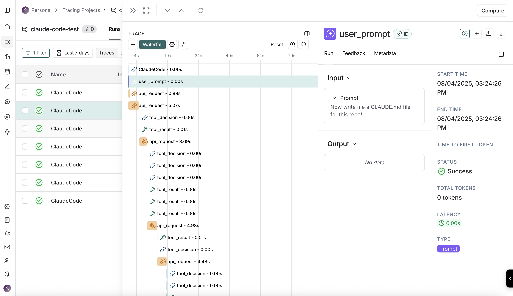

import {
  CodeTabs,
  PythonBlock,
} from "@site/src/components/InstructionsWithCode";

# Tracing Claude Code

[Claude Code](https://docs.anthropic.com/en/docs/claude-code) is one of the most impressive and useful AI coding tools to date.
Claude code emits [open telemetry standard events](https://docs.anthropic.com/en/docs/claude-code/monitoring-usage#events) for monitoring and observability. 
LangSmith can collect and display these events to give you a full detailed log on what Claude Code does under the hood.

## Quick Start

You can integrate LangSmith tracing with Claude Code by setting the following environment variables in the environment in which you run Claude Code.

```bash
// Enables Claude Code to emit OTEL events
export CLAUDE_CODE_ENABLE_TELEMETRY=1

// Sets the output format to use Open Telemetry Protocol
export OTEL_LOGS_EXPORTER=otlp

// LangSmith ingests JSON format events
export OTEL_EXPORTER_OTLP_LOGS_PROTOCOL=http/json

// Claude Code Logs are translated to Spans by LangSmith
export OTEL_EXPORTER_OTLP_LOGS_ENDPOINT=http://api.smith.langchain.com/otel/v1/claude_code
=
// Pass your API key and desired tracing project through headers
export OTEL_EXPORTER_OTLP_HEADERS="x-api-key=<api-key>,Langsmith-Project=<project-name>"

// Set this to true in order to log the input user prompts
export OTEL_LOG_USER_PROMPTS=1 

// Once these are set, start Claude Code, and events will be traced to LangSmith
claude
```

:::note Self-hosted deployments
If you're self-hosting LangSmith, replace the base endpoint with your LangSmith api endpoint and append `/api/v1`. For example: `OTEL_EXPORTER_OTLP_LOGS_ENDPOINT=https://ai-company.com/api/v1/otel/v1/claude_code`
:::



