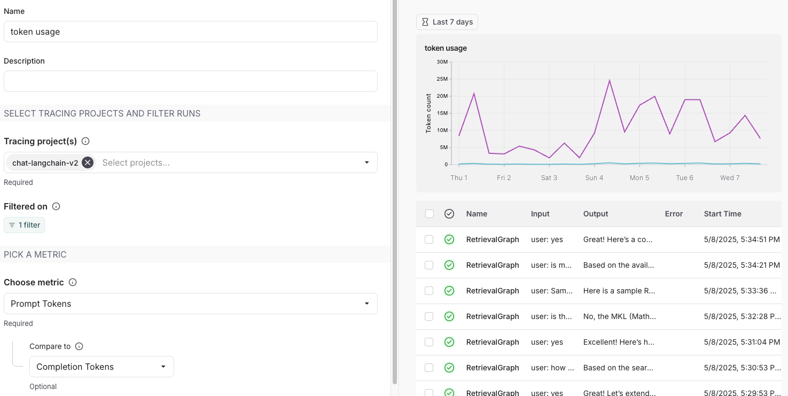
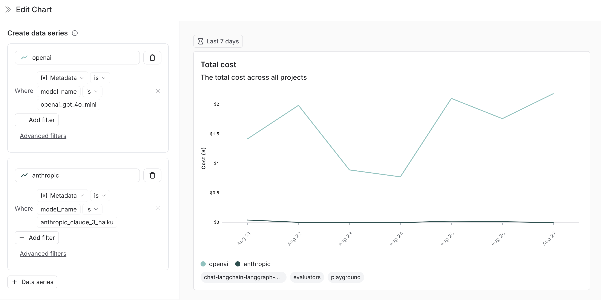
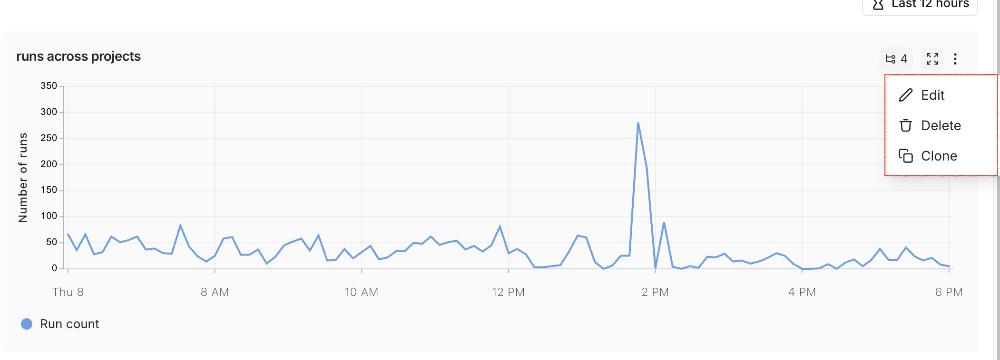
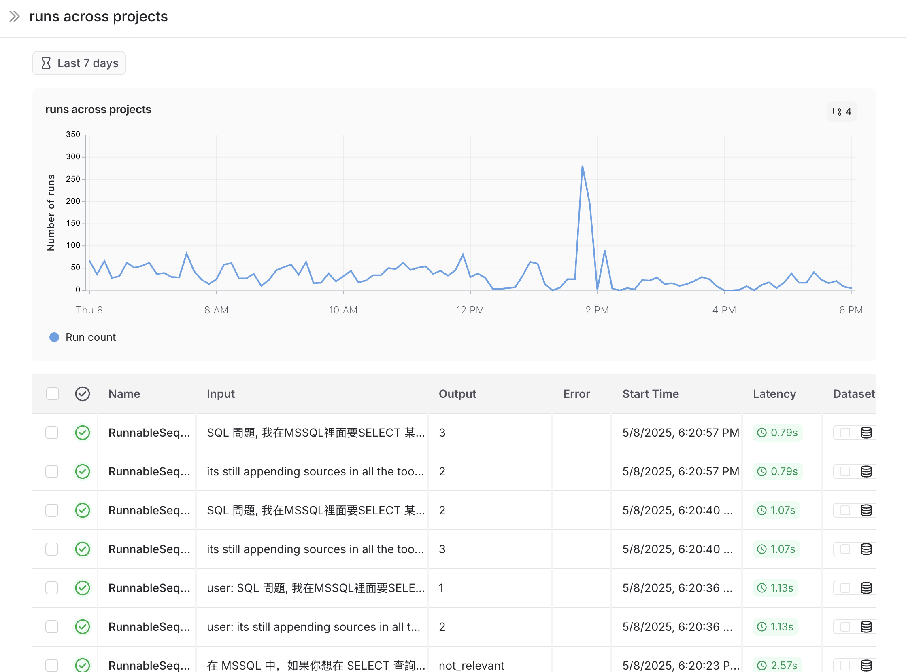
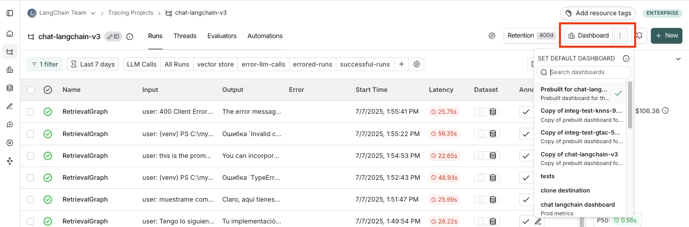
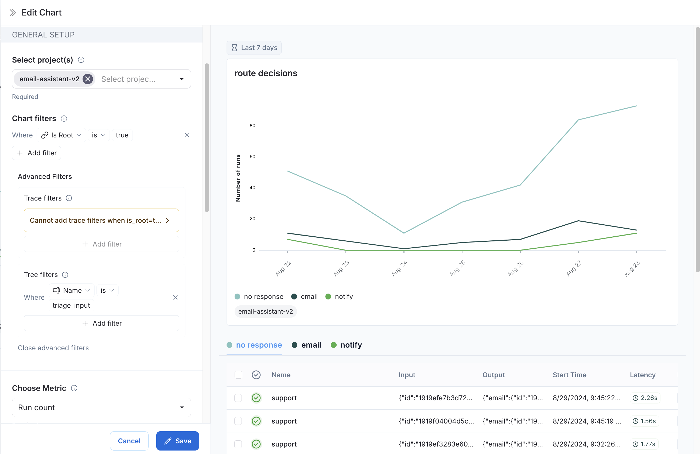
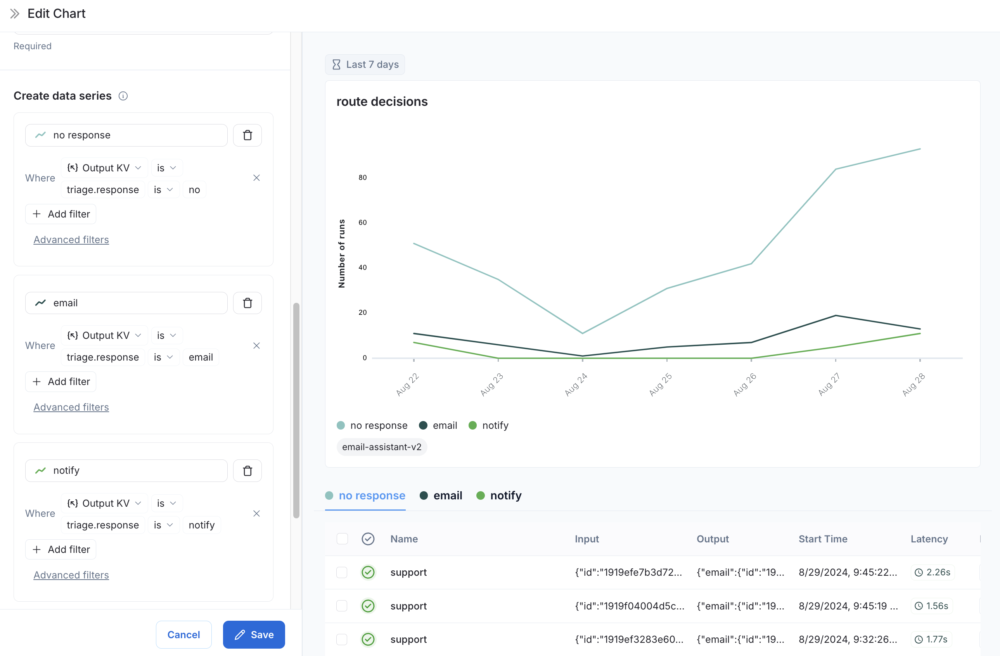

import runDepth from "./static/run_depth_explained.png";

# Monitor projects with dashboards

Dashboards give you high‑level insights into your trace data, helping you spot trends and monitor the health of your applications. LangSmith offers two dashboard types:

- **Prebuilt dashboards**: Automatically generated for every tracing project.
- **Custom dashboards**: Fully configurable collections of charts tailored to your needs.

## Prebuilt dashboards

Prebuilt dashboards are created automatically for each project and cover essential metrics, such as trace count, error rates, token usage, and more.

:::note
You cannot modify a prebuilt dashboard. In the future, we plan to allow you to clone a default dashboard in order to have a starting point to customize it.
:::

### Dashboard sections

Prebuilt dashboards are broken down into the following sections:

| Section         | What it shows                                                                                                                                                                                                                                                                                |
| :-------------- | :------------------------------------------------------------------------------------------------------------------------------------------------------------------------------------------------------------------------------------------------------------------------------------------- |
| Traces          | Trace count, latency and error rates. A [trace](/observability/concepts#traces) is a collection of [runs](/observability/concepts#runs) related to a single operation. For example, if a user request triggers an agent, all runs for that agent invocation would be part of the same trace. |
| LLM Calls       | LLM call count and latency. Includes all runs where run type is "llm".                                                                                                                                                                                                                       |
| Cost & Tokens   | Total and per-trace token counts and costs, broken down by token type. Costs are measured using [LangSmith's cost tracking](/observability/how_to_guides/log_llm_trace#manually-provide-token-counts).                                                                                       |
| Tools           | Run counts, error rates, and latency stats for tool runs broken down by tool name. Includes runs where run type is "tool". Limits to top 5 most frequently occurring tools.                                                                                                                  |
| Run Types       | Run counts, error rates, and latency stats for runs that are immediate children of the root run. This helps in understanding the the high-level execution path of agents. Limits to top 5 most frequently occuring tool names. 1                                                  |
| Feedback Scores | Aggregate stats for the top 5 most frequently occurring types of feedback. Charts show average score for numerical feedback and category counts for categorical feedback.                                                                                                                    |

1 For example, for the following trace, the following runs have a depth
of 1: {" "}

### Group by

Group by [run tag or metadata](/observability/how_to_guides/add_metadata_tags) can be used to split data over attributes that are important to your application. The global group by setting appears on the top right hand side of the dashboard. Note that the Tool and Run Type charts already have a group by applied, so the global group by won't take effect; the global group by will apply to all other charts.

:::tip
When adding metadata to runs, we reccomend having the same metadata on the trace, as well has the specific run (eg. LLM call). Metadata and tags are not propagated from parent to child runs, or vice versa. So, if you want to see e.g. both your trace charts and your LLM call charts grouped on some metadata key then both your traces (root runs) and your LLM runs need to have that metadata attached.
:::

## Custom Dashboards

Create tailored collections of charts for tracking metrics that matter most for your application.

### Creating a new dashboard

1. Navigate to the **Monitor** tab in the left sidebar.
2. Click on the **+ New Dashboard** button.
3. Give your dashboard a name and a description.
4. Click on **Create**.

### Adding charts to your dashboard

1. Within a dashboard, click on the **+ New Chart** button to open up the chart creation pane.
2. Give your chart a name and a description.
3. Configure the chart.

### Chart configuration

#### Select tracing projects and filter runs

- Select one or more tracing projects to track metrics for.
- Use the **Chart filters** section to refine the matching runs. This filter applies to all data series in the chart. For more information on filtering traces, view our guide on [filtering traces in application](./filter_traces_in_application).

#### Pick a metric

- Choose a metric from the dropdown menu to set the y-axis of your chart. With a project and a metric selected, you'll see a preview of your chart and the matching runs.
- For certain metrics (such as latency, token usage, cost), we support comparing multiple metrics with the same unit. For example, you may wany one chart where you can see prompt tokens and completion tokens. Each metric appears as a separate line.

#### Split the data

There are two ways to create multiple series in a chart (i.e. create multiple lines in a chart):

1. **Group by**: Group runs by [run tag or metadata](/observability/how_to_guides/add_metadata_tags), run name, or run type. Group by automatically splits the data into multiple series based on the field selected. Note that group by is limited to the top 5 elements by frequency.

2. **Data series**: Manually define multiple series with individual filters. This is useful for comparing granular data within a single metric.

#### Pick a chart type

- Choose between a line chart and a bar chart for visualizing

### Save and manage charts

- Click `Save` to save your chart to the dashboard.
- Edit or delete a chart by clicking the triple dot button in the top right of the chart.
- Clone a chart by clicking the triple line button in the top right of the chart and selecting **+ Clone**. This will open a new chart creation pane with the same configurations as the original.

## Linking to a dashboard from a tracing project

You can link to a dashboard directly from a tracing project. By default, the prebuilt dashboard for your tracing project is selected. If you have a custom dashboard that you would like to link instead:

1. In your tracing project, click the pencil icon next to the Dashboard selector.
2. Choose a dashboard to set as the new default.

## Example: User‑Journey Monitoring

Use monitoring charts for mapping the decisions made by an agent at a particular node.

Consider an email assistant agent. At a particular node it makes a decision about an email to:

- send an email back
- notify the user
- no response needed

We can create a chart to track and visualize the breakdown of these decisions.

**Creating the chart**

1. **Metric Selection**: Select the metric `Run count`.
2. **Chart Filters**: Add a tree filter to include all of the traces with name `triage_input`. This means we only include traces that hit the `triage_input` node. Also add a chart filter for `Is Root` is `true`, so our count is not inflated by the number of nodes in the trace.
   

3. **Data Series**: Create a data series for each decision made at the `triage_input` node. The output of the decision is stored in the `triage.response` field of the output object,
   and the value of the decision is either `no`, `email`, or `notify`. Each of these decisions generates a separate data series in the chart.
   

Now we can visualize the decisions made at the `triage_input` node over time.
