# Filter traces in the application

:::tip Recommended reading

Before diving into this content, it might be helpful to read the following to gain familiarity with the concepts mentioned here:

- [Conceptual guide on tracing](../concepts)

:::

Tracing projects can contain a significant amount of data. Filters are used for effectively navigating and analyzing this data, allowing you to:

- **Have focused investigations**: Quickly narrow down to specific runs for ad-hoc analysis
- **Debug and analyze**: Identify and examine errors, failed runs, and performance bottlenecks

This page contains a series of guides for how to filter runs in the a tracing project. If you are programmatically exporting runs for analysis via the [API](https://api.smith.langchain.com/redoc#tag/run/operation/query_runs_api_v1_runs_query_post) or [SDK](https://docs.smith.langchain.com/reference/python/client/langsmith.client.Client#langsmith.client.Client.list_runs), please refer to the [exporting traces guide](./export_traces) for more information.

## Creating and Applying Filters

### Filtering by run attributes

There are two ways to filter runs in a tracing project:

1. **Filters**: Located towards the top-left of the tracing projects page. This is where you construct and manage detailed filter criteria.

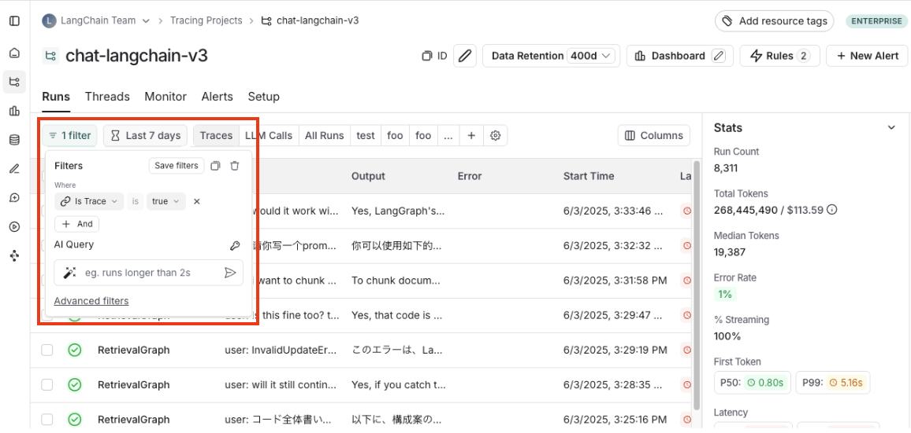

2. **Filter Shortcuts**: Positioned on the right sidebar of the tracing projects page. The filter shortcuts bar provides quick access to filters based on the most frequently occurring attributes in your project's runs.

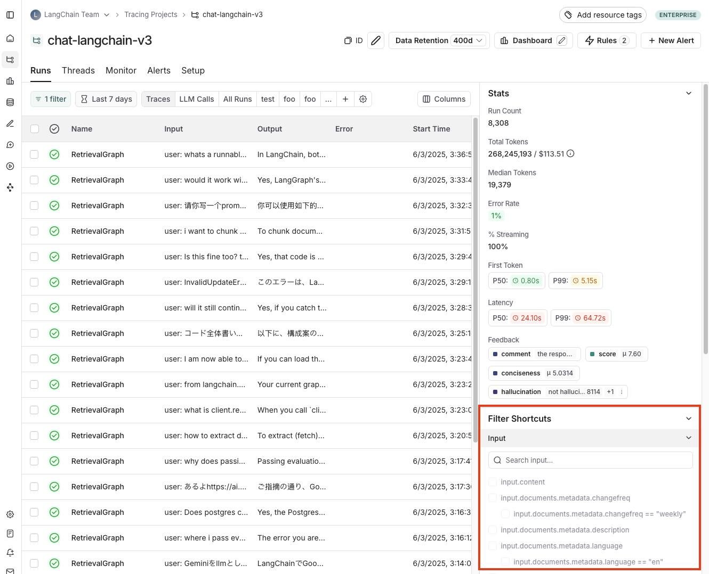

:::info Default filter
By default, the `IsTrace` is `true` filter is applied. This displays only top-level traces. Removing this filter will show all runs, including intermediate spans, in the project.
:::

### Filtering by time range

In addition to filtering by run attributes, you can also filter runs within a specific time range. This option is available towards the top-left of the tracing projects page.

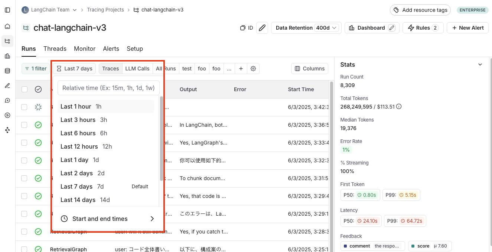

### Filter operators

The available filter operators depend on the data type of the attribute you are filtering on. Here's an overview of common operators:

- **is**: Exact match on the filter value
- **is not**: Negative match on the filter value
- **contains**: Partical match on the filter value
- **does not contain**: Negative partial match on the filter value
- **is one of**: Match on any of the values in the list
- `>` / `<`: Available for numeric fields

## Specific Filtering Techniques

### Filter for intermediate runs (spans)

In order to filter for intermediate runs (spans), you first need to remove the default `IsTrace` is `true` filter. For example, you would do this if you wanted to filter by `run name` for sub runs or filter by `run type`.

Run metadata and tags are also powerful to filter on. These rely on good tagging across all parts of your pipeline. To learn more, you can check out [this guide](./add_metadata_tags).

### Filter based on inputs and outputs

You can filter runs based on the content in the inputs and outputs of the run.

To filter either inputs or outputs, you can use `Full-Text Search` filter which will match keywords in either field. For more targeted search, you can use the `Input` or `Output` filters which will only match content based on the respective field.

You can also specify multiple matches, either by including multiple terms separated by whitespace, or adding multiple filters - which will try to match all terms provided.

Note that keyword search is done splitting the text and finding any partial matches on the search keywords, so it is not done in specific order. We exclude common stop words from the search (from the nltk stop word list along with a few other common json keywords).

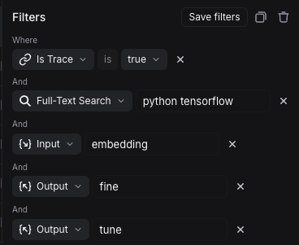

Based on the filters above, the system will search for `python` and `tensorflow` in either inputs or outputs, and `embedding` in the inputs along with `fine` and `tune` in the outputs.

### Filter based on input / output key-value pairs

In addition to full-text search, you can filter runs based on specific key-value pairs in the inputs and outputs. This allows for more precise filtering, especially when dealing with structured data.

To filter based on key-value pairs, select the `Input Key` or `Output Key` filter from the filters dropdown.

For example, to match the following input:

```json
{
  "input": "What is the capital of France?"
}
```

Select `Filters`, `Add Filter` to bring up the filtering options. Then select `Input Key`, enter `input` as the key and enter `What is the capital of France?` as the value.

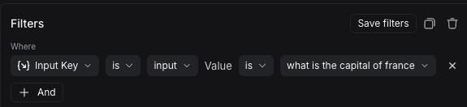

You can also match nested keys by using dot notation to selected the nested key name. For example, to match nested keys in the output:

```json
{
  "documents": [
    {
      "page_content": "The capital of France is Paris",
      "metadata": {},
      "type": "Document"
    }
  ]
}
```

Select `Output Key`, enter `documents.page_content` as the key and enter `The capital of France is Paris` as the value. This will match the nested key `documents.page_content` with the specified value.

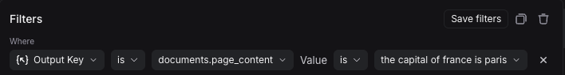

You can add multiple key-value filters to create more complex queries. You can also use the `Filter Shortcuts` on the right side to quickly filter based on common key values pairs as shown below:

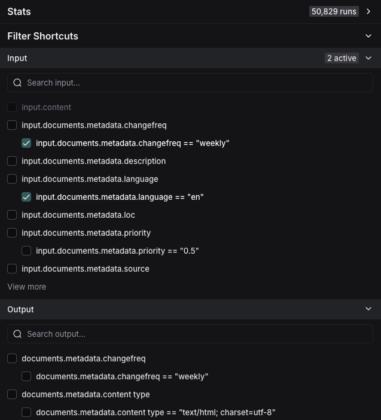

### Example: Filtering for tool calls

It's common to want to search for traces that contain a specific tool calls. Tool calls are typically indicated in the output of an LLM run. To filter for tool calls, you would use the `Output Key` filter.

While this example will show you how to filter for tool calls, the same logic can be applied to filter for any key-value pair in the output.

In this case, let's assume this is the output you want to filter for:

```json
{
  "generations": [
    [
      {
        "text": "",
        "type": "ChatGeneration",
        "message": {
          "lc": 1,
          "type": "constructor",
          "id": [],
          "kwargs": {
            "type": "ai",
            "id": "run-ca7f7531-f4de-4790-9c3e-960be7f8b109",
            "tool_calls": [
              {
                "name": "Plan",
                "args": {
                  "steps": [
                    "Research LangGraph's node configuration capabilities",
                    "Investigate how to add a Python code execution node",
                    "Find an example or create a sample implementation of a code execution node"
                  ]
                },
                "id": "toolu_01XexPzAVknT3gRmUB5PK5BP",
                "type": "tool_call"
              }
            ]
          }
        }
      }
    ]
  ],
  "llm_output": null,
  "run": null,
  "type": "LLMResult"
}
```

With the example above, the KV search will map each nested JSON path as a key-value pair that you can use to search and filter.

LangSmith will break it into the following set of searchable key value pairs:

| Key                                                | Value                                                                        |
| -------------------------------------------------- | ---------------------------------------------------------------------------- |
| `generations.type`                                 | `ChatGeneration`                                                             |
| `generations.message.type`                         | `constructor`                                                                |
| `generations.message.kwargs.type`                  | `ai`                                                                         |
| `generations.message.kwargs.id`                    | `run-ca7f7531-f4de-4790-9c3e-960be7f8b109`                                   |
| `generations.message.kwargs.tool_calls.name`       | `Plan`                                                                       |
| `generations.message.kwargs.tool_calls.args.steps` | `Research LangGraph's node configuration capabilities`                       |
| `generations.message.kwargs.tool_calls.args.steps` | `Investigate how to add a Python code execution node`                        |
| `generations.message.kwargs.tool_calls.args.steps` | `Find an example or create a sample implementation of a code execution node` |
| `generations.message.kwargs.tool_calls.id`         | `toolu_01XexPzAVknT3gRmUB5PK5BP`                                             |
| `generations.message.kwargs.tool_calls.type`       | `tool_call`                                                                  |
| `type`                                             | `LLMResult`                                                                  |

To search for specific tool call, you can use the following Output Key search while removing the root runs filter:

`generations.message.kwargs.tool_calls.name` = `Plan`

This will match root and non-root runs where the `tool_calls` name is `Plan`.

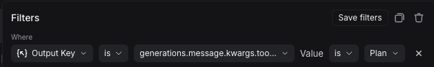

### Negative filtering on key-value pairs

Different types of negative filtering can be applied to `Metadata`, `Input Key`, and `Output Key` fields to exclude specific runs from your results.

For example, to find all runs where the metadata key `phone` is not equal to `1234567890`, set the `Metadata` `Key` operator to `is` and `Key` field to `phone`, then set the `Value` operator to `is not` and the `Value` field to `1234567890`. This will match all runs that have a metadata key `phone` with any value except `1234567890`.


To find runs that don't have a specific metadata key, set the `Key` operator to `is not`. For example, setting the `Key` operator to `is not` with `phone` as the key will match all runs that don't have a `phone` field in their metadata.

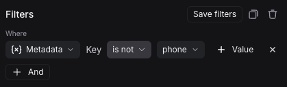

You can also filter for runs that neither have a specific key nor a specific value. To find runs where the metadata has neither the key `phone` nor any field with the value `1234567890`, set the `Key` operator to `is not` with key `phone`, and the `Value` operator to `is not` with value `1234567890`.

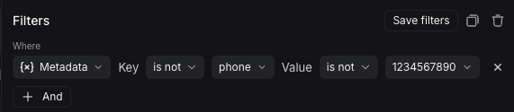

Finally, you can also filter for runs that do not have a specific key but have a specific value. To find runs where there is no `phone` key but there is a value of `1234567890` for some other key, set the `Key` operator to `is not` with key `phone`, and the `Value` operator to `is` with value `1234567890`.

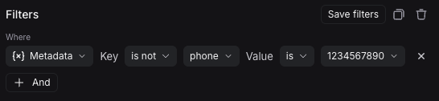

Note that you can use `does not contain` operator instead of `is not` to perform a substring match.

## Save a filter

Saving filters allow you to store and reuse frequently used filter configurations. Saved filters are specific to a tracing project.

#### Save a filter

In the filter box, click the **Save filter** button after you have constructed your filter. This will bring up a dialog to specify the name and a description of the filter.

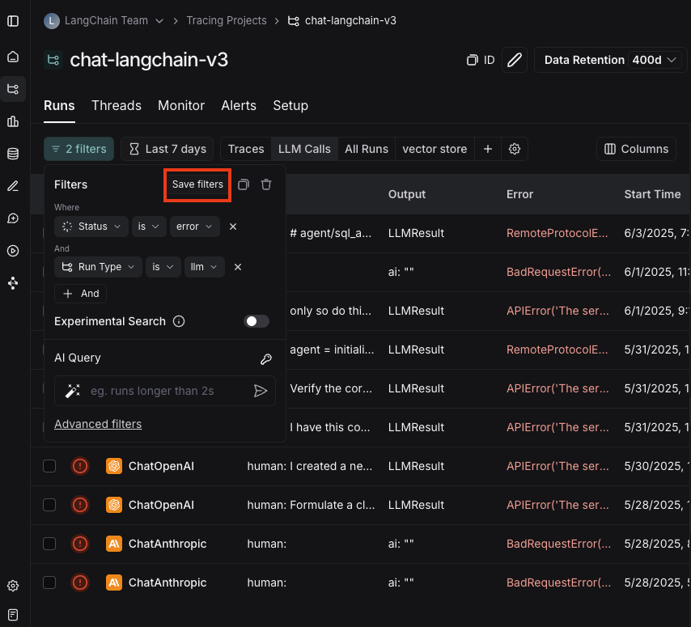

#### Use a saved filter

After saving a filter, it is available in the filter bar as a quick filter for you to use. If you have more than three saved filters, only two will be displayed directly, with the rest accessible via a "more" menu. You can use the settings icon in the saved filter bar to optionally hide default saved filters.

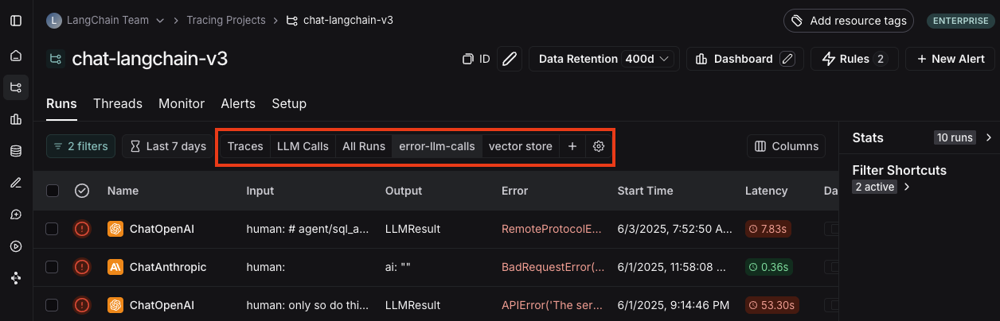

#### Update a saved filter

With the filter selected, make any changes to filter parameters. Then click **Update filter** > **Update** to update the filter.

In the same menu, you can also create a new saved filter by clicking **Update filter** > **Create new**.

#### Delete a saved filter

Click the settings icon in the saved filter bar, and delete a filter using the trash icon.

## Copy a filter

You can copy a constructed filter to share it with colleagues, reuse it later, or query runs programmatically in the [API](https://api.smith.langchain.com/redoc#tag/run/operation/query_runs_api_v1_runs_query_post) or [SDK](https://docs.smith.langchain.com/reference/python/client/langsmith.client.Client#langsmith.client.Client.list_runs).

In order to copy the filter, you can first create it in the UI. From there, you can click the copy button in the upper right hand corner. If you have constructed tree or trace filters, you can also copy those.

This will give you a string representing the filter in the LangSmith query language. For example: `and(eq(is_root, true), and(eq(feedback_key, "user_score"), eq(feedback_score, 1)))`. For more information on the query language syntax, please refer to [this reference](/reference/data_formats/trace_query_syntax#filter-query-language).

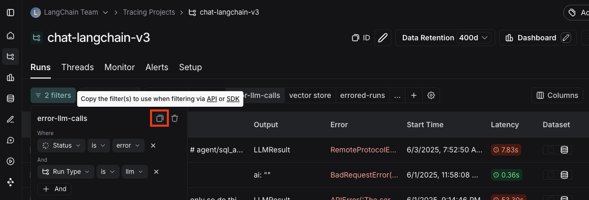

## Filtering runs within the trace view

You can also apply filters directly within the trace view, which is useful for sifting through traces with a large number of runs. The same filters available in the main runs table view can be applied here.

By default, only the runs that match the filters will be shown. To see the matched runs within the broader context of the trace tree, switch the view option from "Filtered Only" to "Show All" or "Most relevant".

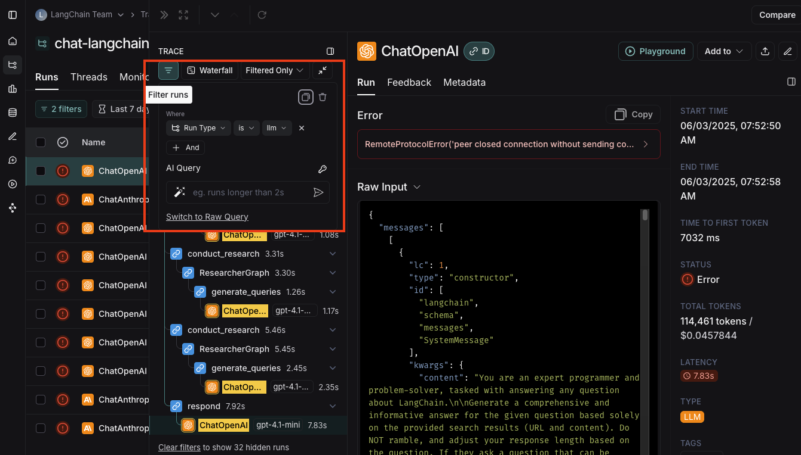

## Manually specify a raw query in LangSmith query language

If you have [copied a previously constructed filter](/observability/how_to_guides/filter_traces_in_application#copy-the-filter), you may want to manually apply this raw query in a future session.

In order to do this, can click on **Advanced filters** on the bottom of the filters popover. From there you can paste a raw query into the text box.

Note that this will add that query to the existing queries, not overwrite it.

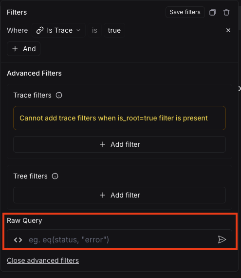

## Use an AI Query to auto-generate a query (Experimental)

Sometimes figuring out the exact query to specify can be difficult! In order to make it easier, we've added a `AI Query` functionality. With this, you can type in the filter you want to construct in natural language and it will convert it into a valid query.

For example: "All runs longer than 10 seconds"

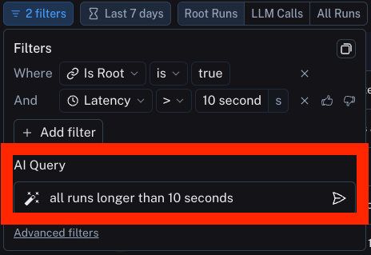

## Advanced filters

### Filter for intermediate runs (spans) on properties of the root

A common concept is to filter for intermediate runs which are part of a trace whose root run has some attribute. An example is filtering for intermediate runs of a particular type whose root run has positive (or negative) feedback associated with it.

In order to do this, first set up a filter for intermediate runs (per the above section). After that, you can then add another filter rule. You can then click the `Advanced Filters` link all the way at the bottom of the filter. This will open up a new modal where you can add `Trace filters`. These filters will apply to the traces of all the parent runs of the individual runs you've already filtered for.

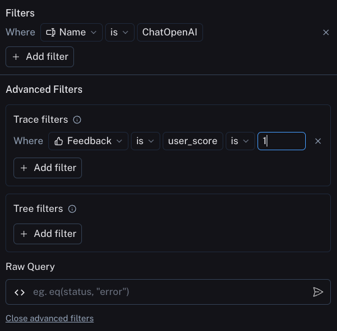

### Filter for runs (spans) whose child runs have some attribute

This is the opposite of the above. You may want to search for runs who have specific types of sub runs. An example of this could be searching for all traces that had a sub run with name `Foo`. This is useful when `Foo` is not always called, but you want to analyze the cases where it is.

In order to do this, you can click on the `Advanced Filters` link all the way at the bottom of the filter. This will open up a new modal where you can add `Tree filters`. This will make the rule you specific apply to all child runs of the individual runs you've already filtered for.

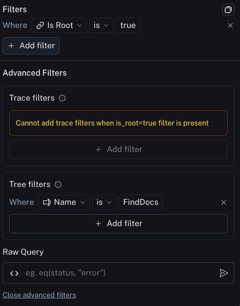

### Example: Filtering on all runs whose tree contains the tool call filter

Extending the [tool call filtering example](/observability/how_to_guides/filter_traces_in_application#example-filtering-for-tool-calls) from above, if you would like to filter for all runs _whose tree contains_ the tool filter call, you can use the tree filter in the [advanced filters](/observability/how_to_guides/filter_traces_in_application#advanced-filters) setting:

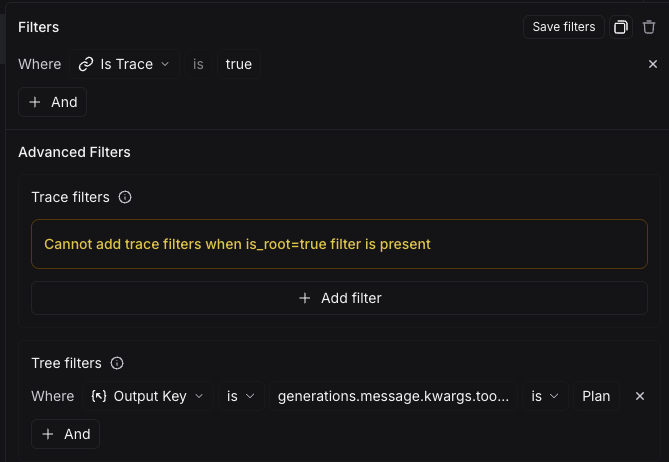
