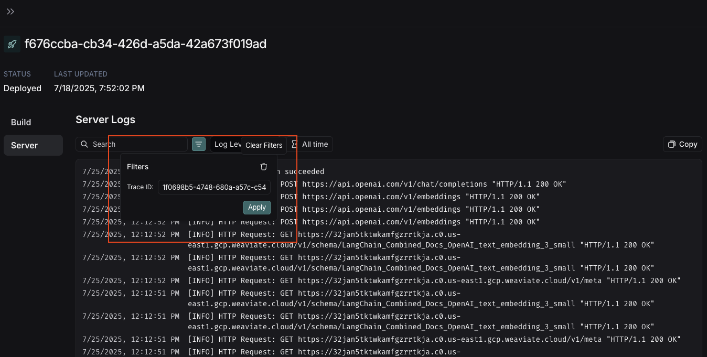

import { RegionalUrl } from "@site/src/components/RegionalUrls";

# View server logs for a trace

When viewing a trace that was generated by a run in LangGraph Platform, you can access the associated server logs directly from the trace view.

## Access server logs from trace view

In the trace view, look for the **See Logs** button in the top right corner, next to the **Run in Studio** button.


Clicking this button will take you to the server logs view for the associated deployment in LangGraph Platform.

## Server logs view

The server logs view displays logs from both:

- **LangGraph Server's own operational logs** - Internal server operations, API calls, and system events
- **User application logs** - Logs written in your graph with:
  - Python: Use the `logging` or `structlog` libraries
  - JavaScript: Use the re-exported Winston logger from `@langchain/langgraph-sdk/logging`:

```javascript
import { getLogger } from "@langchain/langgraph-sdk/logging"

const logger = getLogger()
logger.info("Your log message")
```

## Filtering logs by trace ID

When you navigate from the trace view, the **Filters** box will automatically pre-fill with the Trace ID from the trace you just viewed.

This allows you to quickly filter the logs to see only those related to your specific trace execution.


