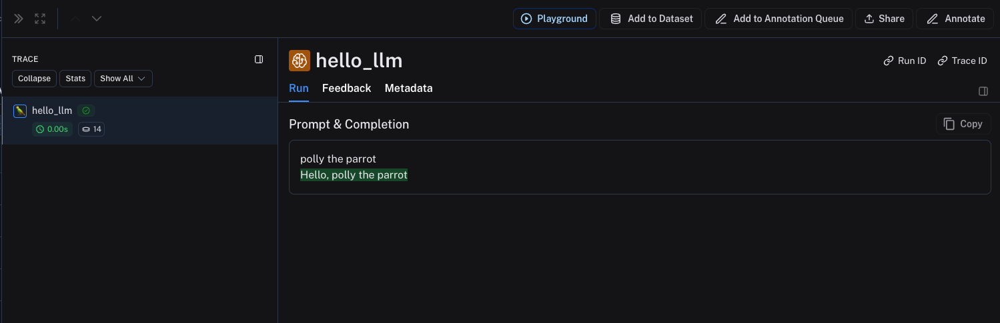

import {
  CodeTabs,
  PythonBlock,
  TypeScriptBlock,
} from "@site/src/components/InstructionsWithCode";
import { RegionalUrl } from "@site/src/components/RegionalUrls";

# Log custom LLM traces

:::note
Nothing will break if you don't log LLM traces in the correct format and data will still be logged. However, the data will not be processed or rendered in a way that is specific to LLMs.
:::

The best way to logs traces from OpenAI models is to use the [wrapper](./annotate_code#wrap-the-openai-client) available in the `langsmith` SDK for Python and TypeScript. However, you can also log traces from custom models by following the guidelines below.

LangSmith provides special rendering and processing for LLM traces, including token counting (assuming token counts are not available from the model provider) and token-based cost calculation.
In order to make the most of this feature, you must log your LLM traces in a specific format.

:::note

The examples below uses the `traceable` decorator/wrapper to log the model run (which is the recommended approach for Python and JS/TS). However, the same idea applies if you are using the [RunTree](./annotate_code#use-the-runtree-api) or <RegionalUrl type='api' suffix='/redoc' text='API' /> directly.

:::

## Chat-style models

For chat-style models, inputs must be a list of messages in OpenAI-compatible format, represented as Python dictionaries or TypeScript object. Each message must contain the key `role` and `content`.

The output is accepted in any of the following formats:

- A dictionary/object that contains the key `choices` with a value that is a list of dictionaries/objects. Each dictionary/object must contain the key `message`, which maps to a message object with the keys `role` and `content`.
- A dictionary/object that contains the key `message` with a value that is a message object with the keys `role` and `content`.
- A tuple/array of two elements, where the first element is the role and the second element is the content.
- A dictionary/object that contains the key `role` and `content`.

The input to your function should be named `messages`.

You can also provide the following `metadata` fields to help LangSmith identify the model and calculate costs. If using LangChain or [OpenAI wrapper](./annotate_code#wrap-the-openai-client), these fields will be automatically populated correctly. To learn more about how to use the `metadata` fields, see [this guide](./add_metadata_tags).

- `ls_provider`: The provider of the model, eg "openai", "anthropic", etc.
- `ls_model_name`: The name of the model, eg "gpt-4o-mini", "claude-3-opus-20240307", etc.

<CodeTabs
  tabs={[
    PythonBlock(`from langsmith import traceable\n
inputs = [
    {"role": "system", "content": "You are a helpful assistant."},
    {"role": "user", "content": "I'd like to book a table for two."},
]\n
output = {
    "choices": [
        {
            "message": {
                "role": "assistant",
                "content": "Sure, what time would you like to book the table for?"
            }
        }
    ]
}\n
# Can also use one of:
# output = {
#     "message": {
#         "role": "assistant",
#         "content": "Sure, what time would you like to book the table for?"
#     }
# }
#
# output = {
#     "role": "assistant",
#     "content": "Sure, what time would you like to book the table for?"
# }
#
# output = ["assistant", "Sure, what time would you like to book the table for?"]\n
@traceable(
    run_type="llm",
    metadata={"ls_provider": "my_provider", "ls_model_name": "my_model"}
)
def chat_model(messages: list):
    return output\n
chat_model(inputs)`),
    TypeScriptBlock(`import { traceable } from "langsmith/traceable";\n
const messages = [
  { role: "system", content: "You are a helpful assistant." },
  { role: "user", content: "I'd like to book a table for two." }
];\n
const output = {
  choices: [
    {
      message: {
        role: "assistant",
        content: "Sure, what time would you like to book the table for?"
      }
    }
  ]
};\n
// Can also use one of:
// const output = {
//   message: {
//     role: "assistant",
//     content: "Sure, what time would you like to book the table for?"
//   }
// };
//
// const output = {
//   role: "assistant",
//   content: "Sure, what time would you like to book the table for?"
// };
//
// const output = ["assistant", "Sure, what time would you like to book the table for?"];\n
const chatModel = traceable(
  async ({ messages }: { messages: { role: string; content: string }[] }) => {
    return output;
  },
  { run_type: "llm", name: "chat_model", metadata: { ls_provider: "my_provider", ls_model_name: "my_model" } }
);\n
await chatModel({ messages });`),
  ]}
  groupId="client-language"
/>

The above code will log the following trace:


## Stream outputs

For streaming, you can "reduce" the outputs into the same format as the non-streaming version. This is currently only supported in Python.

```python
def _reduce_chunks(chunks: list):
    all_text = "".join([chunk["choices"][0]["message"]["content"] for chunk in chunks])
    return {"choices": [{"message": {"content": all_text, "role": "assistant"}}]}

@traceable(
    run_type="llm",
    reduce_fn=_reduce_chunks,
    metadata={"ls_provider": "my_provider", "ls_model_name": "my_model"}
)
def my_streaming_chat_model(messages: list):
    for chunk in ["Hello, " + messages[1]["content"]]:
        yield {
            "choices": [
                {
                    "message": {
                        "content": chunk,
                        "role": "assistant",
                    }
                }
            ]
        }

list(
    my_streaming_chat_model(
        [
            {"role": "system", "content": "You are a helpful assistant. Please greet the user."},
            {"role": "user", "content": "polly the parrot"},
        ],
    )
)
```

:::tip

If `ls_model_name` is not present in `extra.metadata`, other fields might be used from the `extra.metadata` for estimating token counts. The following fields are used in the order of precedence:

1. `metadata.ls_model_name`
2. `inputs.model`
3. `inputs.model_name`

:::

## Manually provide usage information

:::tip Token-based cost tracking

To learn how to set up custom token-based cost tracking based on provided token counts, see [this guide](./calculate_token_based_costs).

:::

By default, LangSmith uses [TikToken](https://github.com/openai/tiktoken) to count tokens, utilizing a best guess at the model's tokenizer based on the `ls_model_name` provided.
However, many models already include exact token counts as part of the response. If you have this information, you can override the default token calculation in LangSmith in one of two ways:

1. Extract usage within your traced function and set a `usage_metadata` field on the run's metadata.
2. Return a `usage_metadata` field in your traced function/`RunTree` outputs.

In both cases, the usage metadata you extract should contain some of the following LangSmith-recognized fields:

```python
class ExtractedUsageMetadata(TypedDict, total=False):
    prompt_tokens: int
    """The number of tokens used for the prompt."""

    completion_tokens: int
    """The number of tokens generated as output."""

    total_tokens: int
    """The total number of tokens used."""

    input_token_details: dict[str, Any]
    """The details of the input tokens."""

    output_token_details: dict[str, Any]
    """The details of the output tokens."""

    input_cost: Decimal
    """The cost of the input tokens."""

    output_cost: Decimal
    """The cost of the output tokens."""

    total_cost: Decimal
    """The total cost of the tokens."""

    input_cost_details: dict[str, Any]
    """The cost details of the input tokens."""

    output_cost_details: dict[str, Any]
    """The cost details of the output tokens."""
```

### Setting usage metadata on the run

:::note

Modifying metadata as shown below was added in `langsmith>=0.3.43` (Python) and `langsmith>=0.3.30` (JS/TS).

:::

You can [modify the current run's metadata](./add_metadata_tags)
with usage information within your traced function. The advantage of this approach is that you do not need to actively change
your traced function's runtime outputs. Here's an example:

<CodeTabs
  tabs={[
    PythonBlock(`from langsmith import traceable, get_current_run_tree\n
inputs = [
    {"role": "system", "content": "You are a helpful assistant."},
    {"role": "user", "content": "I'd like to book a table for two."},
]\n
@traceable(
    run_type="llm",
    metadata={"ls_provider": "my_provider", "ls_model_name": "my_model"}
)
def chat_model(messages: list):
    llm_output = {
        "choices": [
            {
                "message": {
                    "role": "assistant",
                    "content": "Sure, what time would you like to book the table for?"
                }
            }
        ],
        "usage_metadata": {
            "input_tokens": 27,
            "llm_output_tokens": 13,
            "total_tokens": 40,
        },
    }
    run = get_current_run_tree()
    run.set(usage=llm_output["usage_metadata"])
    return llm_output["choices"][0]["message"]\n
chat_model(inputs)`),
    TypeScriptBlock(`import { traceable, getCurrentRunTree } from "langsmith/traceable";\n
const messages = [
  { role: "system", content: "You are a helpful assistant." },
  { role: "user", content: "I'd like to book a table for two." },
];\n
const chatModel = traceable(
  async ({
    messages,
  }: {
    messages: { role: string; content: string }[];
    model: string;
  }) => {
    const llmOutput = {
      choices: [
        {
          message: {
            role: "assistant",
            content: "Sure, what time would you like to book the table for?",
          },
        },
      ],
      usage_metadata: {
        input_tokens: 27,
        output_tokens: 13,
        total_tokens: 40,
      },
    };
    const runTree = getCurrentRunTree();
    runTree.metadata.usage_metadata = llmOutput.usage_metadata;
    return llmOutput.choices[0].message;
  },
  { run_type: "llm", name: "chat_model", metadata: { ls_provider: "my_provider", ls_model_name: "my_model" } }
);\n
await chatModel({ messages });`),
  ]}
  groupId="client-language"
/>

### Returning usage metadata

You can add a `usage_metadata` key to the function's response.
If using LangChain or [OpenAI wrapper](./annotate_code#wrap-the-openai-client), these fields will be automatically populated correctly.

<CodeTabs
  tabs={[
    PythonBlock(`from langsmith import traceable\n
inputs = [
    {"role": "system", "content": "You are a helpful assistant."},
    {"role": "user", "content": "I'd like to book a table for two."},
]\n
output = {
    "choices": [
        {
            "message": {
                "role": "assistant",
                "content": "Sure, what time would you like to book the table for?"
            }
        }
    ],
    "usage_metadata": {
        "input_tokens": 27,
        "output_tokens": 13,
        "total_tokens": 40,
    },
}\n
@traceable(
    run_type="llm",
    metadata={"ls_provider": "my_provider", "ls_model_name": "my_model"}
)
def chat_model(messages: list):
    return output\n
chat_model(inputs)`),
    TypeScriptBlock(`import { traceable } from "langsmith/traceable";\n
const messages = [
  { role: "system", content: "You are a helpful assistant." },
  { role: "user", content: "I'd like to book a table for two." },
];\n
const output = {
  choices: [
    {
      message: {
        role: "assistant",
        content: "Sure, what time would you like to book the table for?",
      },
    },
  ],
  usage_metadata: {
    input_tokens: 27,
    output_tokens: 13,
    total_tokens: 40,
  },
};\n
const chatModel = traceable(
  async ({
    messages,
  }: {
    messages: { role: string; content: string }[];
    model: string;
  }) => {
    return output;
  },
  { run_type: "llm", name: "chat_model", metadata: { ls_provider: "my_provider", ls_model_name: "my_model" } }
);\n
await chatModel({ messages });`),
  ]}
  groupId="client-language"
/>

## Instruct-style models

For instruct-style models (string in, string out), your inputs must contain a key `prompt` with a string value. Other inputs are also permitted. The output must return an object that, when serialized, contains the key `choices` with a list of dictionaries/objects. Each must contain the key `text` with a string value.
The same rules for `metadata` and `usage_metadata` apply as for chat-style models.

<CodeTabs
  tabs={[
    PythonBlock(`@traceable(
    run_type="llm",
    metadata={"ls_provider": "my_provider", "ls_model_name": "my_model"}
)
def hello_llm(prompt: str):
    return {
        "choices": [
            {"text": "Hello, " + prompt}
        ],
        "usage_metadata": {
            "input_tokens": 4,
            "output_tokens": 5,
            "total_tokens": 9,
        },
    }\n
hello_llm("polly the parrot\\n")`),
    TypeScriptBlock(`import { traceable } from "langsmith/traceable";\n
const helloLLM = traceable(
  ({ prompt }: { prompt: string }) => {
    return {
      choices: [
        { text: "Hello, " + prompt }
      ],
        usage_metadata: {
            input_tokens: 4,
            output_tokens: 5,
            total_tokens: 9,
        },
    };
  },
  { run_type: "llm", name: "hello_llm", metadata: { ls_provider: "my_provider", ls_model_name: "my_model" } }
);\n
await helloLLM({ prompt: "polly the parrot\\n" });`),
  ]}
  groupId="client-language"
/>

The above code will log the following trace:


