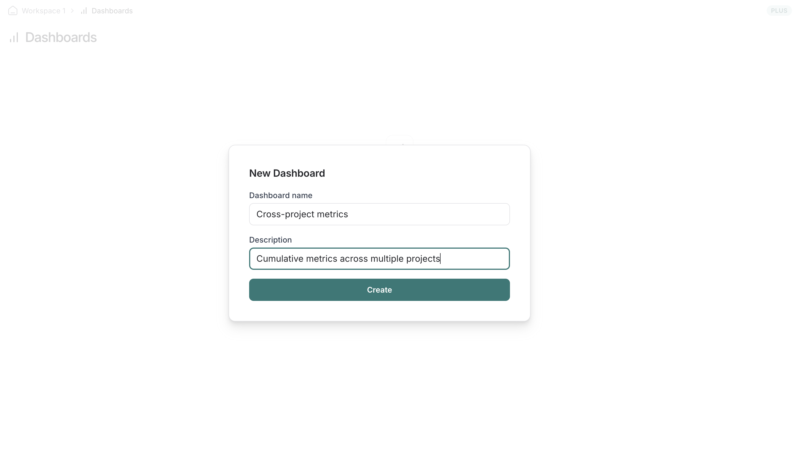
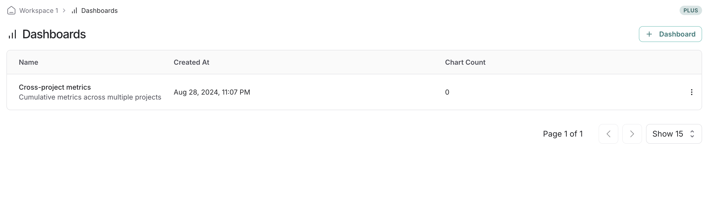
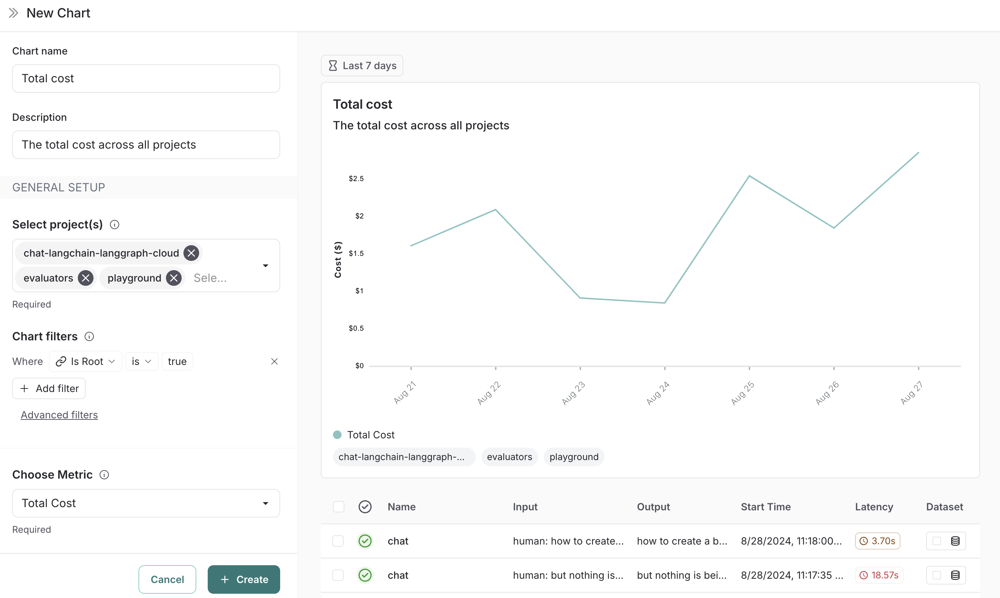
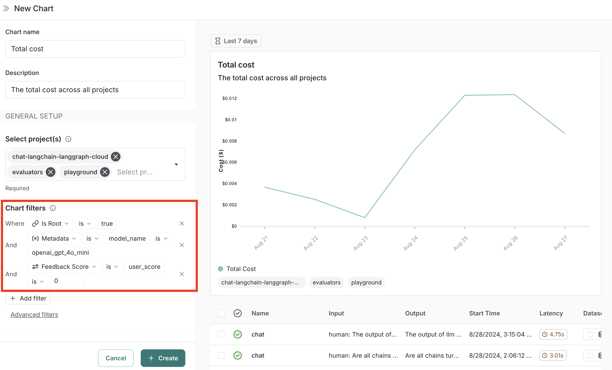
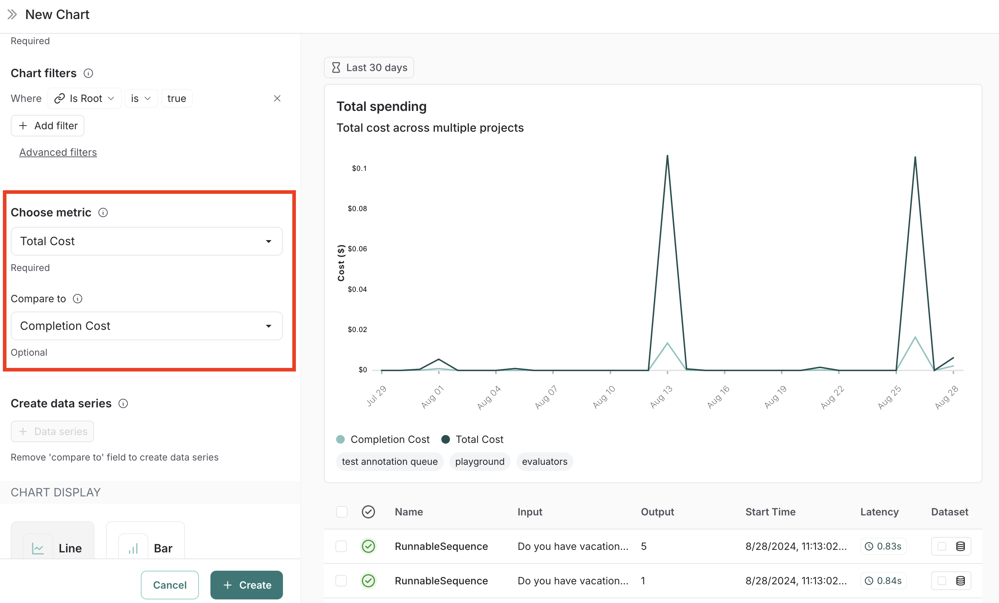
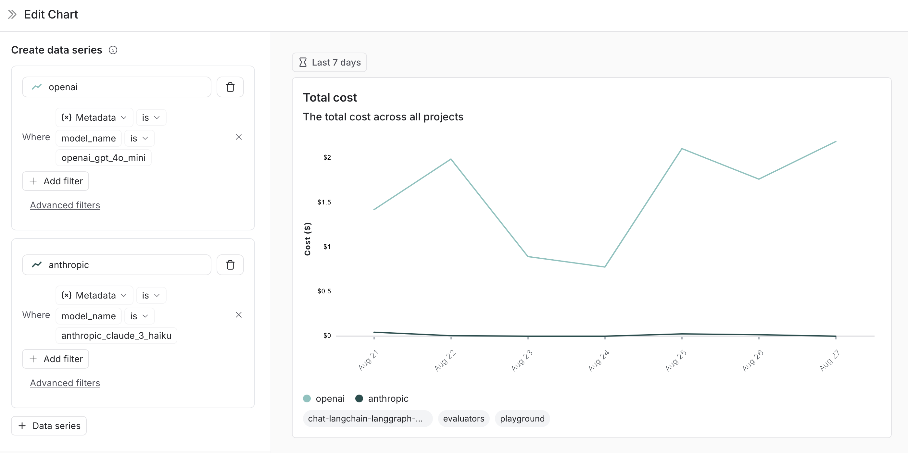
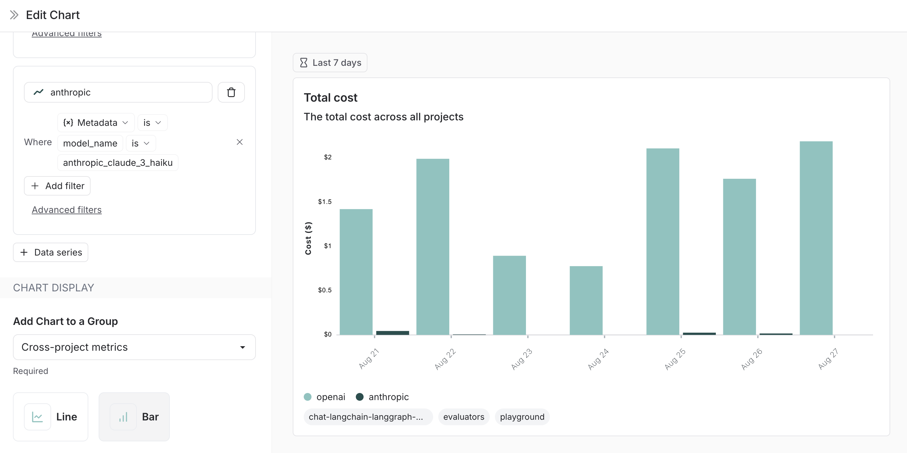
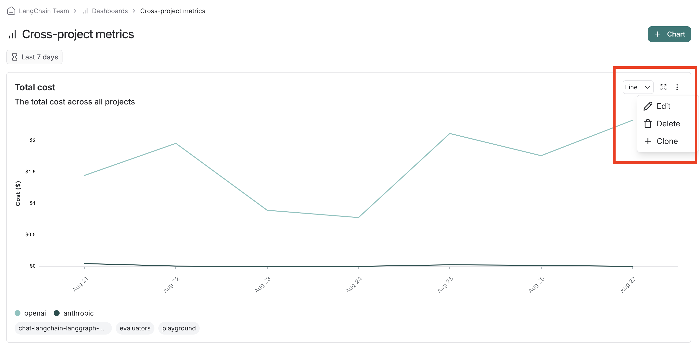
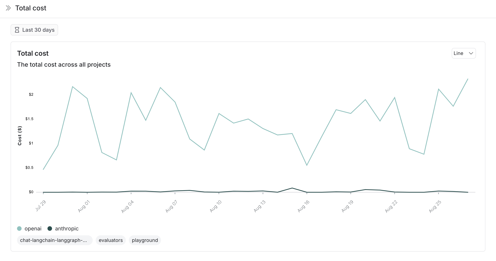
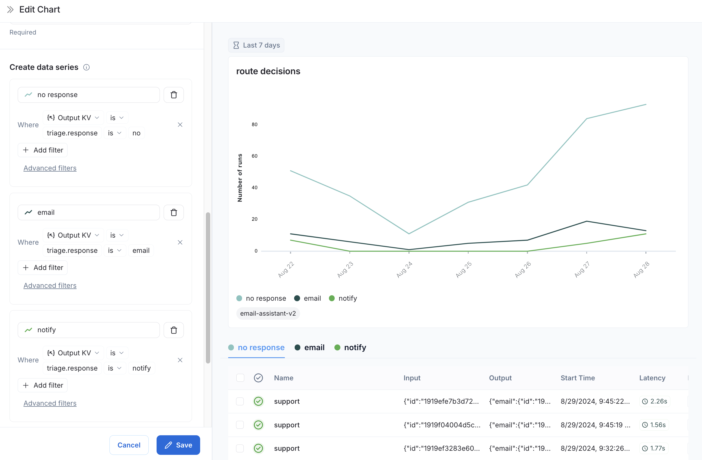

# Create dashboards

With dashboards you can create tailored collections of charts for tracking metrics that matter most to your application.

## Creating a new dashboard

1. Navigate to the `Dashboards` tab in the left sidebar.
2. Click on the `+ Dashboard` button.
3. Give your dashboard a name and a description.
4. Click on `Create`.

You'll see all of your dashboards displayed in a table view.

## Adding charts to your dashboard

1. Within a dashboard, click on the `+ Chart` button to open up the chart creation pane.
2. Give your chart a name and a description.
3. Select one or more projects to track metrics for.
4. Choose a metric from the dropdown menu to set the y-axis of your chart.

With a project and a metric selected, you'll see a preview of your chart and the matching runs.

## Filtering traces in your chart

Use the **Chart filters** section to refine the matching runs. These are the same filters available on the Projects page and apply to all data series in the chart. (See [Filter traces in application](./filter_traces_in_application) for more information on filtering traces.)

## Comparing data within a chart

There are two ways to compare data in a chart (i.e. create multiple lines in a chart):

1. **Multiple metrics**: Add multiple metrics with the same unit to a single chart. Each metric appears as a separate line. For example, compare P99 with P50 latency.
   When you pick an initial metric, the comparison metrics dropdown will only show metrics with the same unit.

Or

2. **Data series**: Create multiple data series within a chart, each with its own filters. This is useful for comparing granular data within a single metric.
   An example of using data series is to compare the performance of two different models or configurations. Name each series and apply specific filters.

## Chart display options

- Choose between a line chart and a bar chart for visualizing (you can toggle this within the dashboard view)
- Optionally reassign the chart to a different dashboard

## Saving and managing charts

- Click `Save` to save your chart to the dashboard.
- Edit or delete a chart by clicking the triple line button in the top right of the chart.
- Clone a chart by clicking the triple line button in the top right of the chart and selecting `+ Clone`. This will open a new chart creation pane with the same configurations as the original.

## View a chart in full screen

Click the expand icon in the top right corner of a chart to view it in full screen. This view offers:

- Greater detail on individual runs contributing to the chart data.
- The ability to change the time range of the chart.

## User journeys

1. **Use monitoring charts for mapping the decisions made by an agent at a particular node.**

Consider an email assistant agent. At a particular node it makes a decision about an email to:

- send an email back
- notify the user
- no response needed

We can create a chart to track and visualize the breakdown of these decisions.

**Creating the chart**

1. **Metric Selection**: Select the metric `Run count`.
2. **Chart Filters**: Add a tree filter to include all of the traces with name `triage_input`. This means we only include traces that hit the `triage_input` node. Also add a chart filter for `Is Root` is `true`, so our count is not inflated by the number of nodes in the trace.
   

3. **Data Series**: Create a data series for each decision made at the `triage_input` node. The output of the decision is stored in the `triage.response` field of the output object,
   and the value of the decision is either `no`, `email`, or `notify`. Each of these decisions generates a separate data series in the chart.
   

Now we can visualize the decisions made at the `triage_input` node over time.
