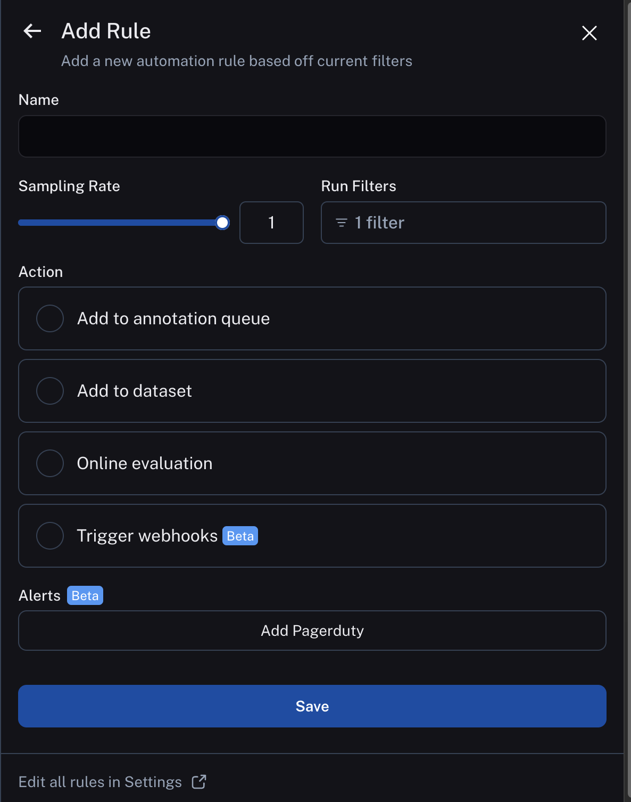
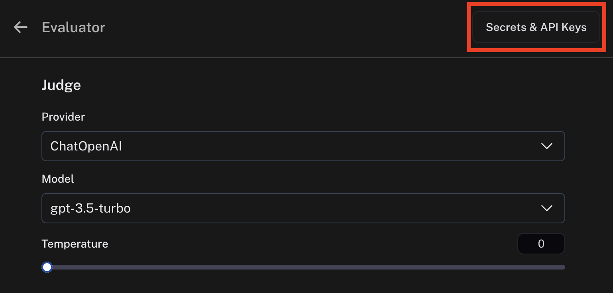
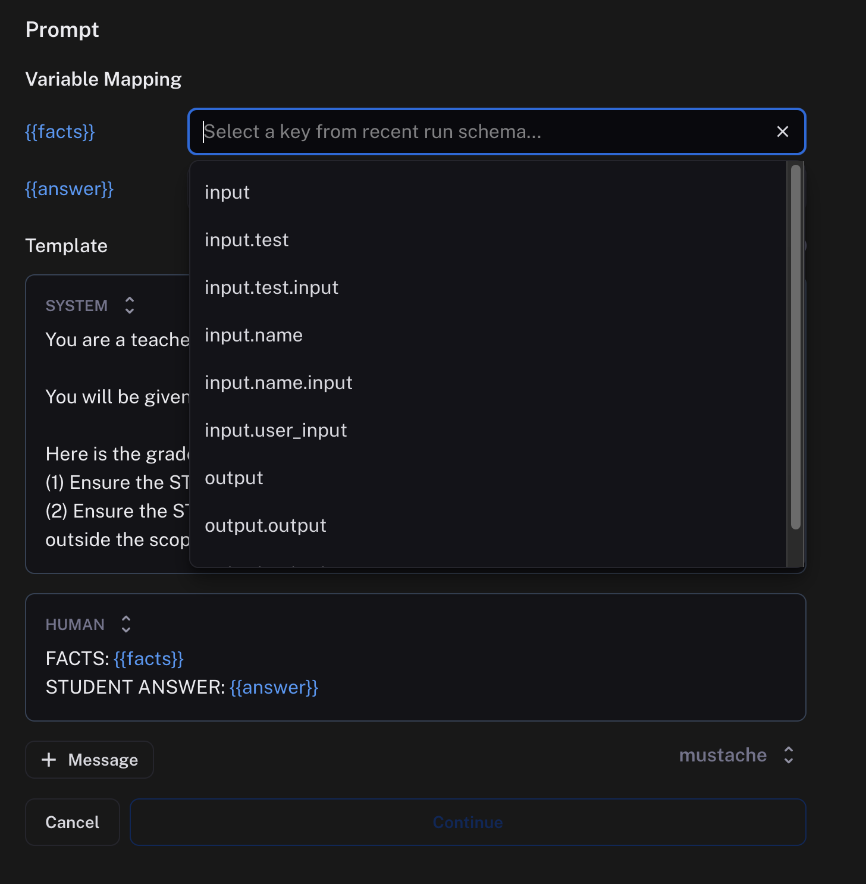
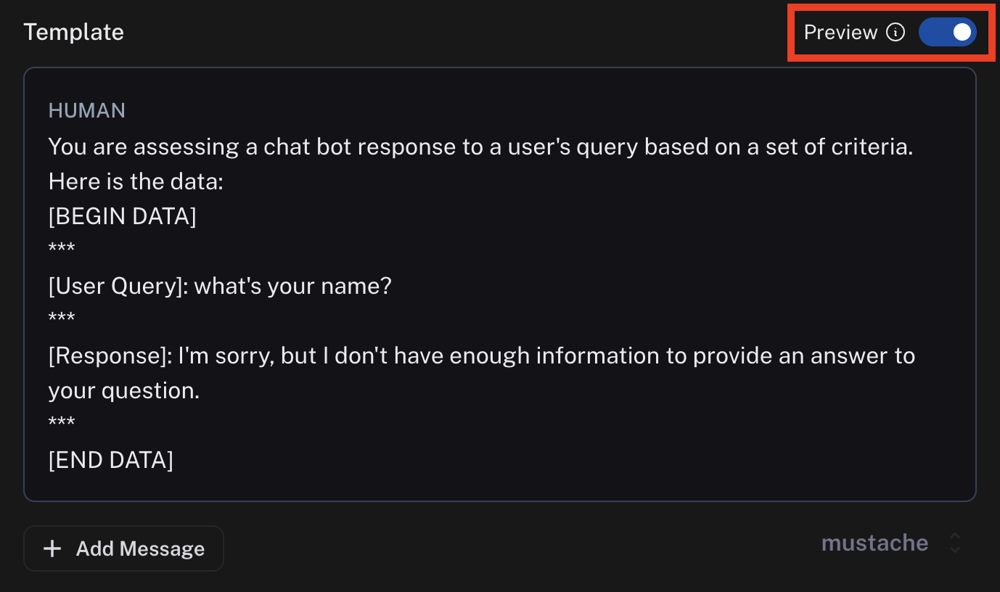
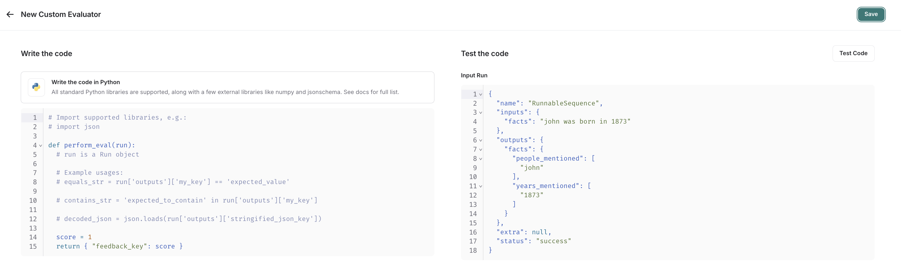

# Set up online evaluations

:::tip Recommended Reading
Before diving into this content, it might be helpful to read the following:

- [Set up automation rules](./rules)

:::

Online evaluations is a powerful LangSmith feature that allows you to gain insight on your production traces. You
simply configure a sample of runs that you want to be evaluated from production, and the evaluator will leave feedback
on sampled runs that you can query downstream in our application. There are two types of online evaluations we support:

- Custom Code: write a python evaluator directly in LangSmith. Often used for validating structure or statistical properties of your data.
- LLM as a Judge: use an LLM to evaluate your traces. Often used to understand higher level qualities of your output (e.g. toxicity, hallucination, etc)



## Configure LLM as judge evaluators

Currently, we provide support for specifying a prompt template, a model, and a set of criteria to evaluate the runs on.

After entering [rules setup](./rules), you can select `LLM-as-Judge evaluator` from the list of possible actions.

### Model

You can choose any model available in the dropdown. Currently, we support **OpenAI**, **AzureOpenAI**, and models hosted on **Fireworks**.
In order to set the API keys to use for these invocations, click on the `Secrets & API Keys` button and add the necessary keys.



### Prompt template

For the prompt template, you can select a suggested evaluator prompt, create a new prompt, or choose a prompt from the LangChain Hub.

1. #### Suggested evaluator prompts

We provide a list of pre-existing prompts that cater to common evaluator use cases.

2. #### Create your own prompt

We provide a base template from which you can form your own prompt.

3. #### Pull a prompt from the LangChain Hub

You can pull any structured prompt, private or public.

You can't edit these prompts directly within the prompt editor, but you can view the prompt and the schema it uses.
If the prompt is your own, you can edit it in the playground and commit the version.
If the prompt is someone else's, you can fork the prompt, make your edits in the playground, and then pull in your new prompt to the online evaluator.

When you choose a hub prompt for your online evaluator, the prompt will be locked to the commit version it was at rule creation. If you want to update the prompt, you can go to edit the online evaluator and re-select the prompt in the dropdown.

### Mapping variables

Prompts can be crafted with any variable name you choose. To map what is passed into your evaluator prompt from your runs or experiments, use the variable mapping inputs. There's a dropdown with suggestions provided based on the schema of your recent runs.



### Preview

Previewing the prompt will show you an example of what the formatted prompt will look like. This preview pulls the input and output of the most recent run. In the case of a dataset evaluator, the preview will also pull reference output from an example in your dataset.



:::note
You can configure an evaluation prompt that doesn't match the schema of your recent runs, but the dropdown suggestions and preview function won't work as expected.
:::

### Output schema

An evaluator will attach metadata tags to a run. These tags will have a name and a value. You can configure these in the `Schema` section.
The names and the descriptions of the fields will be passed into the prompt. Behind the scenes, we use tool calling to coerce the output of the LLM into the score you specify.
:::note
The name of the schema cannot have spaces since it is used as the name of a tool.
:::

## Configure custom code evaluators

Click `Add Rule` -> `Code evaluator` to create an evaluator.

### Write your evaluation function

:::note Custom code evaluators restrictions.

**Allowed Libraries**: You can import all standard library functions, as well as the following public packages:

```
  numpy (v2.2.2): "numpy"
  pandas (v1.5.2): "pandas"
  jsonschema (v4.21.1): "jsonschema"
  scipy (v1.14.1): "scipy"
  sklearn (v1.26.4): "scikit-learn"
```

**Network Access**: You cannot access the internet from a custom code evaluator.
:::

In the UI, you will see a panel that lets you write your code inline, with some starter code:



Custom code evaluators take in one arguments:

- A `Run` ([reference](..//reference/data_formats/run_data_format)). This represents the sampled run to evaluate.

They return a single value:

- Feedback(s) Dictionary: A dictionary whose keys are the type of feedback you want to return, and values are the
  score you will give for that feedback key. For example, `{"correctness": 1, "silliness": 0}` would create two types
  of feedback on the run, one saying it is correct, and the other saying it is not silly.

In the below screenshot, you can see an example of a simple function that validates that each run in the experiment
has a known json field:

```{python}
import json

def perform_eval(run):
  output_to_validate = run['outputs']
  is_valid_json = 0

  # assert you can serialize/deserialize as json
  try:
    json.loads(json.dumps(output_to_validate))
  except Exception as e:
    return { "formatted": False }

  # assert output facts exist
  if "facts" not in output_to_validate:
    return { "formatted": False }

  # assert required fields exist
  if "years_mentioned" not in output_to_validate["facts"]:
    return { "formatted": False }

  return {"formatted": True}
```

### Test and save your evaluation function

Before saving, you can click test, and LangSmith will pull up a recent run to make sure that your code executes properly.

Save once your code works, and your online evaluator will now run over newly sampled runs (or backfilled ones too if you chose the backfill option).
