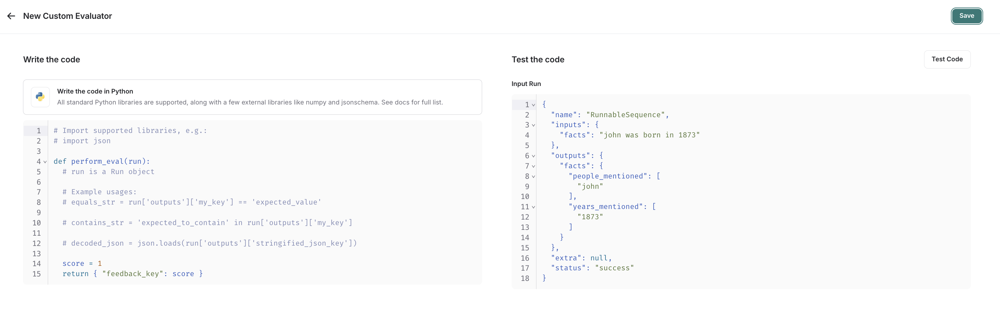

# Set up online evaluations

:::tip Recommended Reading
Before diving into this content, it might be helpful to read the following:

- Running [online evaluations](/evaluation/concepts#online-evaluation)

:::

Online evaluations provide real-time feedback on your production traces. This is useful to continuously monitor the performance of your application - to identify issues, measure improvements, and ensure consistent quality over time.

There are two types of online evaluations supported in LangSmith:

- **[LLM-as-a-judge](/evaluation/concepts#llm-as-judge)**: Use an LLM to evaluate your traces. Used as a scalable way to provide human-like judgement to your output (e.g. toxicity, hallucination, correctness, etc.).
- **Custom Code**: Write an evaluator in Python directly in LangSmith. Often used for validating structure or statistical properties of your data.

## View online evaluators

Head to the **Tracing Projects** tab and select a tracing project. To view existing online evaluators for that project, click on the **Evaluators** tab.


## Configure online evaluators

#### 1. Navigate to online evaluators

Head to the **Tracing Projects** tab and select a tracing project. Click on **+ New** in the top right corner the tracing project page, then click on **New Evaluator**.

#### 2. Name your evaluator

#### 3. Create a filter

For example, you may want to apply specific evaluators based on:

- Runs where a [user left feedback](/evaluation/how_to_guides/attach_user_feedback) indicating the response was unsatisfactory.
- Runs that invoke a specific tool call. See [filtering for tool calls](//observability/how_to_guides/filter_traces_in_application#example-filtering-for-tool-calls) for more information.
- Runs that match a particular piece of metadata (e.g. if you log traces with a `plan_type` and only want to run evaluations on traces from your enterprise customers). See [adding metadata to your traces](/observability/how_to_guides/add_metadata_tags) for more information.

Filters on evaluators work the same way as when you're filtering traces in a project. For more information on filters, you can refer to [this guide](./filter_traces_in_application).

:::tip
It's often helpful to inspect runs as you're creating a filter for your evaluator. With the evaluator configuration panel open, you can inspect runs and apply filters to them. Any filters you apply to the runs table will automatically be reflected in filters on your evaluator.
:::

#### 4. (Optional) Configure a sampling rate

Configure a sampling rate to control the percentage of filtered runs trigger the automation action. For example, to control costs, you may want to set a filter to only apply the evaluator to 10% of traces. In order to do this, you would set the sampling rate to 0.1.

#### 5. (Optional) Apply rule to past runs

Apply rule to past runs by toggling the **Apply to past runs** and entering a "Backfill from" date. This is only possible upon rule creation. Note: the backfill is processed as a background job, so you will not see the results immediately.

In order to track progress of the backfill, you can view logs for your evaluator by by heading to the **Evaluators** tab within a tracing project and clicking the Logs button for the evaluator you created. Online evaluator logs are similar to [automation rule logs](./rules#view-logs-for-your-automations).

- Add an evaluator name
- Optionally filter runs that you would like to apply your evaluator on or configure a sampling rate.
- Select **Apply Evaluator**

#### 6. Select evaluator type

- Configuring [LLM-as-a-judge evaluators](/observability/how_to_guides/online_evaluations#configure-a-llm-as-a-judge-online-evaluator)
- Configuring [custom code evaluators](/observability/how_to_guides/online_evaluations#configure-a-custom-code-evaluator)

### Configure a LLM-as-a-judge online evaluator

View this guide to configure an [LLM-as-a-judge evaluator](/evaluation/how_to_guides/llm_as_judge?mode=ui).

### Configure a custom code evaluator

Select **custom code** evaluator.

#### Write your evaluation function

:::note Custom code evaluators restrictions.

**Allowed Libraries**: You can import all standard library functions, as well as the following public packages:

```
  numpy (v2.2.2): "numpy"
  pandas (v1.5.2): "pandas"
  jsonschema (v4.21.1): "jsonschema"
  scipy (v1.14.1): "scipy"
  sklearn (v1.26.4): "scikit-learn"
```

**Network Access**: You cannot access the internet from a custom code evaluator.
:::

Custom code evaluators must be written inline. We reccomend testing locally before setting up your custom code evaluator in LangSmith.

In the UI, you will see a panel that lets you write your code inline, with some starter code:



Custom code evaluators take in one arguments:

- A `Run` ([reference](/reference/data_formats/run_data_format)). This represents the sampled run to evaluate.

They return a single value:

- Feedback(s) Dictionary: A dictionary whose keys are the type of feedback you want to return, and values are the
  score you will give for that feedback key. For example, `{"correctness": 1, "silliness": 0}` would create two types
  of feedback on the run, one saying it is correct, and the other saying it is not silly.

In the below screenshot, you can see an example of a simple function that validates that each run in the experiment
has a known json field:

```{python}
import json

def perform_eval(run):
  output_to_validate = run['outputs']
  is_valid_json = 0

  # assert you can serialize/deserialize as json
  try:
    json.loads(json.dumps(output_to_validate))
  except Exception as e:
    return { "formatted": False }

  # assert output facts exist
  if "facts" not in output_to_validate:
    return { "formatted": False }

  # assert required fields exist
  if "years_mentioned" not in output_to_validate["facts"]:
    return { "formatted": False }

  return {"formatted": True}
```

#### Test and save your evaluation function

Before saving, you can test your evaluator function on a recent run by clicking **Test Code** to make sure that your code executes properly.

Once you **Save**, your online evaluator will run over newly sampled runs (or backfilled ones too if you chose the backfill option).

If you prefer a video tutorial, check out the [Online Evaluations video](https://academy.langchain.com/pages/intro-to-langsmith-preview) from the Introduction to LangSmith Course.
