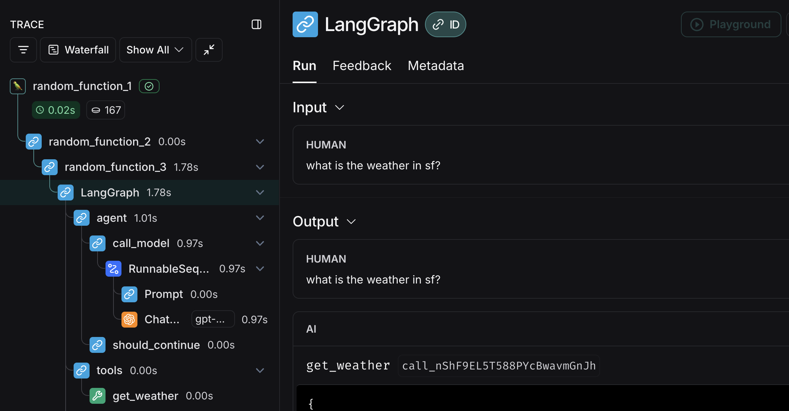

# Propagating LangSmith Traces in PromptFlow

## Introduction

This tutorial explains how to correctly propagate LangSmith traces in a [PromptFlow](https://github.com/microsoft/promptflow) application. We'll cover how to create nested traces, pass run tree information between nodes, and integrate LangGraph within a PromptFlow tool.

## Prerequisites

Before getting started, make sure you have:

- PromptFlow installed and configured
- LangSmith API key set up in your environment
- Basic understanding of PromptFlow's DAG structure

## Setting Up LangSmith Tracing in PromptFlow

### Basic Node Setup

When creating a PromptFlow application, each node can be traced as a separate trace in LangSmith. To achieve this, you use the `@traceable` decorator from LangSmith along with the `@tool` decorator from PromptFlow.

Here's the basic structure for a node:

```python
from promptflow.core import tool
import langsmith as ls

@ls.traceable(run_type="chain")
@tool
def my_tool_function(input_parameter: str) -> str:
    # Your logic here
    processed = f"Processed: {input_parameter}"
    return processed
```

## Creating Nested Traces

To create nested traces (where one trace is a child of another), you need to:

1. Get the current run tree headers in the parent node
2. Pass those headers to the child node via the `langsmith_extra` parameter
3. Use those headers in the child node

### Parent Node Example

```python
from promptflow.core import tool
import langsmith as ls
from langsmith.run_helpers import get_current_run_tree

@ls.traceable(run_type="chain")
@tool
def parent_node(input_text: str) -> dict:
    # Your custom logic here
    processed = f"Processed: {input_text}"

    # Get current run tree headers to pass downstream
    run_tree = get_current_run_tree()
    headers = run_tree.to_headers() if run_tree else {}

    return {
        "processed": processed,
        "langsmith_extra": {
            "parent": headers
        }
    }
```

### Child Node Example

```python
from promptflow.core import tool
import langsmith as ls

@ls.traceable(run_type="chain")
@tool
def child_node(processed_text: str, langsmith_extra: dict = None) -> str:
    # Your logic here
    enhanced_text = f"Enhanced: {processed_text}"
    return enhanced_text
```

### Flow YAML Configuration

Here's how to configure the flow.dag.yaml to connect these nodes with proper trace propagation:

```yaml
inputs:
  user_input:
    type: string

outputs:
  final_output:
    type: string
    reference: ${child.output}

nodes:
  - name: parent
    type: python
    source:
      type: code
      path: parent_node.py
    function: parent_node
    inputs:
      input_text: ${inputs.user_input}

  - name: child
    type: python
    source:
      type: code
      path: child_node.py
    function: child_node
    inputs:
      processed_text: ${parent.output.processed}
      langsmith_extra: ${parent.output.langsmith_extra}
```

## Important Considerations

1. **Return Type**: Make sure to correctly specify the return type of your function in the function signature to match what you're actually returning.

2. **Headers Propagation**: Always check if the run_tree exists before calling to_headers() to avoid errors.

## Using LangGraph with PromptFlow and LangSmith

You can run a LangGraph graph inside a PromptFlow tool, and it will be automatically traced within LangSmith. Here's an example:

```python
from promptflow.core import tool
import langsmith as ls
from langgraph.prebuilt import create_react_agent
from langchain_openai import ChatOpenAI
from langchain_core.tools import tool as langchain_tool

# Define a tool for the LangGraph agent
@langchain_tool
def get_weather(city):
    """Get weather information for a city."""
    if city == "nyc":
        return "Cloudy in NYC"
    elif city == "sf":
        return "Sunny in SF"
    else:
        return "Unknown city"

# Create the agent
model = ChatOpenAI(model="gpt-4o-mini")
tools = [get_weather]
agent = create_react_agent(model, tools=tools)

@ls.traceable(run_type="chain")
@tool
def graph_node(input_text: str, langsmith_extra: dict = None) -> str:
    # Process the input
    processed = f"Processing query: {input_text}"

    # Invoke the LangGraph agent
    response = agent.invoke({
        "messages": [{"role": "user", "content": input_text}]
    })

    return f"Agent response: {response}"
```

This will produce the following trace tree in LangSmith:


:::tip Note
Find out more about Nested Traces in LangSmith [here](/observability/how_to_guides/nest_traces).
:::
