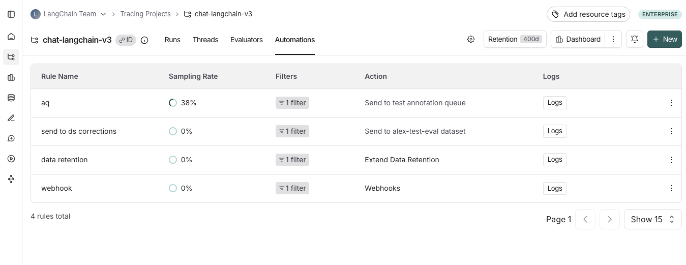

import { RegionalUrl } from "@site/src/components/RegionalUrls";

# Set up automation rules

While you can manually sift through and process production logs from our LLM application, it often becomes difficult as your application scales to more users.
LangSmith provides a powerful feature called automations that allow you to trigger certain actions on your trace data.
At a high level, automations are defined by a **filter**, **sampling rate**, and **action**.

Automation rules can trigger actions such as: adding traces to a dataset, adding to an annotation queue, and triggering a webhook (eg. for remote evaluations) or extending data retention.

:::info
To configure online evalautions, visit the [online evaluations](/observability/how_to_guides/online_evaluations) page.
::: 

An example of an automation you can set up can be _"send all traces with negative feedback to an annotation queue for human review"_. 

## View automation rules 

Head to the **Tracing Projects** tab and select a tracing project. To view existing automation rules for that tracing project, click on the **Automations** tab.

## Create a rule

  [TO-DO: VIDEO HERE]

#### 1. Navigate to rule creation

Head to the **Tracing Projects** tab and select a tracing project. Click on **+ New** in the top right corner the tracing projectpage, then click on **New Automation**.

#### 2. Name your rule

#### 3. Create a filter

Automation rule filters work the same way as filters applied traces in the project. For more information on filters, you can refer to [this guide](./filter_traces_in_application)

#### 4. (Optional) Configure a sampling rate
Configure a sampling rate to control the percentage of filtered runs trigger the automation action. 

You can specify a sampling rate between 0 and 1 for automations. This will control the percent of the filtered runs that are sent to an automation action. For example, if you set the sampling rate to 0.5, then 50% of the traces that pass the filter will be sent to the action.

#### 5. (Optional) Apply rule to past runs

Apply rule to past runs by toggling the **Apply to past runs** and entering a "Backfill from" date. This is only possible upon rule creation. Note: the backfill is processed as a background job, so you will not see the results immediately. In order to track progress of the backfill, you can [view logs for your automations](./rules#view-logs-for-your-automations) 

#### 6. Select an action to trigger when the rule is applied.

There are four actions you can take with an automation rule:

- **Add to dataset**: Add the inputs and outputs of the trace to a [dataset](/evaluation/concepts#datasets).
- **Add to annotation queue**: Add the trace to an [annotation queue](/evaluation/concepts#annotation-queues).
- **Trigger webhook**: Trigger a webhook with the trace data. For more information on webhooks, you can refer to [this guide](./webhooks).
- **Extend data retention**: Extends the data retention period on matching traces that use base retention [(see data retention docs for more details)](../../../administration/concepts#data-retention).
  Note that all other rules will also extend data retention on matching traces through the
  auto-upgrade mechanism described in the aforementioned data retention docs,
  but this rule takes no additional action.
  

## View logs for your automations

Logs allow you to gain confidence that your rules are working as expected. You can view logs for your automations by heading to the **Automations** tab within a tracing project and clicking the **Logs** button for the rule you created.

The logs tab allows you to:
- View all runs processed by a given rule for the time period selected
- If a particular rule execution has triggered an error, you can view the error message by hovering over the error icon
- You can monitor the progress of a backfill job by filtering to the rule's creation timestamp. This is because the backfill starts from when the rule was created.
- Inspect the run that the automation rule applied to using the **View run** button. For rules that add runs as examples to datasets, you can view the example produced.

[TO-DO: NEEDS REFILMING]

