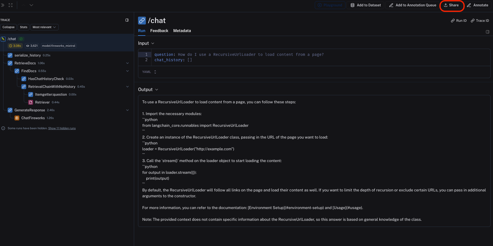
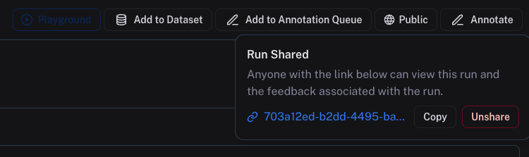
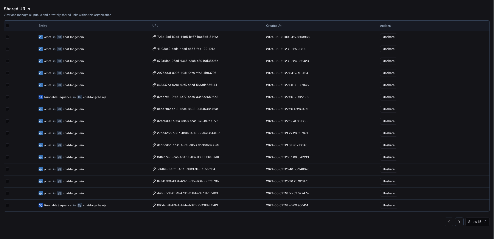

import { RegionalUrl } from "@site/src/components/RegionalUrls";

# Share or unshare a trace publicly

:::caution
Sharing a trace publicly will make it accessible to anyone with the link. Make sure you're not sharing sensitive information.

If your self-hosted or hybrid LangSmith deployment is within a VPC, then the public link is accessible only to members authenticated within your VPC.
:::

To share a trace publicly, simply click on the **Share** button in the upper right hand side of any trace view.

This will open a dialog where you can copy the link to the trace.

Shared traces will be accessible to anyone with the link, even if they don't have a LangSmith account. They will be able to view the trace, but not edit it.

To "unshare" a trace, either

1. Click on **Unshare** by click on **Public** in the upper right hand corner of any publicly shared trace, then **Unshare** in the dialog.
   

2. Navigate to your organization's list of publicly shared traces, either by clicking on **Settings** -> **Shared URLs** or <RegionalUrl text='this link' suffix='/settings/shared'/>, then click on **Unshare** next to the trace you want to unshare.
   
