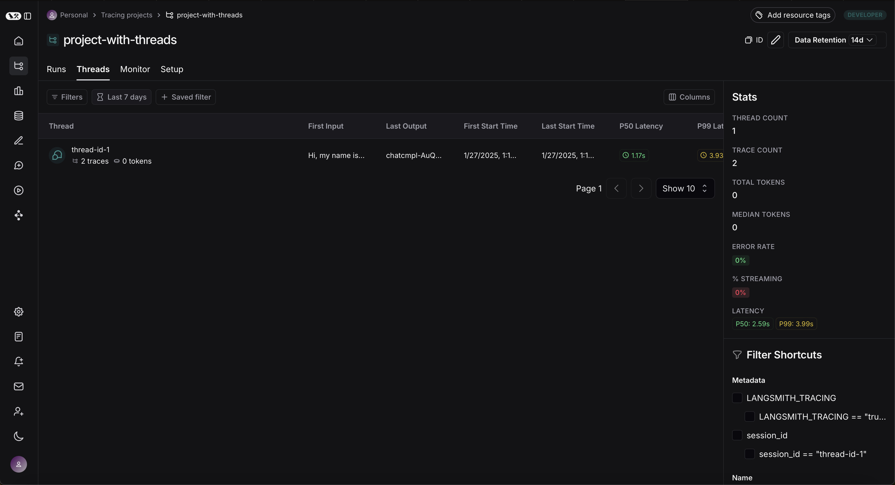
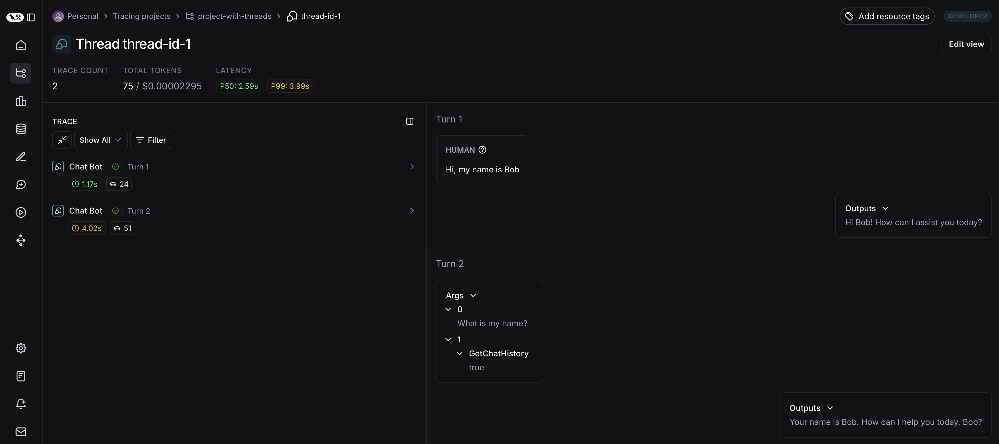

# Set up threads

:::tip Recommended Reading
Before diving into this content, it might be helpful to read the following:

- [Add metadata and tags to traces](../tracing/add_metadata_tags)

:::

Many LLM applications have a chatbot-like interface in which the user and the LLM application engage in a multi-turn conversation. In order to track these conversations, you can use the `Threads` feature in LangSmith.

## Group traces into threads

A `Thread` is a sequence of traces representing a single conversation. Each response is represented as its own trace, but these traces are linked together by being part of the same thread.

To associate traces together, you need to pass in a special `metadata` key where the value is the unique identifier for that thread.

The key value is the unique identifier for that conversation.
The key name should be one of:

- `session_id`
- `thread_id`
- `conversation_id`.

The value should be a UUID, such as `f47ac10b-58cc-4372-a567-0e02b2c3d479`.

## View threads

You can view threads by clicking on the `Threads` tad in any project details page. You will then see a list of all threads, sorted by the most recent activity.

You can then click into a particular thread. This will open the history for a particular thread. If your threads are formatted as chat messages, you will a chatbot-like UI where you can see a history of inputs and outputs.

You can open up the trace or annotate the trace in a side panel by clicking on `Annotate` and `Open trace`, respectively.
