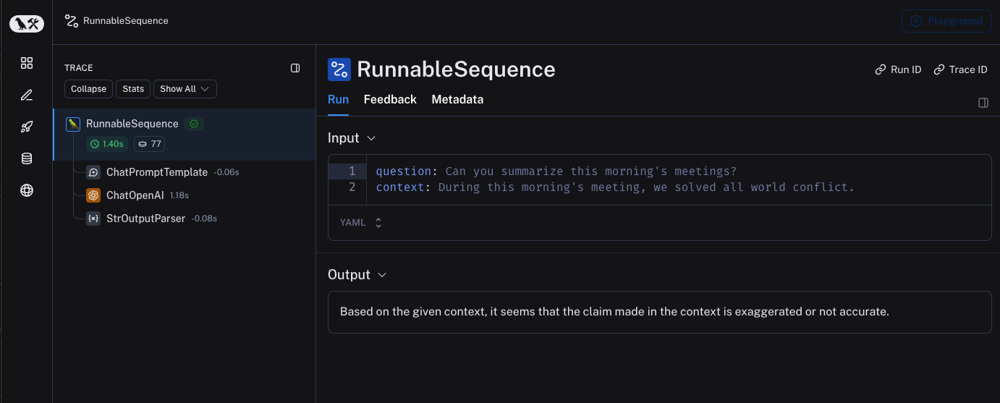
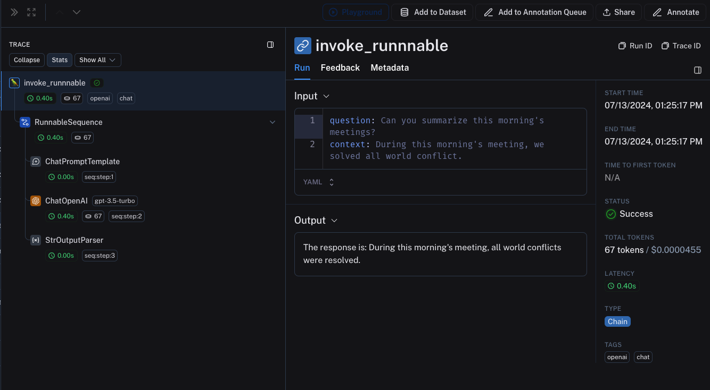
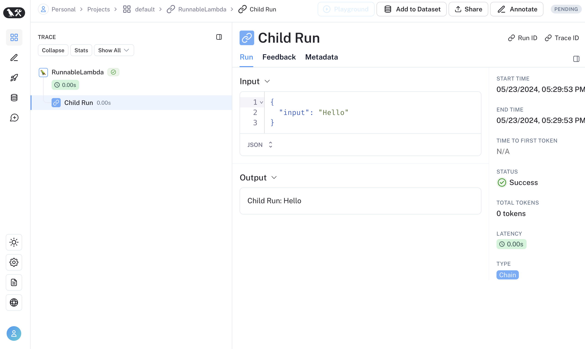
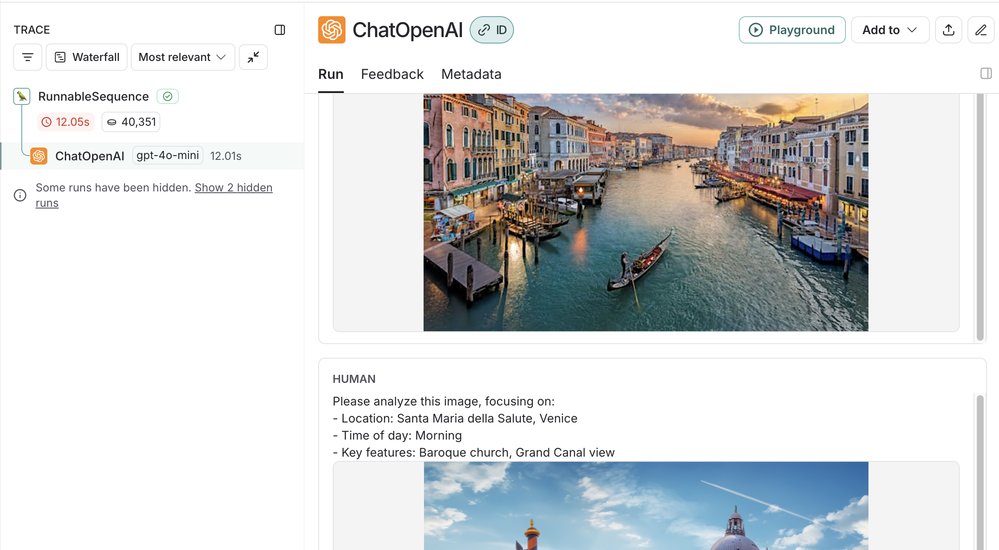

import {
  LangChainInstallationCodeTabs,
  LangChainQuickStartCodeTabs,
  ConfigureLangChainEnvironmentCodeTabs,
} from "@site/src/components/QuickStart";

import {
  CodeTabs,
  TypeScriptBlock,
  PythonBlock,
  typescript,
  python,
} from "@site/src/components/InstructionsWithCode";

# Trace with `LangChain` (Python and JS/TS)

LangSmith integrates seamlessly with LangChain ([Python](https://python.langchain.com/) and [JS](https://js.langchain.com/docs/get_started/introduction)), the popular open-source framework for building LLM applications.

## Installation

Install the core library and the OpenAI integration for Python and JS (we use the OpenAI integration for the code snippets below).

For a full list of packages available, see the [LangChain Python docs](https://python.langchain.com/docs/integrations/platforms/) and [LangChain JS docs](https://js.langchain.com/docs/integrations/platforms/).

<LangChainInstallationCodeTabs />

## Quick start

### 1. Configure your environment

<ConfigureLangChainEnvironmentCodeTabs />

### 2. Log a trace

No extra code is needed to log a trace to LangSmith. Just run your LangChain code as you normally would.

<LangChainQuickStartCodeTabs />

### 3. View your trace

By default, the trace will be logged to the project with the name `default`. An example of a trace logged using the above code is made public and can be viewed [here](https://smith.langchain.com/public/e6a46eb2-d785-4804-a1e3-23f167a04300/r).



## Trace selectively

The [previous section](#quick-start) showed how to trace all invocations of a LangChain runnables within your applications by setting a single environment variable. While this is a convenient way to get started, you may want to trace only specific invocations or parts of your application.

There are two ways to do this in Python: by manually passing in a `LangChainTracer` ([reference docs](https://api.python.langchain.com/en/latest/tracers/langchain_core.tracers.langchain.LangChainTracer.html#langchain_core.tracers.langchain.LangChainTracer)) instance as a callback, or by using the `tracing_v2_enabled` context manager ([reference docs](https://api.python.langchain.com/en/latest/tracers/langchain_core.tracers.context.tracing_v2_enabled.html)).

In JS/TS, you can pass a `LangChainTracer` ([reference docs](https://api.js.langchain.com/classes/langchain_core_tracers_tracer_langchain.LangChainTracer.html)) instance as a callback.

<CodeTabs
  tabs={[
    PythonBlock(`# You can configure a LangChainTracer instance to trace a specific invocation.
from langchain.callbacks.tracers import LangChainTracer\n
tracer = LangChainTracer()
chain.invoke({"question": "Am I using a callback?", "context": "I'm using a callback"}, config={"callbacks": [tracer]})\n
# LangChain Python also supports a context manager for tracing a specific block of code.
from langchain_core.tracers.context import tracing_v2_enabled
with tracing_v2_enabled():
    chain.invoke({"question": "Am I using a context manager?", "context": "I'm using a context manager"})\n
# This will NOT be traced (assuming LANGSMITH_TRACING is not set)
chain.invoke({"question": "Am I being traced?", "context": "I'm not being traced"})`),
    TypeScriptBlock(`// You can configure a LangChainTracer instance to trace a specific invocation.
import { LangChainTracer } from "@langchain/core/tracers/tracer_langchain";\n
const tracer = new LangChainTracer();
await chain.invoke(
  {
    question: "Am I using a callback?",
    context: "I'm using a callback"
  },
  { callbacks: [tracer] }
);`),
  ]}
  groupId="client-language"
/>

## Log to a specific project

### Statically

As mentioned in the [tracing conceptual guide](../concepts) LangSmith uses the concept of a Project to group traces. If left unspecified, the tracer project is set to default. You can set the `LANGSMITH_PROJECT` environment variable to configure a custom project name for an entire application run. This should be done before executing your application.

```shell
export LANGSMITH_PROJECT=my-project
```

:::warning SDK compatibility in JS
The `LANGSMITH_PROJECT` flag is only supported in JS SDK versions >= 0.2.16, use `LANGCHAIN_PROJECT` instead if you are using an older version.
:::

### Dynamically

This largely builds off of the [previous section](#trace-selectively) and allows you to set the project name for a specific `LangChainTracer` instance or as parameters to the `tracing_v2_enabled` context manager in Python.

<CodeTabs
  tabs={[
    PythonBlock(`# You can set the project name for a specific tracer instance:
from langchain.callbacks.tracers import LangChainTracer\n
tracer = LangChainTracer(project_name="My Project")
chain.invoke({"question": "Am I using a callback?", "context": "I'm using a callback"}, config={"callbacks": [tracer]})\n
# You can set the project name using the project_name parameter.
from langchain_core.tracers.context import tracing_v2_enabled
with tracing_v2_enabled(project_name="My Project"):
    chain.invoke({"question": "Am I using a context manager?", "context": "I'm using a context manager"})`),
    TypeScriptBlock(`// You can set the project name for a specific tracer instance:
import { LangChainTracer } from "@langchain/core/tracers/tracer_langchain";\n
const tracer = new LangChainTracer({ projectName: "My Project" });
await chain.invoke(
  {
    question: "Am I using a callback?",
    context: "I'm using a callback"
  },
  { callbacks: [tracer] }
);`),
  ]}
  groupId="client-language"
/>

## Add metadata and tags to traces

You can send annotate your traces with arbitrary metadata and tags by providing them in the [Config](https://api.python.langchain.com/en/latest/runnables/langchain_core.runnables.config.RunnableConfig.html#langchain-core-runnables-config-runnableconfig).
This is useful for associating additional information with a trace, such as the environment in which it was executed, or the user who initiated it.
For information on how to query traces and runs by metadata and tags, see [this guide](./export_traces)

:::note

When you attach metadata or tags to a runnable (either through the RunnableConfig or at runtime with invocation params), they are inherited by all child runnables of that runnable.

:::

<CodeTabs
  tabs={[
    PythonBlock(`from langchain_openai import ChatOpenAI
from langchain_core.prompts import ChatPromptTemplate
from langchain_core.output_parsers import StrOutputParser\n
prompt = ChatPromptTemplate.from_messages([
  ("system", "You are a helpful AI."),
  ("user", "{input}")
])
# The tag "model-tag" and metadata {"model-key": "model-value"} will be attached to the ChatOpenAI run only
# highlight-next-line
chat_model = ChatOpenAI().with_config({"tags": ["model-tag"], "metadata": {"model-key": "model-value"}})
output_parser = StrOutputParser()\n
# Tags and metadata can be configured with RunnableConfig
# highlight-next-line
chain = (prompt | chat_model | output_parser).with_config({"tags": ["config-tag"], "metadata": {"config-key": "config-value"}})\n
# Tags and metadata can also be passed at runtime
# highlight-next-line
chain.invoke({"input": "What is the meaning of life?"}, {"tags": ["invoke-tag"], "metadata": {"invoke-key": "invoke-value"}})`),
    TypeScriptBlock(`import { ChatOpenAI } from "@langchain/openai";
import { ChatPromptTemplate } from "@langchain/core/prompts";
import { StringOutputParser } from "@langchain/core/output_parsers";\n
const prompt = ChatPromptTemplate.fromMessages([
  ["system", "You are a helpful AI."],
  ["user", "{input}"]
])
// The tag "model-tag" and metadata {"model-key": "model-value"} will be attached to the ChatOpenAI run only
const model = new ChatOpenAI().withConfig({ tags: ["model-tag"], metadata: { "model-key": "model-value" } });
const outputParser = new StringOutputParser();\n
// Tags and metadata can be configured with RunnableConfig
const chain = (prompt.pipe(model).pipe(outputParser)).withConfig({"tags": ["config-tag"], "metadata": {"config-key": "top-level-value"}});\n
// Tags and metadata can also be passed at runtime
await chain.invoke({input: "What is the meaning of life?"}, {tags: ["invoke-tag"], metadata: {"invoke-key": "invoke-value"}})`),
  ]}
  groupId="client-language"
/>

## Customize run name

You can customize the name of a given run when invoking or streaming your LangChain code by providing it in the [Config](https://api.python.langchain.com/en/latest/runnables/langchain_core.runnables.config.RunnableConfig.html#langchain-core-runnables-config-runnableconfig).
This name is used to identify the run in LangSmith and can be used to filter and group runs. The name is also used as the title of the run in the LangSmith UI.
This can be done by setting a `run_name` in the `RunnableConfig` object at construction or by passing a `run_name` in the invocation parameters in JS/TS.

:::note

This feature is not currently supported directly for LLM objects.

:::

<CodeTabs
  tabs={[
    PythonBlock(`# When tracing within LangChain, run names default to the class name of the traced object (e.g., 'ChatOpenAI').
configured_chain = chain.with_config({"run_name": "MyCustomChain"})
configured_chain.invoke({"input": "What is the meaning of life?"})\n
# You can also configure the run name at invocation time, like below
chain.invoke({"input": "What is the meaning of life?"}, {"run_name": "MyCustomChain"})`),
    TypeScriptBlock(`// When tracing within LangChain, run names default to the class name of the traced object (e.g., 'ChatOpenAI').
const configuredChain = chain.withConfig({ runName: "MyCustomChain" });
await configuredChain.invoke({ input: "What is the meaning of life?" });\n
// You can also configure the run name at invocation time, like below
await chain.invoke({ input: "What is the meaning of life?" }, {runName: "MyCustomChain"})`),
  ]}
  groupId="client-language"
/>

## Customize run ID

You can customize the ID of a given run when invoking or streaming your LangChain code by providing it in the [Config](https://api.python.langchain.com/en/latest/runnables/langchain_core.runnables.config.RunnableConfig.html#langchain-core-runnables-config-runnableconfig).
This ID is used to uniquely identify the run in LangSmith and can be used to query specific runs. The ID can be useful for linking runs across different systems or for implementing custom tracking logic.
This can be done by setting a `run_id` in the `RunnableConfig` object at construction or by passing a `run_id` in the invocation parameters in JS/TS.

:::note

This feature is not currently supported directly for LLM objects.

:::

<CodeTabs
  tabs={[
    PythonBlock(`import uuid\n
my_uuid = uuid.uuid4()
# You can configure the run ID at invocation time:
chain.invoke({"input": "What is the meaning of life?"}, {"run_id": my_uuid})`),
    TypeScriptBlock(`import { v4 as uuidv4 } from 'uuid';\n
const myUuid = uuidv4();\n
// You can configure the run ID at invocation time, like below
await chain.invoke({ input: "What is the meaning of life?" }, { runId: myUuid });`),
  ]}
  groupId="client-language"
/>

Note that if you do this at the **root** of a trace (i.e., the top-level run, that run ID will be used as the `trace_id`).

## Access run (span) ID for LangChain invocations

When you invoke a LangChain object, you can access the run ID of the invocation. This run ID can be used to query the run in LangSmith.

In Python, you can use the `collect_runs` context manager to access the run ID.

In JS/TS, you can use a `RunCollectorCallbackHandler` instance to access the run ID.

<CodeTabs
  tabs={[
    PythonBlock(`from langchain_openai import ChatOpenAI
from langchain_core.prompts import ChatPromptTemplate
from langchain_core.output_parsers import StrOutputParser
from langchain_core.tracers.context import collect_runs\n
prompt = ChatPromptTemplate.from_messages([
    ("system", "You are a helpful assistant. Please respond to the user's request only based on the given context."),
    ("user", "Question: {question}\\n\\nContext: {context}")
])
model = ChatOpenAI(model="gpt-4o-mini")
output_parser = StrOutputParser()\n
chain = prompt | model | output_parser\n
question = "Can you summarize this morning's meetings?"
context = "During this morning's meeting, we solved all world conflict."
with collect_runs() as cb:
  result = chain.invoke({"question": question, "context": context})
  # Get the root run id
  # highlight-next-line
  run_id = cb.traced_runs[0].id
print(run_id)`),
    TypeScriptBlock(`import { ChatOpenAI } from "@langchain/openai";
import { ChatPromptTemplate } from "@langchain/core/prompts";
import { StringOutputParser } from "@langchain/core/output_parsers";
import { RunCollectorCallbackHandler } from "@langchain/core/tracers/run_collector";\n
const prompt = ChatPromptTemplate.fromMessages([
  ["system", "You are a helpful assistant. Please respond to the user's request only based on the given context."],
  ["user", "Question: {question\\n\\nContext: {context}"],
]);
const model = new ChatOpenAI({ modelName: "gpt-4o-mini" });
const outputParser = new StringOutputParser();\n
const chain = prompt.pipe(model).pipe(outputParser);
const runCollector = new RunCollectorCallbackHandler();\n
const question = "Can you summarize this morning's meetings?"
const context = "During this morning's meeting, we solved all world conflict."
await chain.invoke(
    { question: question, context: context },
    { callbacks: [runCollector] }
);
// highlight-next-line
const runId = runCollector.tracedRuns[0].id;
console.log(runId);`),
  ]}
  groupId="client-language"
/>

## Ensure all traces are submitted before exiting

In LangChain Python, LangSmith's tracing is done in a background thread to avoid obstructing your production application. This means that your process may end before all traces are successfully posted to LangSmith. This is especially prevalent in a serverless environment, where your VM may be terminated immediately once your chain or agent completes.

You can make callbacks synchronous by setting the `LANGCHAIN_CALLBACKS_BACKGROUND` environment variable to `"false"`.

For both languages, LangChain exposes methods to wait for traces to be submitted before exiting your application.
Below is an example:

<CodeTabs
  tabs={[
    PythonBlock(`from langchain_openai import ChatOpenAI
from langchain_core.tracers.langchain import wait_for_all_tracers\n
llm = ChatOpenAI()
try:
    llm.invoke("Hello, World!")
finally:
    # highlight-next-line
    wait_for_all_tracers()
`),
    TypeScriptBlock(`import { ChatOpenAI } from "@langchain/openai";
import { awaitAllCallbacks } from "@langchain/core/callbacks/promises";\n
try {
  const llm = new ChatOpenAI();
  const response = await llm.invoke("Hello, World!");
} catch (e) {
  // handle error
} finally {
   // highlight-next-line
  await awaitAllCallbacks();
}
`),
  ]}
  groupId="client-language"
/>

## Trace without setting environment variables

As mentioned in other guides, the following environment variables allow you to configure tracing enabled, the api endpoint, the api key, and the tracing project:

- `LANGSMITH_TRACING`
- `LANGSMITH_API_KEY`
- `LANGSMITH_ENDPOINT`
- `LANGSMITH_PROJECT`

However, in some environments, it is not possible to set environment variables. In these cases, you can set the tracing configuration programmatically.

This largely builds off of the [previous section](#trace-selectively).

<CodeTabs
  tabs={[
    PythonBlock(`from langchain.callbacks.tracers import LangChainTracer
from langsmith import Client\n
# You can create a client instance with an api key and api url
client = Client(
    api_key="YOUR_API_KEY",  # This can be retrieved from a secrets manager
    api_url="https://api.smith.langchain.com",  # Update appropriately for self-hosted installations or the EU region
)\n
# You can pass the client and project_name to the LangChainTracer instance
# highlight-next-line
tracer = LangChainTracer(client=client, project_name="test-no-env")
chain.invoke({"question": "Am I using a callback?", "context": "I'm using a callback"}, config={"callbacks": [tracer]})\n
# LangChain Python also supports a context manager which allows passing the client and project_name
from langchain_core.tracers.context import tracing_v2_enabled
# highlight-next-line
with tracing_v2_enabled(client=client, project_name="test-no-env"):
    chain.invoke({"question": "Am I using a context manager?", "context": "I'm using a context manager"})`),
    TypeScriptBlock(`import { LangChainTracer } from "@langchain/core/tracers/tracer_langchain";
import { Client } from "langsmith";\n
// You can create a client instance with an api key and api url
const client = new Client(
    {
        apiKey: "YOUR_API_KEY",
        apiUrl: "https://api.smith.langchain.com", // Update appropriately for self-hosted installations or the EU region
    }
);\n
// You can pass the client and project_name to the LangChainTracer instance
// highlight-next-line
const tracer = new LangChainTracer({client, projectName: "test-no-env"});
await chain.invoke(
  {
    question: "Am I using a callback?",
    context: "I'm using a callback",
  },
  { callbacks: [tracer] }
);`),
  ]}
  groupId="client-language"
/>

## Distributed tracing with LangChain (Python)

LangSmith supports distributed tracing with LangChain Python. This allows you to link runs (spans) across different services and applications.
The principles are similar to the [distributed tracing guide](./distributed_tracing) for the LangSmith SDK.

```python
import langsmith
from langchain_core.runnables import chain
from langsmith.run_helpers import get_current_run_tree

# -- This code should be in a separate file or service --
@chain
def child_chain(inputs):
    return inputs["test"] + 1

def child_wrapper(x, headers):
    with langsmith.tracing_context(parent=headers):
        child_chain.invoke({"test": x})

# -- This code should be in a separate file or service --
@chain
def parent_chain(inputs):

    rt = get_current_run_tree()
    headers = rt.to_headers()
    # ... make a request to another service with the headers
    # The headers should be passed to the other service, eventually to the child_wrapper function

parent_chain.invoke({"test": 1})
```

## Interoperability between LangChain (Python) and LangSmith SDK

If you are using LangChain for part of your application and the LangSmith SDK (see [this guide](./annotate_code)) for other parts, you can still trace the entire application seamlessly.

LangChain objects will be traced when invoked within a `traceable` function and be bound as a child run of the `traceable` function.

```python
from langchain_openai import ChatOpenAI
from langchain_core.prompts import ChatPromptTemplate
from langchain_core.output_parsers import StrOutputParser

from langsmith import traceable

prompt = ChatPromptTemplate.from_messages([
    ("system", "You are a helpful assistant. Please respond to the user's request only based on the given context."),
    ("user", "Question: {question}\nContext: {context}")
])
model = ChatOpenAI(model="gpt-4o-mini")
output_parser = StrOutputParser()

chain = prompt | model | output_parser

# The above chain will be traced as a child run of the traceable function
@traceable(
    tags=["openai", "chat"],
    metadata={"foo": "bar"}
)
def invoke_runnnable(question, context):
    result = chain.invoke({"question": question, "context": context})
    return "The response is: " + result

invoke_runnnable("Can you summarize this morning's meetings?", "During this morning's meeting, we solved all world conflict.")
```

This will produce the following trace tree:


## Interoperability between LangChain.JS and LangSmith SDK

### Tracing LangChain objects inside `traceable` (JS only)

Starting with `langchain@0.2.x`, LangChain objects are traced automatically when used inside `@traceable` functions, inheriting the client, tags, metadata and project name of the traceable function.

For older versions of LangChain below `0.2.x`, you will need to manually pass an instance `LangChainTracer` created from the tracing context found in `@traceable`.

```typescript
import { ChatOpenAI } from "@langchain/openai";
import { ChatPromptTemplate } from "@langchain/core/prompts";
import { StringOutputParser } from "@langchain/core/output_parsers";
// highlight-next-line
import { getLangchainCallbacks } from "langsmith/langchain";

const prompt = ChatPromptTemplate.fromMessages([
  [
    "system",
    "You are a helpful assistant. Please respond to the user's request only based on the given context.",
  ],
  ["user", "Question: {question}\nContext: {context}"],
]);
const model = new ChatOpenAI({ modelName: "gpt-4o-mini" });
const outputParser = new StringOutputParser();

const chain = prompt.pipe(model).pipe(outputParser);

const main = traceable(
  async (input: { question: string; context: string }) => {
    // highlight-start
    const callbacks = await getLangchainCallbacks();
    const response = await chain.invoke(input, { callbacks });
    // highlight-end
    return response;
  },
  { name: "main" }
);
```

### Tracing LangChain child runs via `traceable` / RunTree API (JS only)

:::note

We're working on improving the interoperability between `traceable` and LangChain. The following limitations are present when using combining LangChain with `traceable`:

1. Mutating RunTree obtained from `getCurrentRunTree()` of the RunnableLambda context will result in a no-op.
2. It's discouraged to traverse the RunTree obtained from RunnableLambda via `getCurrentRunTree()` as it may not contain all the RunTree nodes.
3. Different child runs may have the same `execution_order` and `child_execution_order` value. Thus in extreme circumstances, some runs may end up in a different order, depending on the `start_time`.

:::

In some uses cases, you might want to run `traceable` functions as part of the RunnableSequence or trace child runs of LangChain run imperatively via the `RunTree` API. Starting with LangSmith 0.1.39 and @langchain/core 0.2.18, you can directly invoke `traceable`-wrapped functions within RunnableLambda.

```typescript
import { traceable } from "langsmith/traceable";
import { RunnableLambda } from "@langchain/core/runnables";
import { RunnableConfig } from "@langchain/core/runnables";

const tracedChild = traceable((input: string) => `Child Run: ${input}`, {
  name: "Child Run",
});

const parrot = new RunnableLambda({
  func: async (input: { text: string }, config?: RunnableConfig) => {
    // highlight-start
    return await tracedChild(input.text);
    // highlight-end
  },
});
```



Alternatively, you can convert LangChain's `RunnableConfig` to a equivalent RunTree object by using `RunTree.fromRunnableConfig` or pass the `RunnableConfig` as the first argument of `traceable`-wrapped function.

<CodeTabs
  tabs={[
    typescript({ value: "traceable", label: "Traceable" })`
    
      import { traceable } from "langsmith/traceable";
      import { RunnableLambda } from "@langchain/core/runnables";
      import { RunnableConfig } from "@langchain/core/runnables";
      
      const tracedChild = traceable((input: string) => \`Child Run: $\{input\}\`, {
        name: "Child Run",
      });
      
      const parrot = new RunnableLambda({
        func: async (input: { text: string }, config?: RunnableConfig) => {
          // highlight-start
          // Pass the config to existing traceable function
          await tracedChild(config, input.text);
          // highlight-end
          return input.text;
        },
      });
    `,
    typescript({ value: "runtree", label: "Run Tree" })`
      import { RunTree } from "langsmith/run_trees";
      import { RunnableLambda } from "@langchain/core/runnables";
      import { RunnableConfig } from "@langchain/core/runnables";
      
      const parrot = new RunnableLambda({
        func: async (input: { text: string }, config?: RunnableConfig) => {
          // highlight-start
          // create the RunTree from the RunnableConfig of the RunnableLambda
          const childRunTree = RunTree.fromRunnableConfig(config, {
            name: "Child Run",
          });
          // highlight-end
          
          childRunTree.inputs = { input: input.text };
          await childRunTree.postRun();
          
          childRunTree.outputs = { output: \`Child Run: $\{input.text\}\` };
          await childRunTree.patchRun();
          
          return input.text;
        },
      });
    `,
  ]}
/>

If you prefer a video tutorial, check out the [Alternative Ways to Trace video](https://academy.langchain.com/pages/intro-to-langsmith-preview) from the Introduction to LangSmith Course.

## Log multimodal traces

You can trace multimodal chains that involve images in LangSmith. There are two main ways to include images in your prompts: using base64-encoded images or direct URLs.

### Using base64-encoded images

You can encode local images to base64 and include them in your prompts. This is useful when working with local images or when you need to process images before sending them to the model.

<CodeTabs
  tabs={[
    PythonBlock(`from langchain_openai import ChatOpenAI
from langchain_core.output_parsers import StrOutputParser
from langchain_core.prompts import ChatPromptTemplate
import base64

def encode_image_to_base64(image_path):
    with open(image_path, "rb") as image_file:
        return base64.b64encode(image_file.read()).decode('utf-8')

def create_image_analysis_prompt() -> ChatPromptTemplate:
    """
    Create a prompt template for analyzing images.
    """
    system_prompt = "You are a helpful assistant that can analyze images."

    user_prompt = "Please describe what you see in this image: {text_input}"

    prompt = ChatPromptTemplate([
        ("system", system_prompt),
        ("human", [
            {
                "type": "text",
                "text": user_prompt
            },
            {
# highlight-next-line
                "type": "image_url",
# highlight-next-line
                "image_url": {"url": "data:image/jpeg;base64,{image_base64}"}
            }
        ])
    ])

    return prompt

# Get base64 representation of the image
image_path = "venice.jpg"
base64_image = encode_image_to_base64(image_path)

# Create the prompt template
prompt = create_image_analysis_prompt()

# Create the chain
model = ChatOpenAI(model="gpt-4o-mini", max_tokens=300)
chain = (
    prompt
    | model
    | StrOutputParser()
)

# Run the chain
response = chain.invoke({
    "text_input": "Focus on the main elements and atmosphere.",
    "image_base64": base64_image
})`),
    TypeScriptBlock(`import { ChatOpenAI } from "@langchain/openai";
import { ChatPromptTemplate } from "@langchain/core/prompts";
import { StringOutputParser } from "@langchain/core/output_parsers";
import * as fs from "fs";

function encodeImageToBase64(imagePath: string): string {
  const imageBuffer = fs.readFileSync(imagePath);
  return imageBuffer.toString("base64");
}

function createImageAnalysisPrompt(): ChatPromptTemplate {
  const systemPrompt = "You are a helpful assistant that can analyze images.";

  const userPrompt = "Please describe what you see in this image: {text_input}";

  return ChatPromptTemplate.fromMessages([
    ["system", systemPrompt],
    ["human", [
      {
        type: "text",
        text: userPrompt
      },
      {
// highlight-next-line
        type: "image_url",
// highlight-next-line
        image_url: { url: "data:image/jpeg;base64,{image_base64}" }
      }
    ]]
  ]);
}

// Get base64 representation of the image
const imagePath = "venice.jpg";
const base64Image = encodeImageToBase64(imagePath);

// Create the prompt template
const prompt = createImageAnalysisPrompt();

// Create the chain
const model = new ChatOpenAI({ modelName: "gpt-4o-mini", maxTokens: 300 });
const chain = prompt
  .pipe(model)
  .pipe(new StringOutputParser());

// Run the chain
const response = await chain.invoke({
  text_input: "Focus on the main elements and atmosphere.",
  image_base64: base64Image
});`),
  ]}
  groupId="client-language"
/>

### Using direct URLs

You can also pass image URLs directly to the prompt template. This is simpler and more efficient when working with images that are already hosted online.

<CodeTabs
  tabs={[
    PythonBlock(`prompt = ChatPromptTemplate([
    ("system", system_prompt),
    ("human", [
        {
            "type": "text",
            "text": user_prompt
        },
        {
            "type": "image_url",
# highlight-next-line
            "image_url": "https://example.com/venice.jpg"
        }
    ])
])`),
    TypeScriptBlock(`const prompt = ChatPromptTemplate.fromMessages([
  ["system", systemPrompt],
  ["human", [
    {
      type: "text",
      text: userPrompt
    },
    {
      type: "image_url",
// highlight-next-line
      image_url: "https://example.com/venice.jpg"
    }
  ]]
]);`),
  ]}
  groupId="client-language"
/>

When you run these chains, LangSmith will automatically capture and display the images in the trace viewer, allowing you to see both the inputs and outputs of your multimodal chains.

:::note
Make sure you're using a model that supports image inputs, such as `gpt-4o-mini` for OpenAI's ChatGPT. The model must be capable of processing the image format you're providing.
:::

### Handling Multiple Images

You can also analyze multiple images in a single chain by using placeholder messages. This approach allows you to dynamically insert multiple image messages into your prompt.

<CodeTabs
  tabs={[
    PythonBlock(`from langchain_openai import ChatOpenAI
from langchain_core.output_parsers import StrOutputParser
from langchain_core.prompts import ChatPromptTemplate
from typing import List, Dict, Any
import base64

def encode_image_to_base64(image_path):
    with open(image_path, "rb") as image_file:
        return base64.b64encode(image_file.read()).decode('utf-8')

def create_image_messages(images_info: List[Dict[str, Any]]) -> List[tuple]:
    """Create a list of message tuples for analyzing multiple images in a single chain.
    
    This function processes a list of image information, handling both local files and URLs.
    For local files, it converts them to base64 format, and for URLs, it uses them directly.
    Each image is paired with a text prompt for analysis.
    
    Args:
        images_info: List of dictionaries containing image information.
                    Each dict should have 'path_or_url' (str) and 'text_input' (str) keys.
                    
    Returns:
        List of tuples, each containing a message role and content for the chat model.
        The content includes both the text prompt and image data.
    """
    messages = []
    for img_info in images_info:
        path_or_url = img_info['path_or_url']
        # Handle both URLs and local files
        if path_or_url.startswith(('http://', 'https://')):
            image_data = {"type": "image_url", "image_url": path_or_url}
        else:
            base64_image = encode_image_to_base64(path_or_url)
            image_data = {
                "type": "image_url",
                "image_url": {"url": f"data:image/jpeg;base64,{base64_image}"}
            }

        messages.extend([
            ("human", [
                {
                    "type": "text",
                    "text": "Please describe this image: {text_input}"
                },
                image_data
            ])
        ])
    return messages

def create_multi_image_prompt() -> ChatPromptTemplate:
    """Create a prompt template for analyzing multiple images."""
    prompt = ChatPromptTemplate([
        ("system", "You are a helpful assistant that can analyze multiple images."),
# highlight-next-line
        ("placeholder", "{image_messages}"),
        ("human", "Please provide a description of all the images shown above.")
    ])
    return prompt

# Define the images to analyze
images_info = [
    {
        "path_or_url": "image1.jpg",
        "text_input": "Focus on the main elements"
    },
    {
        "path_or_url": "https://example.com/image2.jpg",
        "text_input": "Describe the overall scene"
    }
]

# Create image messages
image_messages = create_image_messages(images_info)

# Create the prompt template
prompt = create_multi_image_prompt()

# Create the chain
model = ChatOpenAI(model="gpt-4o-mini", max_tokens=500)
chain = (
    prompt
    | model
    | StrOutputParser()
)

# Run the chain
response = chain.invoke({
# highlight-next-line
    "image_messages": image_messages
})`),
    TypeScriptBlock(`import { ChatOpenAI } from "@langchain/openai";
import { ChatPromptTemplate } from "@langchain/core/prompts";
import { StringOutputParser } from "@langchain/core/output_parsers";
import * as fs from "fs";

interface ImageInfo {
  path_or_url: string;
  text_input: string;
}

function encodeImageToBase64(imagePath: string): string {
  const imageBuffer = fs.readFileSync(imagePath);
  return imageBuffer.toString("base64");
}

function createImageMessages(imagesInfo: ImageInfo[]): Array<[string, any[]]> {
  const messages: Array<[string, any[]]> = [];
  
  for (const imgInfo of imagesInfo) {
    const pathOrUrl = imgInfo.path_or_url;
    // Handle both URLs and local files
    const imageData = pathOrUrl.startsWith('http')
      ? { type: "image_url", image_url: pathOrUrl }
      : {
          type: "image_url",
          image_url: {
            url: \`data:image/jpeg;base64,\${encodeImageToBase64(pathOrUrl)}\`
          }
        };

    messages.push([
      "human",
      [
        {
          type: "text",
          text: "Please describe this image: {text_input}"
        },
        imageData
      ]
    ]);
  }
  
  return messages;
}

function createMultiImagePrompt(): ChatPromptTemplate {
  return ChatPromptTemplate.fromMessages([
    ["system", "You are a helpful assistant that can analyze multiple images."],
// highlight-next-line
    ["placeholder", "{image_messages}"],
    ["human", "Please provide a description of all the images shown above."]
  ]);
}

// Define the images to analyze
const imagesInfo: ImageInfo[] = [
  {
    path_or_url: "image1.jpg",
    text_input: "Focus on the main elements"
  },
  {
    path_or_url: "https://example.com/image2.jpg",
    text_input: "Describe the overall scene"
  }
];

// Create image messages
const imageMessages = createImageMessages(imagesInfo);

// Create the prompt template
const prompt = createMultiImagePrompt();

// Create the chain
const model = new ChatOpenAI({ modelName: "gpt-4o-mini", maxTokens: 500 });
const chain = prompt
  .pipe(model)
  .pipe(new StringOutputParser());

// Run the chain
const response = await chain.invoke({
// highlight-next-line
  image_messages: imageMessages
});`),
  ]}
  groupId="client-language"
/>

This approach has several advantages:
1. Each image can be processed with its own context and instructions
2. Images can be loaded from both local files and URLs
3. All images and their analyses will be properly traced in LangSmith
4. The placeholder message allows for dynamic insertion of any number of images



:::note
When using URLs, make sure they point to valid image files (supported formats: png, jpeg, gif, webp).
:::
