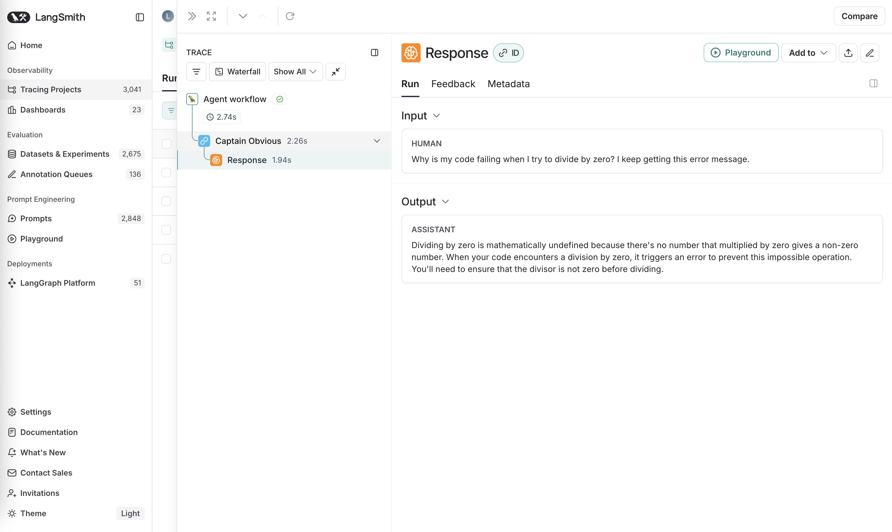

import {
  CodeTabs,
  PythonBlock,
} from "@site/src/components/InstructionsWithCode";

# Trace with OpenAI Agents SDK

The [OpenAI Agents SDK](https://github.com/openai/openai-agents-python) allows you to build agentic applications powered by OpenAI's models.

## Installation

Install LangSmith with OpenAI Agents support:

```bash
pip install "langsmith[openai-agents]"
```

This will install both the LangSmith library and the OpenAI Agents SDK.

> **Note:** This integration requires LangSmith Python SDK version 0.3.15 or higher.

## Quick Start

You can integrate LangSmith tracing with the OpenAI Agents SDK by using the `OpenAIAgentsTracingProcessor` class.

```python
import asyncio
from agents import Agent, Runner, set_trace_processors
from langsmith.wrappers import OpenAIAgentsTracingProcessor

async def main():
    agent = Agent(
        name="Captain Obvious",
        instructions="You are Captain Obvious, the world's most literal technical support agent.",
    )

    question = "Why is my code failing when I try to divide by zero? I keep getting this error message."
    result = await Runner.run(agent, question)
    print(result.final_output)

if __name__ == "__main__":
    set_trace_processors([OpenAIAgentsTracingProcessor()])
    asyncio.run(main())
```

The agent's execution flow, including all spans and their details, will be logged to LangSmith.


