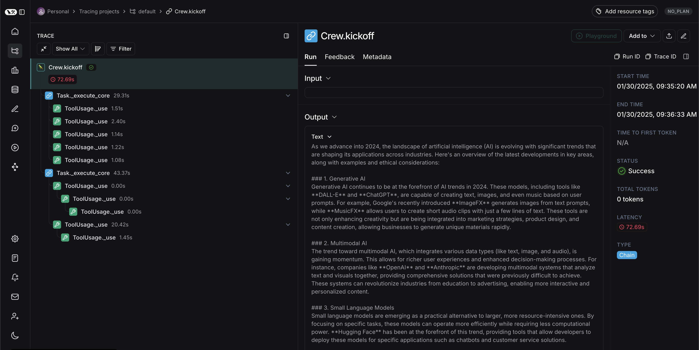

import { ConfigureSDKEnvironmentCodeTabs } from "@site/src/components/QuickStart";
import {
  CodeTabs,
  typescript,
} from "@site/src/components/InstructionsWithCode";

# Trace with OpenTelemetry

LangSmith can accept traces from OpenTelemetry based clients.
This guide will walk through examples on how to achieve this.

:::note For self-hosted and EU region deployments
Update the LangSmith URL appropriately for self-hosted installations or organizations in the EU region in the requests below. For the EU region, use `eu.api.smith.langchain.com`.
:::

## Logging Traces with a basic OpenTelemetry client

This first section covers how to use a standard OpenTelemetry client to log traces to LangSmith.

### 1. Installation

Install the OpenTelemetry SDK, OpenTelemetry exporter packages, as well as the OpenAI package:

```bash
pip install openai
pip install opentelemetry-sdk
pip install opentelemetry-exporter-otlp
```

### 2. Configure your environment

Setup environment variables for the endpoint, substitute your specific values:

```bash
OTEL_EXPORTER_OTLP_ENDPOINT=https://api.smith.langchain.com/otel
OTEL_EXPORTER_OTLP_HEADERS="x-api-key=<your langsmith api key>"
```

#### **Optional: Specify a custom project name other than "default"**

```bash
OTEL_EXPORTER_OTLP_ENDPOINT=https://api.smith.langchain.com/otel
OTEL_EXPORTER_OTLP_HEADERS="x-api-key=<your langsmith api key>,Langsmith-Project=<project name>"
```

### 3. Log a trace

This code sets up an OTEL tracer and exporter that will send traces to LangSmith. It then
calls OpenAI and sends the required OpenTelemetry attributes.

```python
from openai import OpenAI
from opentelemetry import trace
from opentelemetry.sdk.trace import TracerProvider
from opentelemetry.sdk.trace.export import (
    BatchSpanProcessor,
)
from opentelemetry.exporter.otlp.proto.http.trace_exporter import OTLPSpanExporter

client = OpenAI(api_key=os.getenv("OPENAI_API_KEY"))

otlp_exporter = OTLPSpanExporter(
    timeout=10,
)
trace.set_tracer_provider(TracerProvider())
trace.get_tracer_provider().add_span_processor(
    BatchSpanProcessor(otlp_exporter)
)
tracer = trace.get_tracer(__name__)

def call_openai():
    model = "gpt-4o-mini"
    with tracer.start_as_current_span("call_open_ai") as span:
        span.set_attribute("langsmith.span.kind", "LLM")
        span.set_attribute("langsmith.metadata.user_id", "user_123")
        span.set_attribute("gen_ai.system", "OpenAI")
        span.set_attribute("gen_ai.request.model", model)
        span.set_attribute("llm.request.type", "chat")
        messages = [
            {"role": "system", "content": "You are a helpful assistant."},
            {
                "role": "user",
                "content": "Write a haiku about recursion in programming."
            }
        ]

        for i, message in enumerate(messages):
            span.set_attribute(f"gen_ai.prompt.{i}.content", str(message["content"]))
            span.set_attribute(f"gen_ai.prompt.{i}.role", str(message["role"]))

        completion = client.chat.completions.create(
            model=model,
            messages=messages
        )

        span.set_attribute("gen_ai.response.model", completion.model)
        span.set_attribute("gen_ai.completion.0.content", str(completion.choices[0].message.content))
        span.set_attribute("gen_ai.completion.0.role", "assistant")
        span.set_attribute("gen_ai.usage.prompt_tokens", completion.usage.prompt_tokens)
        span.set_attribute("gen_ai.usage.completion_tokens", completion.usage.completion_tokens)
        span.set_attribute("gen_ai.usage.total_tokens", completion.usage.total_tokens)
        return completion.choices[0].message

if __name__ == "__main__":
    call_openai()
```

You should see a trace in your LangSmith dashboard [like this one](https://smith.langchain.com/public/4f2890b1-f105-44aa-a6cf-c777dcc27a37/r).

## Supported OpenTelemetry Attribute and Event Mapping

When sending traces to LangSmith via OpenTelemetry, the following attributes are mapped to LangSmith fields.

### Core LangSmith Attributes

:::caution Run Hierarchy Attributes
The following attributes that determine run hierarchy (`langsmith.span.id`, `langsmith.trace.id`, `langsmith.span.dotted_order`, `langsmith.span.parent_id`) should generally not be set manually when using OpenTelemetry. These are primarily used internally by the LangSmith SDK when tracing with OpenTelemetry. While setting these attributes can improve performance, it's not recommended for most use cases as they can interfere with proper run tree construction. For more details on how these attributes work, see the [Run Data Format documentation](https://docs.smith.langchain.com/reference/data_formats/run_data_format#what-is-dotted_order).
:::

| OpenTelemetry Attribute        | LangSmith Field  | Notes                                                                        |
| ------------------------------ | ---------------- | ---------------------------------------------------------------------------- |
| `langsmith.trace.name`         | Run Name         | Overrides the span name for the run                                          |
| `langsmith.span.kind`          | Run Type         | Values: `llm`, `chain`, `tool`, `retriever`, `embedding`, `prompt`, `parser` |
| `langsmith.span.id`            | Run ID           | Unique identifier for the span,                                              |
| `langsmith.trace.id`           | Trace ID         | Unique identifier for the trace                                              |
| `langsmith.span.dotted_order`  | Dotted Order     | Position in the execution tree                                               |
| `langsmith.span.parent_id`     | Parent Run ID    | ID of the parent span                                                        |
| `langsmith.trace.session_id`   | Session ID       | Session identifier for related traces                                        |
| `langsmith.trace.session_name` | Session Name     | Name of the session                                                          |
| `langsmith.span.tags`          | Tags             | Custom tags attached to the span (comma-separated)                           |
| `langsmith.metadata.{key}`     | `metadata.{key}` | Custom metadata with langsmith prefix                                        |

### GenAI Standard Attributes

| OpenTelemetry Attribute                 | LangSmith Field               | Notes                                                         |
| --------------------------------------- | ----------------------------- | ------------------------------------------------------------- |
| `gen_ai.system`                         | `metadata.ls_provider`        | The GenAI system (e.g., "openai", "anthropic")                |
| `gen_ai.operation.name`                 | Run Type                      | Maps "chat"/"completion" to "llm", "embedding" to "embedding" |
| `gen_ai.prompt`                         | `inputs`                      | The input prompt sent to the model                            |
| `gen_ai.completion`                     | `outputs`                     | The output generated by the model                             |
| `gen_ai.prompt.{n}.role`                | `inputs.messages[n].role`     | Role for the nth input message                                |
| `gen_ai.prompt.{n}.content`             | `inputs.messages[n].content`  | Content for the nth input message                             |
| `gen_ai.prompt.{n}.message.role`        | `inputs.messages[n].role`     | Alternative format for role                                   |
| `gen_ai.prompt.{n}.message.content`     | `inputs.messages[n].content`  | Alternative format for content                                |
| `gen_ai.completion.{n}.role`            | `outputs.messages[n].role`    | Role for the nth output message                               |
| `gen_ai.completion.{n}.content`         | `outputs.messages[n].content` | Content for the nth output message                            |
| `gen_ai.completion.{n}.message.role`    | `outputs.messages[n].role`    | Alternative format for role                                   |
| `gen_ai.completion.{n}.message.content` | `outputs.messages[n].content` | Alternative format for content                                |
| `gen_ai.tool.name`                      | `invocation_params.tool_name` | Tool name, also sets run type to "tool"                       |

### GenAI Request Parameters

| OpenTelemetry Attribute            | LangSmith Field                       | Notes                                   |
| ---------------------------------- | ------------------------------------- | --------------------------------------- |
| `gen_ai.request.model`             | `invocation_params.model`             | The model name used for the request     |
| `gen_ai.response.model`            | `invocation_params.model`             | The model name returned in the response |
| `gen_ai.request.temperature`       | `invocation_params.temperature`       | Temperature setting                     |
| `gen_ai.request.top_p`             | `invocation_params.top_p`             | Top-p sampling setting                  |
| `gen_ai.request.max_tokens`        | `invocation_params.max_tokens`        | Maximum tokens setting                  |
| `gen_ai.request.frequency_penalty` | `invocation_params.frequency_penalty` | Frequency penalty setting               |
| `gen_ai.request.presence_penalty`  | `invocation_params.presence_penalty`  | Presence penalty setting                |
| `gen_ai.request.seed`              | `invocation_params.seed`              | Random seed used for generation         |
| `gen_ai.request.stop_sequences`    | `invocation_params.stop`              | Sequences that stop generation          |
| `gen_ai.request.top_k`             | `invocation_params.top_k`             | Top-k sampling parameter                |
| `gen_ai.request.encoding_formats`  | `invocation_params.encoding_formats`  | Output encoding formats                 |

### GenAI Usage Metrics

| OpenTelemetry Attribute          | LangSmith Field                | Notes                                     |
| -------------------------------- | ------------------------------ | ----------------------------------------- |
| `gen_ai.usage.input_tokens`      | `usage_metadata.input_tokens`  | Number of input tokens used               |
| `gen_ai.usage.output_tokens`     | `usage_metadata.output_tokens` | Number of output tokens used              |
| `gen_ai.usage.total_tokens`      | `usage_metadata.total_tokens`  | Total number of tokens used               |
| `gen_ai.usage.prompt_tokens`     | `usage_metadata.input_tokens`  | Number of input tokens used (deprecated)  |
| `gen_ai.usage.completion_tokens` | `usage_metadata.output_tokens` | Number of output tokens used (deprecated) |

### TraceLoop Attributes

| OpenTelemetry Attribute                  | LangSmith Field  | Notes                                            |
| ---------------------------------------- | ---------------- | ------------------------------------------------ |
| `traceloop.entity.input`                 | `inputs`         | Full input value from TraceLoop                  |
| `traceloop.entity.output`                | `outputs`        | Full output value from TraceLoop                 |
| `traceloop.entity.name`                  | Run Name         | Entity name from TraceLoop                       |
| `traceloop.span.kind`                    | Run Type         | Maps to LangSmith run types                      |
| `traceloop.llm.request.type`             | Run Type         | "embedding" maps to "embedding", others to "llm" |
| `traceloop.association.properties.{key}` | `metadata.{key}` | Custom metadata with traceloop prefix            |

### OpenInference Attributes

| OpenTelemetry Attribute   | LangSmith Field          | Notes                                     |
| ------------------------- | ------------------------ | ----------------------------------------- |
| `input.value`             | `inputs`                 | Full input value, can be string or JSON   |
| `output.value`            | `outputs`                | Full output value, can be string or JSON  |
| `openinference.span.kind` | Run Type                 | Maps various kinds to LangSmith run types |
| `llm.system`              | `metadata.ls_provider`   | LLM system provider                       |
| `llm.model_name`          | `metadata.ls_model_name` | Model name from OpenInference             |
| `tool.name`               | Run Name                 | Tool name when span kind is "TOOL"        |
| `metadata`                | `metadata.*`             | JSON string of metadata to be merged      |

### LLM Attributes

| OpenTelemetry Attribute      | LangSmith Field                       | Notes                                |
| ---------------------------- | ------------------------------------- | ------------------------------------ |
| `llm.input_messages`         | `inputs.messages`                     | Input messages                       |
| `llm.output_messages`        | `outputs.messages`                    | Output messages                      |
| `llm.token_count.prompt`     | `usage_metadata.input_tokens`         | Prompt token count                   |
| `llm.token_count.completion` | `usage_metadata.output_tokens`        | Completion token count               |
| `llm.token_count.total`      | `usage_metadata.total_tokens`         | Total token count                    |
| `llm.usage.total_tokens`     | `usage_metadata.total_tokens`         | Alternative total token count        |
| `llm.invocation_parameters`  | `invocation_params.*`                 | JSON string of invocation parameters |
| `llm.presence_penalty`       | `invocation_params.presence_penalty`  | Presence penalty                     |
| `llm.frequency_penalty`      | `invocation_params.frequency_penalty` | Frequency penalty                    |
| `llm.request.functions`      | `invocation_params.functions`         | Function definitions                 |

### Prompt Template Attributes

| OpenTelemetry Attribute         | LangSmith Field | Notes                                            |
| ------------------------------- | --------------- | ------------------------------------------------ |
| `llm.prompt_template.variables` | Run Type        | Sets run type to "prompt", used with input.value |

### Retriever Attributes

| OpenTelemetry Attribute                     | LangSmith Field                     | Notes                                         |
| ------------------------------------------- | ----------------------------------- | --------------------------------------------- |
| `retrieval.documents.{n}.document.content`  | `outputs.documents[n].page_content` | Content of the nth retrieved document         |
| `retrieval.documents.{n}.document.metadata` | `outputs.documents[n].metadata`     | Metadata of the nth retrieved document (JSON) |

### Tool Attributes

| OpenTelemetry Attribute | LangSmith Field                    | Notes                                     |
| ----------------------- | ---------------------------------- | ----------------------------------------- |
| `tools`                 | `invocation_params.tools`          | Array of tool definitions                 |
| `tool_arguments`        | `invocation_params.tool_arguments` | Tool arguments as JSON or key-value pairs |

### Logfire Attributes

| OpenTelemetry Attribute | LangSmith Field    | Notes                                            |
| ----------------------- | ------------------ | ------------------------------------------------ |
| `prompt`                | `inputs`           | Logfire prompt input                             |
| `all_messages_events`   | `outputs`          | Logfire message events output                    |
| `events`                | `inputs`/`outputs` | Logfire events array, splits input/choice events |

## OpenTelemetry Event Mapping

| Event Name                  | LangSmith Field      | Notes                                                            |
| --------------------------- | -------------------- | ---------------------------------------------------------------- |
| `gen_ai.content.prompt`     | `inputs`             | Extracts prompt content from event attributes                    |
| `gen_ai.content.completion` | `outputs`            | Extracts completion content from event attributes                |
| `gen_ai.system.message`     | `inputs.messages[]`  | System message in conversation                                   |
| `gen_ai.user.message`       | `inputs.messages[]`  | User message in conversation                                     |
| `gen_ai.assistant.message`  | `outputs.messages[]` | Assistant message in conversation                                |
| `gen_ai.tool.message`       | `outputs.messages[]` | Tool response message                                            |
| `gen_ai.choice`             | `outputs`            | Model choice/response with finish reason                         |
| `exception`                 | `status`, `error`    | Sets status to "error" and extracts exception message/stacktrace |

### Event Attribute Extraction

For message events, the following attributes are extracted:

- `content` → message content
- `role` → message role
- `id` → tool_call_id (for tool messages)
- `gen_ai.event.content` → full message JSON

For choice events:

- `finish_reason` → choice finish reason
- `message.content` → choice message content
- `message.role` → choice message role
- `tool_calls.{n}.id` → tool call ID
- `tool_calls.{n}.function.name` → tool function name
- `tool_calls.{n}.function.arguments` → tool function arguments
- `tool_calls.{n}.type` → tool call type

For exception events:

- `exception.message` → error message
- `exception.stacktrace` → error stacktrace (appended to message)

## Logging Traces with the Traceloop SDK

The Traceloop SDK is an OpenTelemetry compatible SDK that covers a range of models, vector databases and frameworks.
If there are integrations that you are interested in instrumenting that are covered by this SDK, you
can use this SDK with OpenTelemetry to log traces to LangSmith.

To see what integrations are supported by the Traceloop SDK, see the [Traceloop SDK documentation](https://www.traceloop.com/docs/openllmetry/tracing/supported).

To get started, follow these steps:

### 1. Installation

```bash
pip install traceloop-sdk
pip install openai
```

### 2. Configure your environment

Setup environment variables:

```bash
TRACELOOP_BASE_URL=https://api.smith.langchain.com/otel
TRACELOOP_HEADERS=x-api-key=<your_langsmith_api_key>
```

#### **Optional: Specify a custom project name other than "default"**

```bash
TRACELOOP_HEADERS=x-api-key=<your_langsmith_api_key>,Langsmith-Project=<langsmith_project_name>
```

### 3. Initialize the SDK

To use the SDK, you need to initialize it before logging traces:

```python
from traceloop.sdk import Traceloop
Traceloop.init()
```

### 4. Log a trace

Here is a complete example using an OpenAI chat completion:

```python
import os
from openai import OpenAI
from traceloop.sdk import Traceloop

client = OpenAI(api_key=os.getenv("OPENAI_API_KEY"))
Traceloop.init()

completion = client.chat.completions.create(
    model="gpt-4o-mini",
    messages=[
        {"role": "system", "content": "You are a helpful assistant."},
        {
            "role": "user",
            "content": "Write a haiku about recursion in programming."
        }
    ]
)

print(completion.choices[0].message)
```

You should see a trace in your LangSmith dashboard [like this one](https://smith.langchain.com/public/106f5bed-edca-4357-91a5-80089252c9ed/r).

## Tracing using the Arize SDK

With the Arize SDK and OpenTelemetry, you can log traces from multiple other frameworks to LangSmith.
Below is an example of tracing CrewAI to LangSmith, you can find a full list of supported
frameworks [here](https://docs.arize.com/phoenix/tracing/integrations-tracing). To make this example
work with other frameworks, you just need to change the instrumentor to match the framework.

### 1. Installation

First, install the required packages:

```bash
pip install -qU arize-phoenix-otel openinference-instrumentation-crewai crewai crewai-tools
```

### 2. Configure your environment

Next, set the following environment variables:

```bash
OPENAI_API_KEY=<your_openai_api_key>
SERPER_API_KEY=<your_serper_api_key>
```

### 3. Set up the instrumentor

Before running any application code let's set up our instrumentor (you can replace this with any of the frameworks supported [here](https://docs.arize.com/phoenix/tracing/integrations-tracing))

```python
from opentelemetry.sdk.trace import TracerProvider
from opentelemetry.sdk.trace.export import BatchSpanProcessor
from opentelemetry.exporter.otlp.proto.http.trace_exporter import OTLPSpanExporter

# Add LangSmith API Key for tracing
LANGSMITH_API_KEY = "YOUR_API_KEY"
# Set the endpoint for OTEL collection
ENDPOINT = "https://api.smith.langchain.com/otel/v1/traces"
# Select the project to trace to
LANGSMITH_PROJECT = "YOUR_PROJECT_NAME"

# Create the OTLP exporter
otlp_exporter = OTLPSpanExporter(
    endpoint=ENDPOINT,
    headers={"x-api-key": LANGSMITH_API_KEY, "Langsmith-Project": LANGSMITH_PROJECT}
)

# Set up the trace provider
provider = TracerProvider()
processor = BatchSpanProcessor(otlp_exporter)
provider.add_span_processor(processor)

# Now instrument CrewAI
from openinference.instrumentation.crewai import CrewAIInstrumentor
CrewAIInstrumentor().instrument(tracer_provider=provider)
```

### 4. Log a trace

Now, you can run a CrewAI workflow and the trace will automatically be logged to LangSmith

```python
from crewai import Agent, Task, Crew, Process
from crewai_tools import SerperDevTool

search_tool = SerperDevTool()

# Define your agents with roles and goals
researcher = Agent(
  role='Senior Research Analyst',
  goal='Uncover cutting-edge developments in AI and data science',
  backstory="""You work at a leading tech think tank.
  Your expertise lies in identifying emerging trends.
  You have a knack for dissecting complex data and presenting actionable insights.""",
  verbose=True,
  allow_delegation=False,
  # You can pass an optional llm attribute specifying what model you wanna use.
  # llm=ChatOpenAI(model_name="gpt-3.5", temperature=0.7),
  tools=[search_tool]
)
writer = Agent(
  role='Tech Content Strategist',
  goal='Craft compelling content on tech advancements',
  backstory="""You are a renowned Content Strategist, known for your insightful and engaging articles.
  You transform complex concepts into compelling narratives.""",
  verbose=True,
  allow_delegation=True
)

# Create tasks for your agents
task1 = Task(
  description="""Conduct a comprehensive analysis of the latest advancements in AI in 2024.
  Identify key trends, breakthrough technologies, and potential industry impacts.""",
  expected_output="Full analysis report in bullet points",
  agent=researcher
)

task2 = Task(
  description="""Using the insights provided, develop an engaging blog
  post that highlights the most significant AI advancements.
  Your post should be informative yet accessible, catering to a tech-savvy audience.
  Make it sound cool, avoid complex words so it doesn't sound like AI.""",
  expected_output="Full blog post of at least 4 paragraphs",
  agent=writer
)

# Instantiate your crew with a sequential process
crew = Crew(
  agents=[researcher, writer],
  tasks=[task1, task2],
  verbose= False,
  process = Process.sequential
)

# Get your crew to work!
result = crew.kickoff()

print("######################")
print(result)
```

You should see a trace in your LangSmith project that looks like this:


