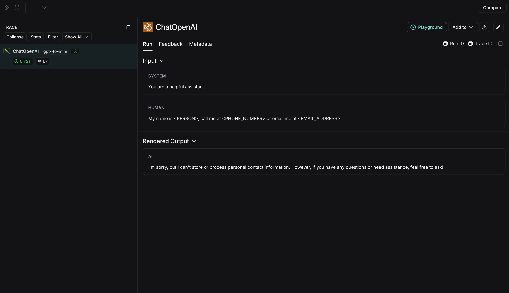
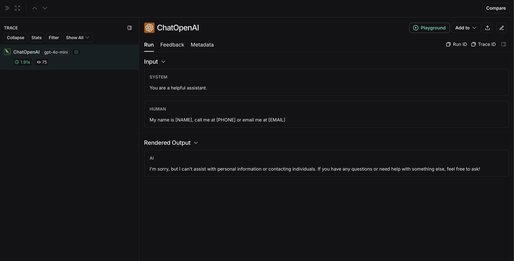

import {
  CodeTabs,
  PythonBlock,
  TypeScriptBlock,
  python,
  typescript,
} from "@site/src/components/InstructionsWithCode";

# Prevent logging of sensitive data in traces

In some situations, you may need to prevent the inputs and outputs of your traces from being logged for privacy or security reasons. LangSmith provides a way to filter the inputs and outputs of your traces before they are sent to the LangSmith backend.

If you want to completely hide the inputs and outputs of your traces, you can set the following environment variables when running your application:

```bash
LANGCHAIN_HIDE_INPUTS=true
LANGCHAIN_HIDE_OUTPUTS=true
```

This works for both the LangSmith SDK (Python and TypeScript) and LangChain.

You can also customize and override this behavior for a given `Client` instance. This can be done by setting the `hide_inputs` and `hide_outputs` parameters on the `Client` object (`hideInputs` and `hideOutputs` in TypeScript).

For the example below, we will simply return an empty object for both `hide_inputs` and `hide_outputs`, but you can customize this to your needs.

<CodeTabs
  tabs={[
    PythonBlock(`import openai
from langsmith import Client
from langsmith.wrappers import wrap_openai\n
openai_client = wrap_openai(openai.Client())
langsmith_client = Client(
    hide_inputs=lambda inputs: {}, hide_outputs=lambda outputs: {}
)\n
# The trace produced will have its metadata present, but the inputs will be hidden
openai_client.chat.completions.create(
    model="gpt-4o-mini",
    messages=[
        {"role": "system", "content": "You are a helpful assistant."},
        {"role": "user", "content": "Hello!"},
    ],
    langsmith_extra={"client": langsmith_client},
)\n
# The trace produced will not have hidden inputs and outputs
openai_client.chat.completions.create(
    model="gpt-4o-mini",
    messages=[
        {"role": "system", "content": "You are a helpful assistant."},
        {"role": "user", "content": "Hello!"},
    ],
)
`),
    TypeScriptBlock(`import OpenAI from "openai";
import { Client } from "langsmith";
import { wrapOpenAI } from "langsmith/wrappers";\n
const langsmithClient = new Client({
  hideInputs: (inputs) => ({}),
  hideOutputs: (outputs) => ({}),
});\n
// The trace produced will have its metadata present, but the inputs will be hidden
const filteredOAIClient = wrapOpenAI(new OpenAI(), {
    client: langsmithClient,
});
await filteredOAIClient.chat.completions.create({
    model: "gpt-4o-mini",
    messages: [
      { role: "system", content: "You are a helpful assistant." },
      { role: "user", content: "Hello!" },
    ],
});
const openaiClient = wrapOpenAI(new OpenAI());
// The trace produced will not have hidden inputs and outputs
await openaiClient.chat.completions.create({
    model: "gpt-4o-mini",
    messages: [
      { role: "system", content: "You are a helpful assistant." },
      { role: "user", content: "Hello!" },
    ],
});
`),
  ]}
  groupId="client-language"
/>

## Rule-based masking of inputs and outputs

To mask specific data in inputs and outputs, you can use the `hide_inputs` and `hide_outputs` parameters when instantiating the client. These parameters allow you to anonymize inputs and outputs by either applying a list of regex patterns with replacement values or using a custom function.

<CodeTabs
  tabs={[
    PythonBlock(`import re
from langsmith import Client, traceable\n
# Define the regex patterns for email addresses and UUIDs
EMAIL_REGEX = r"[a-zA-Z0-9._%+-]+@[a-zA-Z0-9.-]+\.[a-zA-Z]{2,}"
UUID_REGEX = r"[0-9a-fA-F]{8}-[0-9a-fA-F]{4}-[0-9a-fA-F]{4}-[0-9a-fA-F]{4}-[0-9a-fA-F]{12}"\n
def replace_sensitive_data(data, depth=10):
    if depth == 0:
        return data\n
    if isinstance(data, dict):
        return {k: replace_sensitive_data(v, depth-1) for k, v in data.items()}
    elif isinstance(data, list):
        return [replace_sensitive_data(item, depth-1) for item in data]
    elif isinstance(data, str):
        data = re.sub(EMAIL_REGEX, "<email-address>", data)
        data = re.sub(UUID_REGEX, "<UUID>", data)
        return data
    else:
        return data\n
client = Client(
    hide_inputs=lambda inputs: replace_sensitive_data(inputs),
    hide_outputs=lambda outputs: replace_sensitive_data(outputs)
)\n
inputs = {"role": "user", "content": "Hello! My email is user@example.com and my ID is 123e4567-e89b-12d3-a456-426614174000."}
outputs = {"role": "assistant", "content": "Hi! I've noted your email as user@example.com and your ID as 123e4567-e89b-12d3-a456-426614174000."}\n
@traceable(client=client)
def child(inputs: dict) -> dict:
    return outputs\n
@traceable(client=client)
def parent(inputs: dict) -> dict:
    child_outputs = child(inputs)
    return child_outputs\n
parent(inputs)`),
    TypeScriptBlock(`import { Client } from "langsmith";
import { traceable } from "langsmith/traceable";\n
// Define the regex patterns for email addresses and UUIDs
const EMAIL_REGEX = /[a-zA-Z0-9._%+-]+@[a-zA-Z0-9.-]+\.[a-zA-Z]{2,}/g;
const UUID_REGEX = /[0-9a-fA-F]{8}-[0-9a-fA-F]{4}-[0-9a-fA-F]{4}-[0-9a-fA-F]{4}-[0-9a-fA-F]{12}/g;\n
function replaceSensitiveData(data: any, depth: number = 10): any {
    if (depth === 0) return data;\n
    if (typeof data === "object" && !Array.isArray(data)) {
        const result: Record<string, any> = {};
        for (const [key, value] of Object.entries(data)) {
            result[key] = replaceSensitiveData(value, depth - 1);
        }
        return result;
    } else if (Array.isArray(data)) {
        return data.map(item => replaceSensitiveData(item, depth - 1));
    } else if (typeof data === "string") {
        return data.replace(EMAIL_REGEX, "<email-address>").replace(UUID_REGEX, "<UUID>");
    } else {
        return data;
    }
}\n
const langsmithClient = new Client({
    hideInputs: (inputs) => replaceSensitiveData(inputs),
    hideOutputs: (outputs) => replaceSensitiveData(outputs)
});\n
const inputs = {
    role: "user",
    content: "Hello! My email is user@example.com and my ID is 123e4567-e89b-12d3-a456-426614174000."
};\n
const outputs = {
    role: "assistant",
    content: "Hi! I've noted your email as <email-address> and your ID as <UUID>."
};\n
const child = traceable(async (inputs: any) => {
    return outputs;
}, { name: "child", client: langsmithClient });\n
const parent = traceable(async (inputs: any) => {
    const childOutputs = await child(inputs);
    return childOutputs;
}, { name: "parent", client: langsmithClient });\n
await parent(inputs)
`),
  ]}
  groupId="client-language"
/>

## Processing Inputs & Outputs for a Single Function

:::info
The `process_outputs` parameter is available in LangSmith SDK version 0.1.98 and above for Python.
:::

In addition to client-level input and output processing, LangSmith provides function-level processing through the `process_inputs` and `process_outputs` parameters of the `@traceable` decorator.

These parameters accept functions that allow you to transform the inputs and outputs of a specific function before they are logged to LangSmith. This is useful for reducing payload size, removing sensitive information, or customizing how an object should be serialized and represented in LangSmith for a particular function.

Here's an example of how to use `process_inputs` and `process_outputs`:

```python
from langsmith import traceable

def process_inputs(inputs: dict) -> dict:
    # inputs is a dictionary where keys are argument names and values are the provided arguments
    # Return a new dictionary with processed inputs
    return {
        "processed_key": inputs.get("my_cool_key", "default"),
        "length": len(inputs.get("my_cool_key", ""))
    }

def process_outputs(output: Any) -> dict:
    # output is the direct return value of the function
    # Transform the output into a dictionary
    # In this case, "output" will be an integer
    return {"processed_output": str(output)}

@traceable(process_inputs=process_inputs, process_outputs=process_outputs)
def my_function(my_cool_key: str) -> int:
    # Function implementation
    return len(my_cool_key)

result = my_function("example")
```

In this example, `process_inputs` creates a new dictionary with processed input data, and `process_outputs` transforms the output into a specific format before logging to LangSmith.

:::caution
It's recommended to avoid mutating the source objects in the processor functions. Instead, create and return new objects with the processed data.
:::

For asynchronous functions, the usage is similar:

```python
@traceable(process_inputs=process_inputs, process_outputs=process_outputs)
async def async_function(key: str) -> int:
    # Async implementation
    return len(key)
```

These function-level processors take precedence over client-level processors (`hide_inputs` and `hide_outputs`) when both are defined.

## Quick starts

You can combine rule-based masking with various anonymizers to scrub sensitive information from inputs and outputs. In this how-to-guide, we'll cover working with regex, Microsoft Presidio, and Amazon Comprehend.

### Regex

:::info
The implementation below is not exhaustive and may miss some formats or edge cases. Test any implementation thoroughly before using it in production.
:::

You can use regex to mask inputs and outputs before they are sent to LangSmith. The implementation below masks email addresses, phone numbers, full names, credit card numbers, and SSNs.

```python
import re
import openai
from langsmith import Client
from langsmith.wrappers import wrap_openai

# Define regex patterns for various PII
SSN_PATTERN = re.compile(r'\b\d{3}-\d{2}-\d{4}\b')
CREDIT_CARD_PATTERN = re.compile(r'\b(?:\d[ -]*?){13,16}\b')
EMAIL_PATTERN = re.compile(r'\b[A-Za-z0-9._%+-]+@[A-Za-z0-9.-]+\.[A-Z|a-z]{2,7}\b')
PHONE_PATTERN = re.compile(r'\b(?:\+?1[-.\s]?)?\(?\d{3}\)?[-.\s]?\d{3}[-.\s]?\d{4}\b')
FULL_NAME_PATTERN = re.compile(r'\b([A-Z][a-z]*\s[A-Z][a-z]*)\b')

def regex_anonymize(text):
    """
    Anonymize sensitive information in the text using regex patterns.

    Args:
        text (str): The input text to be anonymized.

    Returns:
        str: The anonymized text.
    """
    # Replace sensitive information with placeholders
    text = SSN_PATTERN.sub('[REDACTED SSN]', text)
    text = CREDIT_CARD_PATTERN.sub('[REDACTED CREDIT CARD]', text)
    text = EMAIL_PATTERN.sub('[REDACTED EMAIL]', text)
    text = PHONE_PATTERN.sub('[REDACTED PHONE]', text)
    text = FULL_NAME_PATTERN.sub('[REDACTED NAME]', text)
    return text

def recursive_anonymize(data, depth=10):
    """
    Recursively traverse the data structure and anonymize sensitive information.
    Args:
        data (any): The input data to be anonymized.
        depth (int): The current recursion depth to prevent excessive recursion.

    Returns:
        any: The anonymized data.
    """
    if depth == 0:
        return data

    if isinstance(data, dict):
        anonymized_dict = {}
        for k, v in data.items():
            anonymized_value = recursive_anonymize(v, depth - 1)
            anonymized_dict[k] = anonymized_value
        return anonymized_dict
    elif isinstance(data, list):
        anonymized_list = []
        for item in data:
            anonymized_item = recursive_anonymize(item, depth - 1)
            anonymized_list.append(anonymized_item)
        return anonymized_list
    elif isinstance(data, str):
        anonymized_data = regex_anonymize(data)
        return anonymized_data
    else:
        return data

openai_client = wrap_openai(openai.Client())

# Initialize the LangSmith client with the anonymization functions
langsmith_client = Client(
    hide_inputs=recursive_anonymize, hide_outputs=recursive_anonymize
)

# The trace produced will have its metadata present, but the inputs and outputs will be anonymized
response_with_anonymization = openai_client.chat.completions.create(
    model="gpt-4o-mini",
    messages=[
        {"role": "system", "content": "You are a helpful assistant."},
        {"role": "user", "content": "My name is John Doe, my SSN is 123-45-6789, my credit card number is 4111 1111 1111 1111, my email is john.doe@example.com, and my phone number is (123) 456-7890."},
    ],
    langsmith_extra={"client": langsmith_client},
)

# The trace produced will not have anonymized inputs and outputs
response_without_anonymization = openai_client.chat.completions.create(
    model="gpt-4o-mini",
    messages=[
        {"role": "system", "content": "You are a helpful assistant."},
        {"role": "user", "content": "My name is John Doe, my SSN is 123-45-6789, my credit card number is 4111 1111 1111 1111, my email is john.doe@example.com, and my phone number is (123) 456-7890."},
    ],
)
```

The anonymized run will look like this in LangSmith:


The non-anonymized run will look like this in LangSmith:


### Microsoft Presidio

:::info
The implementation below provides a general example of how to anonymize sensitive information in messages exchanged between a user and an LLM. It is not exhaustive and does not account for all cases. Test any implementation thoroughly before using it in production.
:::

Microsoft Presidio is a data protection and de-identification SDK. The implementation below uses Presidio to anonymize inputs and outputs before they are sent to LangSmith. For up to date information, please refer to Presidio's [official documentation](https://microsoft.github.io/presidio/).

To use Presidio and its spaCy model, install the following:

```bash
pip install presidio-analyzer
pip install presidio-anonymizer
python -m spacy download en_core_web_lg
```

Also, install OpenAI:

```bash
pip install openai
```

```python
import openai
from langsmith import Client
from langsmith.wrappers import wrap_openai
from presidio_anonymizer import AnonymizerEngine
from presidio_analyzer import AnalyzerEngine

anonymizer = AnonymizerEngine()
analyzer = AnalyzerEngine()

def presidio_anonymize(data):
    """
    Anonymize sensitive information sent by the user or returned by the model.

    Args:
        data (any): The data to be anonymized.

    Returns:
        any: The anonymized data.
    """
    if not (
    'messages' in data or
    (
        'choices' in data and
        isinstance(data['choices'], list) and
        data['choices'] and
        'message' in data['choices'][0]
    )
):
        return data
    if 'messages' in data:
        message_list = data['messages']
    else:
        message_list = [data['choices'][0]['message']]
    for message in message_list:
        results = analyzer.analyze(
            text=message['content'],
            entities=["PERSON", "PHONE_NUMBER", "EMAIL_ADDRESS", "US_SSN"],
            language='en'
        )
        anonymized_result = anonymizer.anonymize(
            text=message['content'],
            analyzer_results=results
        )
        message['content'] = anonymized_result.text
    return data

openai_client = wrap_openai(openai.Client())

# initialize the langsmith client with the anonymization functions
langsmith_client = Client(
  hide_inputs=presidio_anonymize, hide_outputs=presidio_anonymize
)

# The trace produced will have its metadata present, but the inputs and outputs will be anonymized
response_with_anonymization = openai_client.chat.completions.create(
  model="gpt-4o-mini",
  messages=[
      {"role": "system", "content": "You are a helpful assistant."},
      {"role": "user", "content": "My name is Slim Shady, call me at 313-666-7440 or email me at real.slim.shady@gmail.com"},
  ],
  langsmith_extra={"client": langsmith_client},
)

# The trace produced will not have anonymized inputs and outputs
response_without_anonymization = openai_client.chat.completions.create(
  model="gpt-4o-mini",
  messages=[
      {"role": "system", "content": "You are a helpful assistant."},
      {"role": "user", "content": "My name is Slim Shady, call me at 313-666-7440 or email me at real.slim.shady@gmail.com"},
  ],
)
```

The anonymized run will look like this in LangSmith:


The non-anonymized run will look like this in LangSmith:


### Amazon Comprehend

:::info
The implementation below provides a general example of how to anonymize sensitive information in messages exchanged between a user and an LLM. It is not exhaustive and does not account for all cases. Test any implementation thoroughly before using it in production.
:::

Comprehend is a natural language processing service that can detect personally identifiable information. The implementation below uses Comprehend to anonymize inputs and outputs before they are sent to LangSmith. For up to date information, please refer to Comprehend's [official documentation](https://docs.aws.amazon.com/comprehend/latest/APIReference/API_DetectPiiEntities.html).

To use Comprehend, install [boto3](https://boto3.amazonaws.com/v1/documentation/api/latest/guide/quickstart.html):

```bash
pip install boto3
```

Also, install OpenAI:

```bash
pip install openai
```

You will need to set up credentials in AWS and authenticate using the AWS CLI. Follow the instructions [here](https://docs.aws.amazon.com/comprehend/latest/dg/setting-up.html).

```python
import openai
import boto3
from langsmith import Client
from langsmith.wrappers import wrap_openai

comprehend = boto3.client('comprehend', region_name='us-east-1')

def redact_pii_entities(text, entities):
    """
    Redact PII entities in the text based on the detected entities.

    Args:
        text (str): The original text containing PII.
        entities (list): A list of detected PII entities.

    Returns:
        str: The text with PII entities redacted.
    """
    sorted_entities = sorted(entities, key=lambda x: x['BeginOffset'], reverse=True)

    redacted_text = text
    for entity in sorted_entities:
        begin = entity['BeginOffset']
        end = entity['EndOffset']
        entity_type = entity['Type']
        # Define the redaction placeholder based on entity type
        placeholder = f"[{entity_type}]"
        # Replace the PII in the text with the placeholder
        redacted_text = redacted_text[:begin] + placeholder + redacted_text[end:]

    return redacted_text

def detect_pii(text):
    """
    Detect PII entities in the given text using AWS Comprehend.

    Args:
        text (str): The text to analyze.

    Returns:
        list: A list of detected PII entities.
    """
    try:
        response = comprehend.detect_pii_entities(
            Text=text,
            LanguageCode='en',
        )
        entities = response.get('Entities', [])
        return entities
    except Exception as e:
        print(f"Error detecting PII: {e}")
        return []

def comprehend_anonymize(data):
    """
    Anonymize sensitive information sent by the user or returned by the model.

    Args:
        data (any): The input data to be anonymized.

    Returns:
        any: The anonymized data.
    """
    if not (
    'messages' in data or
    (
        'choices' in data and
        isinstance(data['choices'], list) and
        data['choices'] and
        'message' in data['choices'][0]
    )
):
        return data
    if 'messages' in data:
        message_list = data['messages']
    else:
        message_list = [data['choices'][0]['message']]
    for message in message_list:
        content = message.get('content', '')
        entities = detect_pii(content)
        if entities:
            anonymized_text = redact_pii_entities(content, entities)
            message['content'] = anonymized_text
        else:
            print("No PII detected. Content remains unchanged.")

    return data

openai_client = wrap_openai(openai.Client())

# initialize the langsmith client with the anonymization functions
langsmith_client = Client(
  hide_inputs=comprehend_anonymize, hide_outputs=comprehend_anonymize
)

# The trace produced will have its metadata present, but the inputs and outputs will be anonymized
response_with_anonymization = openai_client.chat.completions.create(
  model="gpt-4o-mini",
  messages=[
      {"role": "system", "content": "You are a helpful assistant."},
      {"role": "user", "content": "My name is Slim Shady, call me at 313-666-7440 or email me at real.slim.shady@gmail.com"},
  ],
  langsmith_extra={"client": langsmith_client},
)

# The trace produced will not have anonymized inputs and outputs
response_without_anonymization = openai_client.chat.completions.create(
  model="gpt-4o-mini",
  messages=[
      {"role": "system", "content": "You are a helpful assistant."},
      {"role": "user", "content": "My name is Slim Shady, call me at 313-666-7440 or email me at real.slim.shady@gmail.com"},
  ],
)
```

The anonymized run will look like this in LangSmith:


The non-anonymized run will look like this in LangSmith:

