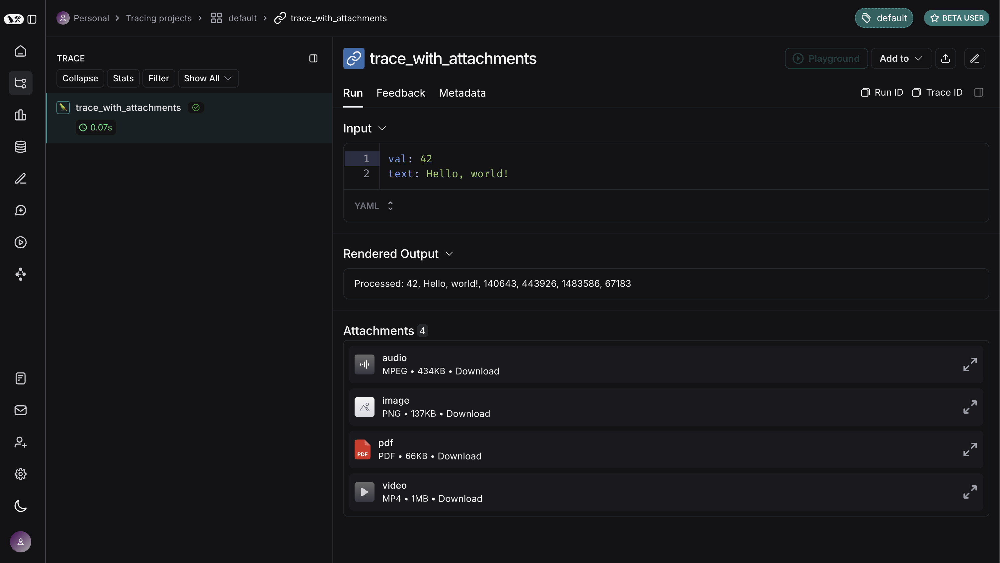

import {
  CodeTabs,
  PythonBlock,
  TypeScriptBlock,
} from "@site/src/components/InstructionsWithCode";

# Upload files with traces

:::tip Recommended Reading
Before diving into this content, it would be helpful to read the following guides:

- [Trace with LangSmith using the traceable decorator or wrapper](./annotate_code/#use-traceable--traceable)
  :::

:::note Minimum SDK Versions
The following features are available in the following SDK versions:

- Python SDK: >=0.1.141
- JS/TS SDK: >=0.2.5
  :::

LangSmith supports uploading binary files (such as images, audio, videos, PDFs, and CSVs) with your traces. This is particularly useful when working with LLM pipelines using multimodal inputs or outputs.

In both the Python and TypeScript SDKs, attachments can be added to your traces by specifying the MIME type and binary content of each file.
This guide explains how to define and trace attachments using the `Attachment` type in Python and `Uint8Array` / `ArrayBuffer` in TypeScript.

<CodeTabs
  tabs={[
    PythonBlock(
      `from langsmith import traceable
from langsmith.schemas import Attachment\n\n
@traceable
def trace_with_attachments(
    val: int,
    text: str,
    image: Attachment,
    audio: Attachment,
    video: Attachment,
    pdf: Attachment,
    csv: Attachment,
):
    return f"Processed: {val}, {text}, {len(image.data)}, {len(audio.data)}, {len(video.data)}, {len(pdf.data), {len(csv.data)}}"\n\n
# Helper function to load files as bytes
def load_file(file_path: str) -> bytes:
    with open(file_path, "rb") as f:
        return f.read()\n\n
# Load files and create attachments
image_data = load_file("my_image.png")
audio_data = load_file("my_mp3.mp3")
video_data = load_file("my_video.mp4")
pdf_data = load_file("my_document.pdf")
csv_data = load_file("my_csv.csv")
image_attachment = Attachment(mime_type="image/png", data=image_data)
audio_attachment = Attachment(mime_type="audio/mpeg", data=audio_data)
video_attachment = Attachment(mime_type="video/mp4", data=video_data)
pdf_attachment = Attachment(mime_type="application/pdf", data=pdf_data)
csv_attachment = Attachment(mime_type="text/csv", data=csv_data)

# Define other parameters

val = 42
text = "Hello, world!"

# Call the function with traced attachments

result = trace_with_attachments(
val=val,
text=text,
image=image_attachment,
audio=audio_attachment,
video=video_attachment,
pdf=pdf_attachment,
csv=csv_attachment,
)`,
      `In the Python SDK, you can use the \`Attachment\` type to add files to your traces.
Each \`Attachment\` requires:\n

- \`mime_type\` (str): The MIME type of the file (e.g., \`"image/png"\`).
- \`data\` (bytes): The binary content of the file.\n
  Simply decorate a function with \`@traceable\` and include your \`Attachment\` instances as arguments.`),
TypeScriptBlock(`import { traceable } from "langsmith/traceable";\n
  const traceableWithAttachments = traceable(
  (
  val: number,
  text: string,
  attachment: Uint8Array,
  attachment2: ArrayBuffer,
  attachment3: Uint8Array,
  attachment4: ArrayBuffer,
  attachment5: Uint8Array,
  ) =>
  \`Processed: \${val}, \${text}, \${attachment.length}, \${attachment2.byteLength}, \${attachment3.length}, \${attachment4.byteLength}\, \${attachment5.byteLength}\`,
  {
  name: "traceWithAttachments",
  extractAttachments: (
  val: number,
  text: string,
  attachment: Uint8Array,
  attachment2: ArrayBuffer,
  attachment3: Uint8Array,
  attachment4: ArrayBuffer,
  attachment5: Uint8Array,
  ) => [
  {
  "image inputs": ["image/png", attachment],
  "mp3 inputs": ["audio/mpeg", new Uint8Array(attachment2)],
  "video inputs": ["video/mp4", attachment3],
  "pdf inputs": ["application/pdf", new Uint8Array(attachment4)],
  "csv inputs": ["text/csv", new Uint8Array(attachment5)]
  },
  { val, text },
  ],
  }
  );\n
  const fs = Deno // or Node.js fs module\n
  const image = await fs.readFile("my_image.png"); // Uint8Array
  const mp3Buffer = await fs.readFile("my_mp3.mp3");
  const mp3ArrayBuffer = mp3Buffer.buffer; // Convert to ArrayBuffer\n
  const video = await fs.readFile("my_video.mp4"); // Uint8Array
  const pdfBuffer = await fs.readFile("my_document.pdf");
  const pdfArrayBuffer = pdfBuffer.buffer; // Convert to ArrayBuffer
  const csv = await fs.readFile("test-vals.csv"); // Uint8Array\n
  // Define example parameters
  const val = 42;
  const text = "Hello, world!";\n
  // Call traceableWithAttachments with the files
  const result = await traceableWithAttachments(val, text, image, mp3ArrayBuffer, video, pdfArrayBuffer, csv);`,
  `In the TypeScript SDK, you can add attachments to traces by using \`Uint8Array\` or \`ArrayBuffer\` as data types.
  Each attachment's MIME type is specified within \`extractAttachments\`:\n\n
- \`Uint8Array\`: Useful for handling binary data directly.
- \`ArrayBuffer\`: Represents fixed-length binary data, which can be converted to \`Uint8Array\` as needed.\n
  Wrap your function with \`traceable\` and include your attachments within the \`extractAttachments\` option.\n
  In the TypeScript SDK, the \`extractAttachments\` function is an optional parameter in the \`traceable\` configuration. When the traceable-wrapped function is invoked, it extracts binary data (e.g., images, audio files) from your inputs and logs them alongside other trace data, specifying their MIME types.\n
  \`\`\`
  type AttachmentData = Uint8Array | ArrayBuffer;
  type Attachments = Record<string, [string, AttachmentData]>;\n
  extractAttachments?: (
  ...args: Parameters<Func>
  ) => [Attachments | undefined, KVMap];
  \`\`\``
  ),
  ]}
  groupId="client-language"
  />

Here is how the above would look in the LangSmith UI. You can expand each attachment to view its contents.

