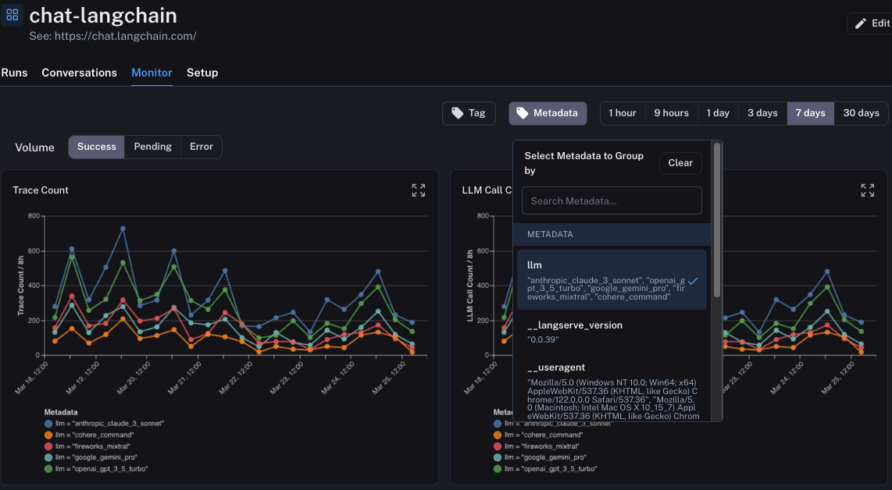
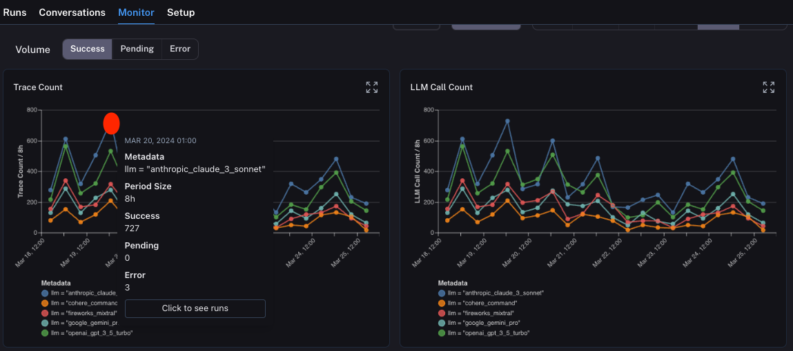

# Use monitoring charts

LangSmith has a collection of monitoring charts accessible for each tracing project. These can be accessed on the `Monitor` tab within a particular project.

## Change the time period

You can view monitors over differing time periods. This can be controlled by the tabs at the top of the page. By default, it is set to seven days.

## Slice data by metadata or tag

By default, the monitor tab shows results for all runs. However, you can slice the data by metadata or tags to view specific subsets of runs.
This can be useful to compare how two different prompts or models are performing.

In order to do this, you first need to make sure you are [attaching appropriate tags or metadata](./add_metadata_tags) to these runs when logging them.
After that, you can click the `Tag` or `Metadata` tab at the top to group runs accordingly.

## Drill down into specific subsets

Monitoring charts can be useful to idea when spikes in errors or latency may be occurring. When you observe those spikes in a monitoring dashboard, you can easily drill into the runs causing those issues by clicking on the dot in the dashboard.

From there, you will be brought back to the `Traces` tab, with a filter applied so you are only viewing the runs that occurred in the time bucket that you clicked into.

If you prefer a video tutorial, check out the [Monitoring video](https://academy.langchain.com/pages/intro-to-langsmith-preview) from the Introduction to LangSmith Course.