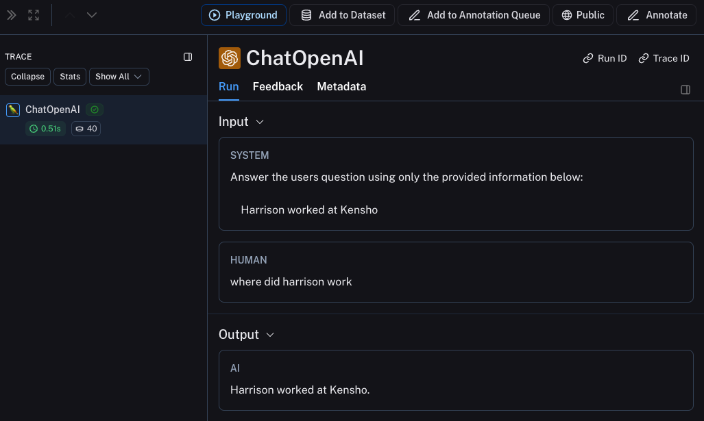
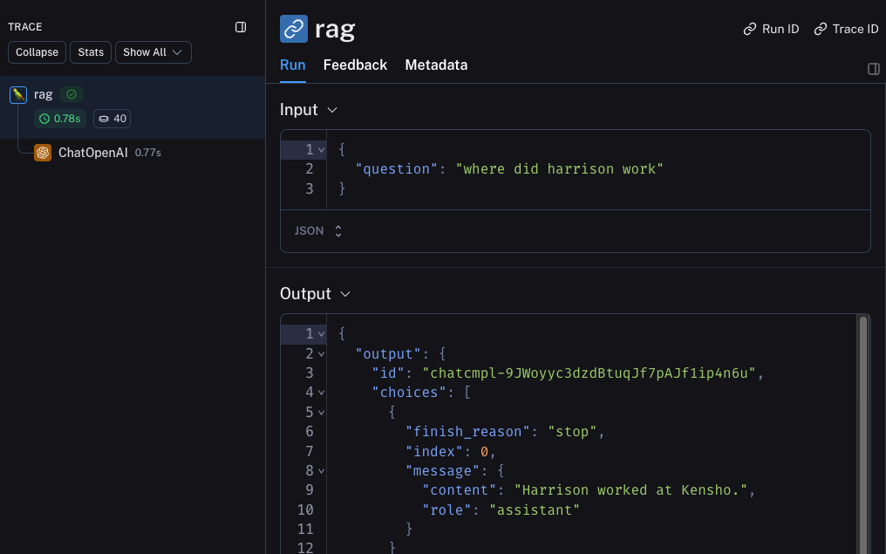

import {
  CodeTabs,
  python,
  typescript,
  ShellBlock,
} from "@site/src/components/InstructionsWithCode";
import { RegionalUrl } from "@site/src/components/RegionalUrls";

# Observability Quick Start

This tutorial will get you up and running with our observability SDK by showing you how to
trace your application to LangSmith.

If you're already familiar with the observability SDK, or are interested in tracing more than just
LLM calls you can skip to the [next steps section](#next-steps),
or check out the [how-to guides](../observability/how_to_guides).

## 1. Install Dependencies

<CodeTabs
  tabs={[
    {
      value: "python",
      label: "Python",
      language: "bash",
      content: `pip install -U langsmith openai`,
    },
    {
      value: "typescript",
      label: "TypeScript",
      language: "bash",
      content: `yarn add langsmith openai`,
    },
  ]}
  groupId="client-language"
/>

## 2. Create an API key

To create an API key head to the <RegionalUrl text='Settings page' suffix='/settings' />. Then click **Create API Key.**

## 3. Set up your environment

<CodeTabs
  tabs={[
    ShellBlock(`export LANGCHAIN_TRACING_V2=true
export LANGCHAIN_API_KEY="<your-langchain-api-key>"
# The example uses OpenAI, but it's not necessary if your code uses another LLM provider
export OPENAI_API_KEY="<your-openai-api-key>"`),
  ]}
  groupId="client-language"
/>

## 4. Define your application

We will use a simple [RAG](https://www.mckinsey.com/featured-insights/mckinsey-explainers/what-is-retrieval-augmented-generation-rag)
application for this tutorial, but feel free to use your own code if you'd like - just make sure
it has an LLM call!

<details>
  <summary>Application Code (Python and TypeScript)</summary>
  <CodeTabs
    groupId="client-language"
    tabs={[
      python({ label: "Python" })`
      from openai import OpenAI
      
      openai_client = OpenAI()
      
      # This is the retriever we will use in RAG
      # This is mocked out, but it could be anything we want
      def retriever(query: str):
          results = ["Harrison worked at Kensho"]
          return results
      
      # This is the end-to-end RAG chain.
      # It does a retrieval step then calls OpenAI
      def rag(question):
          docs = retriever(question)
          system_message = """Answer the users question using only the provided information below:
          
          {docs}""".format(docs="\\n".join(docs))
          
          return openai_client.chat.completions.create(
              messages=[
                  {"role": "system", "content": system_message},
                  {"role": "user", "content": question},
              ],
              model="gpt-4o-mini",
          )
    `,
      typescript({ label: "TypeScript" })`
      import { OpenAI } from "openai";
      
      const openAIClient = new OpenAI();
      
      // This is the retriever we will use in RAG
      // This is mocked out, but it could be anything we want
      async function retriever(query: string) {
        return ["This is a document"];
      }
      
      // This is the end-to-end RAG chain.
      // It does a retrieval step then calls OpenAI
      async function rag(question: string) {
        const docs = await retriever(question);
        
        const systemMessage =
          "Answer the users question using only the provided information below:\\n\\n" +
          docs.join("\\n");
          
        return await openAIClient.chat.completions.create({
          messages: [
            { role: "system", content: systemMessage },
            { role: "user", content: question },
          ],
          model: "gpt-4o-mini",
        });
      }
    `,
    ]}
  />
</details>

## 5. Trace OpenAI calls

The first thing you might want to trace is all your OpenAI calls. LangSmith makes this easy with the `wrap_openai/wrapOpenAI` wrappers.
All you have to do is modify your code to use the wrapped client instead of using the `OpenAI` client directly.

<CodeTabs
  groupId="client-language"
  tabs={[
    python({ label: "Python" })`
      from openai import OpenAI
      # highlight-next-line
      from langsmith.wrappers import wrap_openai
      
      # highlight-next-line
      openai_client = wrap_openai(OpenAI())
      
      # This is the retriever we will use in RAG
      # This is mocked out, but it could be anything we want
      def retriever(query: str):
          results = ["Harrison worked at Kensho"]
          return results
      
      # This is the end-to-end RAG chain.
      # It does a retrieval step then calls OpenAI
      def rag(question):
          docs = retriever(question)
          system_message = """Answer the users question using only the provided information below:
          
          {docs}""".format(docs="\\n".join(docs))
          
          return openai_client.chat.completions.create(
              messages=[
                  {"role": "system", "content": system_message},
                  {"role": "user", "content": question},
              ],
              model="gpt-4o-mini",
          )
    `,
    typescript({ label: "TypeScript" })`
      import { OpenAI } from "openai";
      // highlight-next-line
      import { wrapOpenAI } from "langsmith/wrappers";
      
      // highlight-next-line
      const openAIClient = wrapOpenAI(new OpenAI());
      
      // This is the retriever we will use in RAG
      // This is mocked out, but it could be anything we want
      async function retriever(query: string) {
        return ["This is a document"];
      }
      
      // This is the end-to-end RAG chain.
      // It does a retrieval step then calls OpenAI
      async function rag(question: string) {
        const docs = await retriever(question);
        
        const systemMessage =
          "Answer the users question using only the provided information below:\\n\\n" +
          docs.join("\\n");
          
        return await openAIClient.chat.completions.create({
          messages: [
            { role: "system", content: systemMessage },
            { role: "user", content: question },
          ],
          model: "gpt-4o-mini",
        });
      }
    `,
  ]}
/>

Now when you call your application as follows:

```python
rag("where did harrison work")
```

This will produce a trace of just the OpenAI call - it should look something like [this](https://smith.langchain.com/public/e7b7d256-10fe-4d49-a8d5-36ca8e5af0d2/r)



## 6. Trace entire application

You can also use the `traceable` decorator to trace your entire application instead of just the LLM calls.

<CodeTabs
  groupId="client-language"
  tabs={[
    python({ label: "Python" })`
      from openai import OpenAI
      # highlight-next-line
      from langsmith import traceable
      from langsmith.wrappers import wrap_openai
      
      openai_client = wrap_openai(OpenAI())
      
      def retriever(query: str):
          results = ["Harrison worked at Kensho"]
          return results
      
      # highlight-next-line
      @traceable
      def rag(question):
          docs = retriever(question)
          system_message = """Answer the users question using only the provided information below:
          
          {docs}""".format(docs="\\n".join(docs))
          
          return openai_client.chat.completions.create(
              messages=[
                  {"role": "system", "content": system_message},
                  {"role": "user", "content": question},
              ],
              model="gpt-4o-mini",
          )
    `,
    typescript({ label: "TypeScript" })`
      import { OpenAI } from "openai";
      // highlight-next-line
      import { traceable } from "langsmith/traceable";
      import { wrapOpenAI } from "langsmith/wrappers";
      
      const openAIClient = wrapOpenAI(new OpenAI());
      
      async function retriever(query: string) {
        return ["This is a document"];
      }
      
      // highlight-next-line
      const rag = traceable(async function rag(question: string) {
        const docs = await retriever(question);
        
        const systemMessage =
          "Answer the users question using only the provided information below:\\n\\n" +
          docs.join("\\n");
          
        return await openAIClient.chat.completions.create({
          messages: [
            { role: "system", content: systemMessage },
            { role: "user", content: question },
          ],
          model: "gpt-4o-mini",
        });
      });
    `,
  ]}
/>

Now if you call your application as follows:

```python
rag("where did harrison work")
```

This will produce a trace of just the entire pipeline (with the OpenAI call as a child run) - it should look something like [this](https://smith.langchain.com/public/2174f4e9-48ab-4f9e-a8c4-470372d976f1/r)



## Next steps

Congratulations! If you've made it this far, you're well on your way to being an expert in observability with LangSmith.
Here are some topics you might want to explore next:

- [Trace a `LangChain` application](./observability/how_to_guides/tracing/trace_with_langchain)
- [Trace a `LangGraph` application](./observability/how_to_guides/tracing/trace_with_langgraph)
- [Trace multiturn conversations](./observability/how_to_guides/monitoring/threads)
- [Send traces to a specific project](./observability/how_to_guides/tracing/log_traces_to_project)

Or you can visit the [how-to guides page](./observability/how_to_guides) to find out about all the things you can do with LangSmith observability.
