import {
  CodeTabs,
  python,
  typescript,
  shell,
} from "@site/src/components/InstructionsWithCode";
import { RegionalUrl } from "@site/src/components/RegionalUrls";

# Add observability to your LLM application

Observability is important for any software application, but especially so for LLM applications.
LLMs are non-deterministic by nature, meaning they can produce unexpected results.
This makes them trickier than normal to debug.

Luckily, this is where LangSmith can help!
LangSmith has LLM-native observability, allowing you to get meaningful insights into your application.

Note that observability is important throughout all stages of application development - from prototyping, to beta testing, to production.
There are different considerations at all stages, but they are all intricately tied together.
In this tutorial we walk through the natural progression.

Let's assume that we're building a simple RAG application using the OpenAI SDK.
The simple application we're adding observability to looks like:

<CodeTabs
  groupId="client-language"
  tabs={[
    python({ label: "Python" })`
      from openai import OpenAI
      
      openai_client = OpenAI()
      
      # This is the retriever we will use in RAG
      # This is mocked out, but it could be anything we want
      def retriever(query: str):
          results = ["Harrison worked at Kensho"]
          return results
      
      # This is the end-to-end RAG chain.
      # It does a retrieval step then calls OpenAI
      def rag(question):
          docs = retriever(question)
          system_message = """Answer the users question using only the provided information below:
          
          {docs}""".format(docs="\\n".join(docs))
          
          return openai_client.chat.completions.create(
              messages=[
                  {"role": "system", "content": system_message},
                  {"role": "user", "content": question},
              ],
              model="gpt-4o-mini",
          )
    `,
    typescript({ label: "TypeScript" })`
      import { OpenAI } from "openai";
      
      const openAIClient = new OpenAI();
      
      // This is the retriever we will use in RAG
      // This is mocked out, but it could be anything we want
      async function retriever(query: string) {
        return ["This is a document"];
      }
      
      // This is the end-to-end RAG chain.
      // It does a retrieval step then calls OpenAI
      async function rag(question: string) {
        const docs = await retriever(question);
        
        const systemMessage =
          "Answer the users question using only the provided information below:\\n\\n" +
          docs.join("\\n");
          
        return await openAIClient.chat.completions.create({
          messages: [
            { role: "system", content: systemMessage },
            { role: "user", content: question },
          ],
          model: "gpt-4o-mini",
        });
      }
    `,
  ]}
/>

## Prototyping

Having observability set up from the start can you help iterate **much** more quickly than you would otherwise be able to.
It allows you to have great visibility into your application as you are rapidly iterating on the prompt, or changing the data and models you are using.
In this section we'll walk through how to set up observability so you can have maximal observability as you are prototyping.

### Set up your environment

First, create an API key by navigating to the <RegionalUrl text='settings page' suffix='/settings'/>.

Next, install the LangSmith SDK:

<CodeTabs
  groupId="client-language"
  tabs={[
    shell({ value: "python", label: "Python SDK" })`
      pip install langsmith
    `,
    shell({ value: "typescript", label: "TypeScript SDK" })`
      npm install langsmith
    `,
  ]}
/>

Finally, set up the appropriate environment variables. This will log traces to the `default` project (though you can easily change that).

```shell
export LANGSMITH_TRACING=true
export LANGSMITH_API_KEY=<your-api-key>
export LANGSMITH_PROJECT=default
```

:::warning SDK compatibility in JS
The `LANGSMITH_PROJECT` flag is only supported in JS SDK versions >= 0.2.16, use `LANGCHAIN_PROJECT` instead if you are using an older version.
:::

### Trace your LLM calls

The first thing you might want to trace is all your OpenAI calls.
After all, this is where the LLM is actually being called, so it is the most important part!
We've tried to make this as easy as possible with LangSmith by introducing a dead-simple OpenAI wrapper.
All you have to do is modify your code to look something like:

<CodeTabs
  groupId="client-language"
  tabs={[
    python({ label: "Python" })`
      from openai import OpenAI
      # highlight-next-line
      from langsmith.wrappers import wrap_openai
      
      # highlight-next-line
      openai_client = wrap_openai(OpenAI())
      
      # This is the retriever we will use in RAG
      # This is mocked out, but it could be anything we want
      def retriever(query: str):
          results = ["Harrison worked at Kensho"]
          return results
      
      # This is the end-to-end RAG chain.
      # It does a retrieval step then calls OpenAI
      def rag(question):
          docs = retriever(question)
          system_message = """Answer the users question using only the provided information below:
          
          {docs}""".format(docs="\\n".join(docs))
          
          return openai_client.chat.completions.create(
              messages=[
                  {"role": "system", "content": system_message},
                  {"role": "user", "content": question},
              ],
              model="gpt-4o-mini",
          )
    `,
    typescript({ label: "TypeScript" })`
      import { OpenAI } from "openai";
      // highlight-next-line
      import { wrapOpenAI } from "langsmith/wrappers";
      
      // highlight-next-line
      const openAIClient = wrapOpenAI(new OpenAI());
      
      // This is the retriever we will use in RAG
      // This is mocked out, but it could be anything we want
      async function retriever(query: string) {
        return ["This is a document"];
      }
      
      // This is the end-to-end RAG chain.
      // It does a retrieval step then calls OpenAI
      async function rag(question: string) {
        const docs = await retriever(question);
        
        const systemMessage =
          "Answer the users question using only the provided information below:\\n\\n" +
          docs.join("\\n");
          
        return await openAIClient.chat.completions.create({
          messages: [
            { role: "system", content: systemMessage },
            { role: "user", content: question },
          ],
          model: "gpt-4o-mini",
        });
      }
    `,
  ]}
/>

Notice how we import `from langsmith.wrappers import wrap_openai` and use it to wrap the OpenAI client (`openai_client = wrap_openai(OpenAI())`).

What happens if you call it in the following way?

```python
rag("where did harrison work")
```

This will produce a trace of just the OpenAI call - it should look something like [this](https://smith.langchain.com/public/e7b7d256-10fe-4d49-a8d5-36ca8e5af0d2/r)

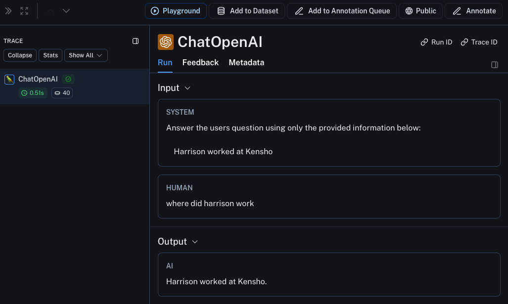

### Trace the whole chain

Great - we've traced the LLM call. But it's often very informative to trace more than that.
LangSmith is **built** for tracing the entire LLM pipeline - so let's do that!
We can do this by modifying the code to now look something like this:

<CodeTabs
  groupId="client-language"
  tabs={[
    python({ label: "Python" })`
      from openai import OpenAI
      # highlight-next-line
      from langsmith import traceable
      from langsmith.wrappers import wrap_openai
      
      openai_client = wrap_openai(OpenAI())
      
      def retriever(query: str):
          results = ["Harrison worked at Kensho"]
          return results
      
      # highlight-next-line
      @traceable
      def rag(question):
          docs = retriever(question)
          system_message = """Answer the users question using only the provided information below:
          
          {docs}""".format(docs="\\n".join(docs))
          
          return openai_client.chat.completions.create(
              messages=[
                  {"role": "system", "content": system_message},
                  {"role": "user", "content": question},
              ],
              model="gpt-4o-mini",
          )
    `,
    typescript({ label: "TypeScript" })`
      import { OpenAI } from "openai";
      // highlight-next-line
      import { traceable } from "langsmith/traceable";
      import { wrapOpenAI } from "langsmith/wrappers";
      
      const openAIClient = wrapOpenAI(new OpenAI());
      
      async function retriever(query: string) {
        return ["This is a document"];
      }
      
      // highlight-next-line
      const rag = traceable(async function rag(question: string) {
        const docs = await retriever(question);
        
        const systemMessage =
          "Answer the users question using only the provided information below:\\n\\n" +
          docs.join("\\n");
          
        return await openAIClient.chat.completions.create({
          messages: [
            { role: "system", content: systemMessage },
            { role: "user", content: question },
          ],
          model: "gpt-4o-mini",
        });
      });
    `,
  ]}
/>

Notice how we import `from langsmith import traceable` and use it decorate the overall function (`@traceable`).

What happens if you call it in the following way?

```python
rag("where did harrison work")
```

This will produce a trace of just the entire pipeline (with the OpenAI call as a child run) - it should look something like [this](https://smith.langchain.com/public/2174f4e9-48ab-4f9e-a8c4-470372d976f1/r)

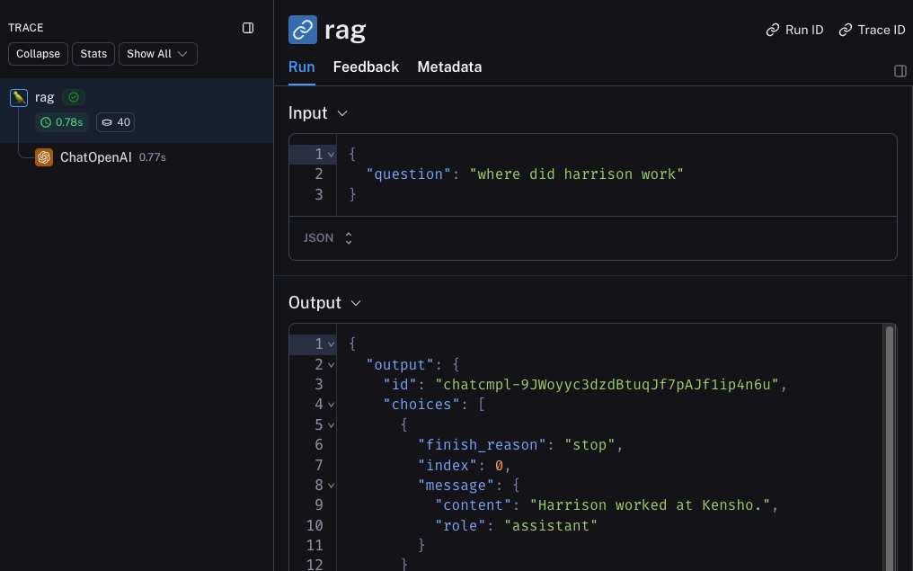

### Trace the retrieval step

There's one last part of the application we haven't traced - the retrieval step!
Retrieval is a key part of LLM applications, and we've made it easy to log retrieval steps as well.
All we have to do is modify our code to look like:

<CodeTabs
  groupId="client-language"
  tabs={[
    python({ label: "Python" })`
      from openai import OpenAI
      from langsmith import traceable
      from langsmith.wrappers import wrap_openai
      
      openai_client = wrap_openai(OpenAI())
      
      # highlight-next-line
      @traceable(run_type="retriever")
      def retriever(query: str):
          results = ["Harrison worked at Kensho"]
          return results
      
      @traceable
      def rag(question):
          docs = retriever(question)
          system_message = """Answer the users question using only the provided information below:
          
          {docs}""".format(docs="\\n".join(docs))
          
          return openai_client.chat.completions.create(
              messages=[
                  {"role": "system", "content": system_message},
                  {"role": "user", "content": question},
              ],
              model="gpt-4o-mini",
          )
    `,
    typescript({ label: "TypeScript" })`
      import { OpenAI } from "openai";
      import { traceable } from "langsmith/traceable";
      import { wrapOpenAI } from "langsmith/wrappers";
      
      const openAIClient = wrapOpenAI(new OpenAI());
      
      // highlight-next-line
      const retriever = traceable(
        async function retriever(query: string) {
          return ["This is a document"];
        },
        // highlight-next-line
        { run_type: "retriever" }
      )
      
      const rag = traceable(async function rag(question: string) {
        const docs = await retriever(question);
        
        const systemMessage =
          "Answer the users question using only the provided information below:\\n\\n" +
          docs.join("\\n");
          
        return await openAIClient.chat.completions.create({
          messages: [
            { role: "system", content: systemMessage },
            { role: "user", content: question },
          ],
          model: "gpt-4o-mini",
        });
      });
    `,
  ]}
/>

Notice how we import `from langsmith import traceable` and use it decorate the overall function (`@traceable(run_type="retriever")`).

What happens if you call it in the following way?

```python
rag("where did harrison work")
```

This will produce a trace of the whole chain including the retrieval step - it should look something like [this](https://smith.langchain.com/public/7b3fe3b1-b287-49ec-9e3b-feecbe460144/r)

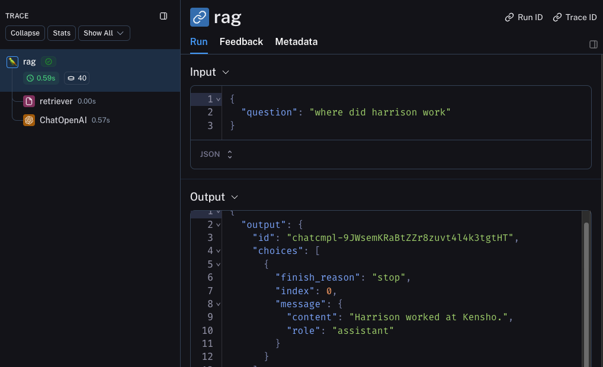

## Beta Testing

The next stage of LLM application development is beta testing your application.
This is when you release it to a few initial users.
Having good observability set up here is crucial as often you don't know exactly how users will actually use your application, so this allows you get insights into how they do so.
This also means that you probably want to make some changes to your tracing set up to better allow for that.
This extends the observability you set up in the previous section

### Collecting Feedback

A huge part of having good observability during beta testing is collecting feedback.
What feedback you collect is often application specific - but at the very least a simple thumbs up/down is a good start.
After logging that feedback, you need to be able to easily associate it with the run that caused that.
Luckily LangSmith makes it easy to do that.

First, you need to log the feedback from your app.
An easy way to do this is to keep track of a run ID for each run, and then use that to log feedback.
Keeping track of the run ID would look something like:

```python
import uuid

run_id = str(uuid.uuid4())
rag(
    "where did harrison work",
    langsmith_extra={"run_id": run_id}
)
```

Associating feedback with that run would look something like:

```python
from langsmith import Client
ls_client = Client()

ls_client.create_feedback(
    run_id,
    key="user-score",
    score=1.0,
)
```

Once the feedback is logged, you can then see it associated with each run by clicking into the `Metadata` tab when inspecting the run.
It should look something like [this](https://smith.langchain.com/public/8cafba6a-1a6d-4a73-8565-483186f31c29/r)

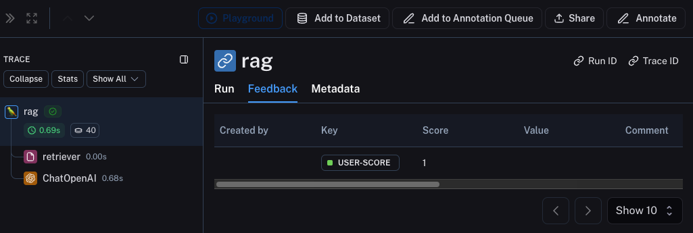

You can also query for all runs with positive (or negative) feedback by using the filtering logic in the runs table.
You can do this by creating a filter like the following:

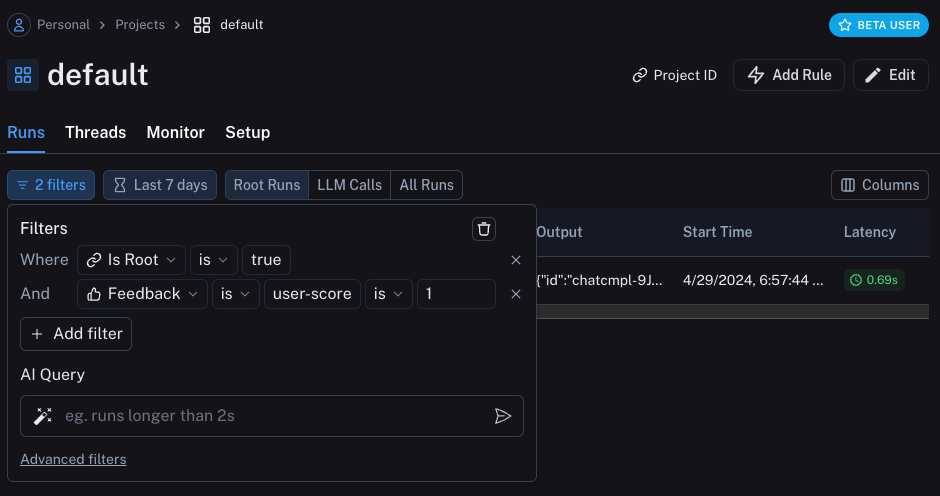

### Logging Metadata

It is also a good idea to start logging metadata.
This allows you to start keep track of different attributes of your app.
This is important in allowing you to know what version or variant of your app was used to produce a given result.

For this example, we will log the LLM used.
Oftentimes you may be experimenting with different LLMs, so having that information as metadata can be useful for filtering.
In order to do that, we can add it as such:

```python
from openai import OpenAI
from langsmith import traceable
from langsmith.wrappers import wrap_openai

openai_client = wrap_openai(OpenAI())

@traceable(run_type="retriever")
def retriever(query: str):
    results = ["Harrison worked at Kensho"]
    return results

@traceable(metadata={"llm": "gpt-4o-mini"})
def rag(question):
    docs = retriever(question)
    system_message = """Answer the users question using only the provided information below:

    {docs}""".format(docs='\n'.join(docs))
    return openai_client.chat.completions.create(messages = [
        {"role": "system", "content": system_message},
        {"role": "user", "content": question},

    ], model="gpt-4o-mini")
```

Notice we added `@traceable(metadata={"llm": "gpt-4o-mini"})` to the `rag` function.

Keeping track of metadata in this way assumes that it is known ahead of time.
This is fine for LLM types, but less desirable for other types of information - like a User ID.
In order to log information that, we can pass it in at run time with the run ID.

```python
import uuid

run_id = str(uuid.uuid4())
rag(
    "where did harrison work",
    langsmith_extra={"run_id": run_id, "metadata": {"user_id": "harrison"}}
)
```

Now that we've logged these two pieces of metadata, we should be able to see them both show up in the UI [here](https://smith.langchain.com/public/37adf7e5-97aa-42d0-9850-99c0199bddf6/r).

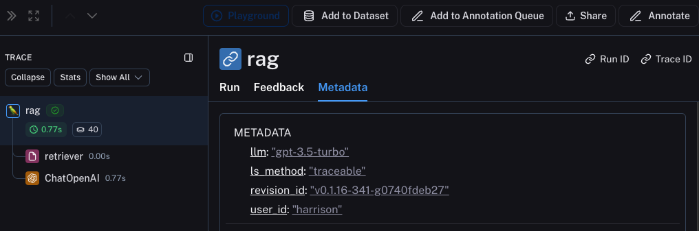

We can filter for these pieces of information by constructing a filter like the following:

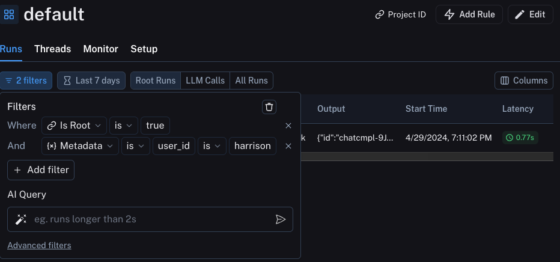

## Production

Great - you've used this newfound observability to iterate quickly and gain confidence that your app is performing well.
Time to ship it to production!
What new observability do you need to add?

First of all, let's note that the same observability you've already added will keep on providing value in production.
You will continue to be able to drill down into particular runs.

In production you likely have a LOT more traffic. So you don't really want to be stuck looking at datapoints one at a time.
Luckily, LangSmith has a set of tools to help with observability in production.

### Monitoring

If you click on the `Monitor` tab in a project, you will see a series of monitoring charts.
Here we track lots of LLM specific statistics - number of traces, feedback, time-to-first-token, etc.
You can view these over time across a few different time bins.

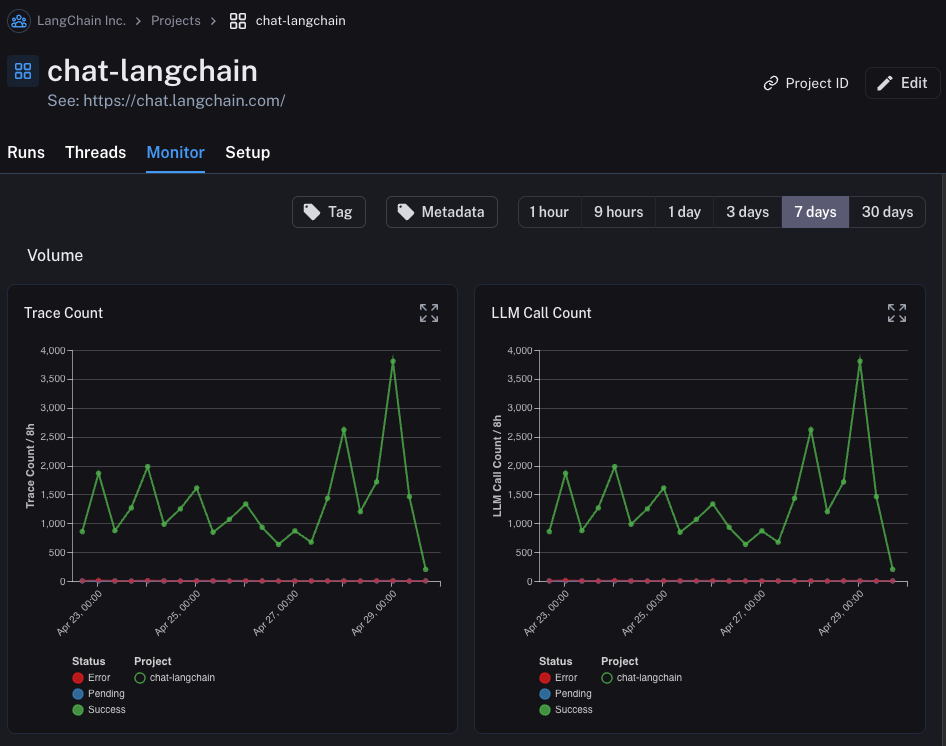

### A/B Testing

:::note
Group-by functionality for A/B testing requires at least 2 different values to exist for a given metadata key.
:::

You can also use this tab to perform a version of A/B Testing.
In the previous tutorial we starting tracking a few different metadata attributes - one of which was `llm`.
We can group the monitoring charts by ANY metadata attribute, and instantly get grouped charts over time.
This allows us to experiment with different LLMs (or prompts, or other) and track their performance over time.

In order to do this, we just need to click on the `Metadata` button at the top.
This will give us a drop down of options to choose from to group by:

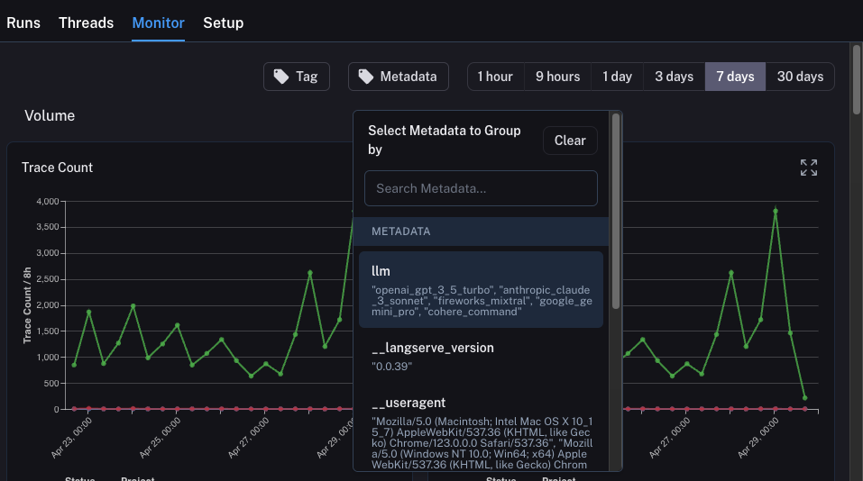

Once we select this, we will start to see charts grouped by this attribute:

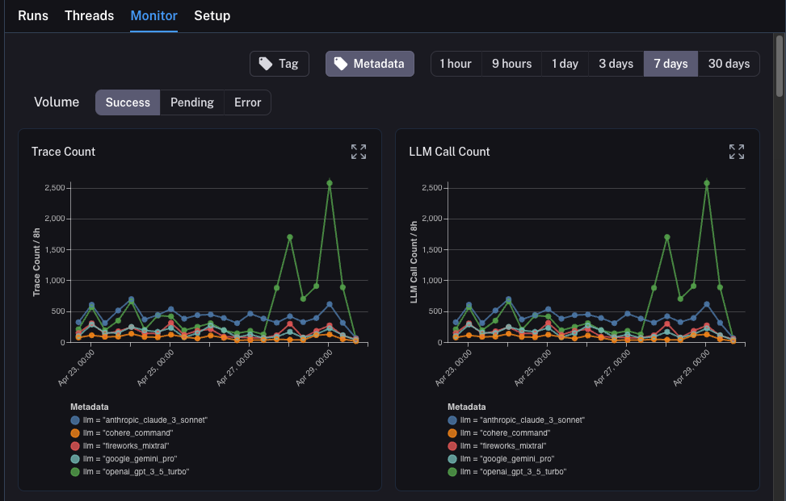

### Drilldown

One of the awesome abilities that LangSmith provides is the ability to easily drilldown into datapoints that you identify
as problematic while looking at monitoring charts.
In order to do this, you can simply hover over a datapoint in the monitoring chart.
When you do this, you will be able to click the datapoint.
This will lead you back to the runs table with a filtered view:

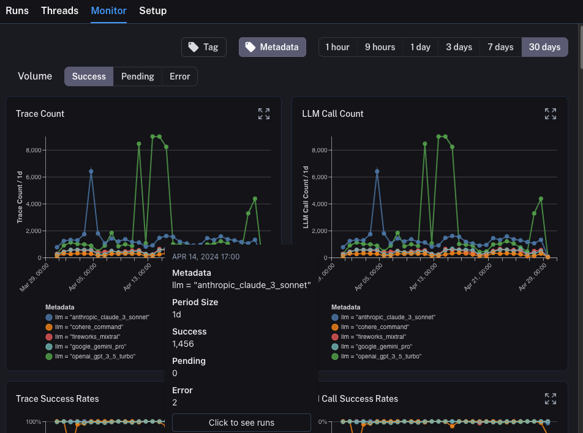

## Conclusion

In this tutorial you saw how to set up your LLM application with best-in-class observability.
No matter what stage your application is in, you will still benefit from observability.

If you have more in-depth questions about observability, check out the [how-to section](../how_to_guides) for guides on topics like testing, prompt management, and more.
