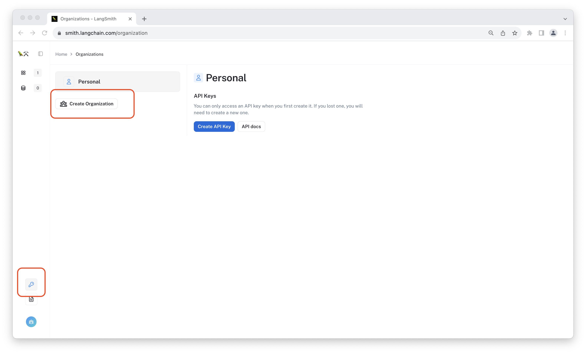
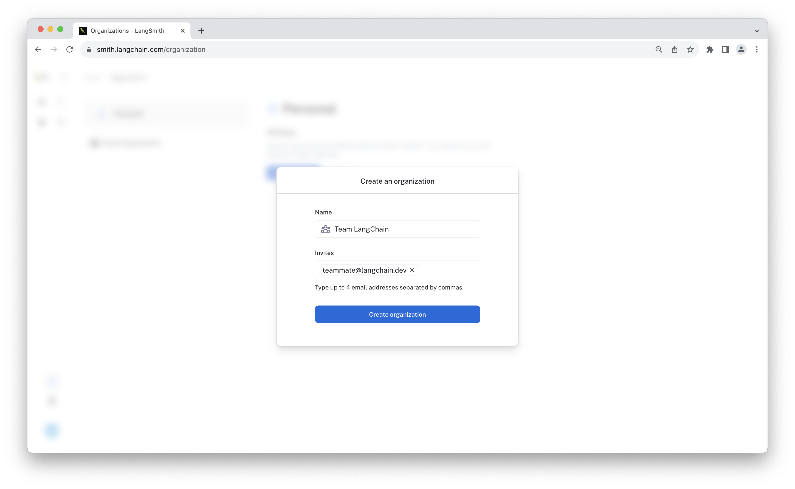
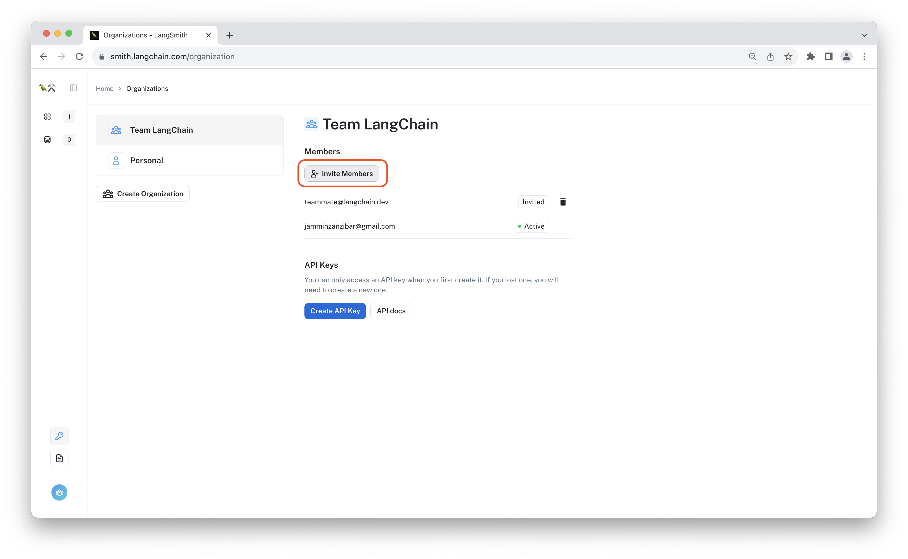
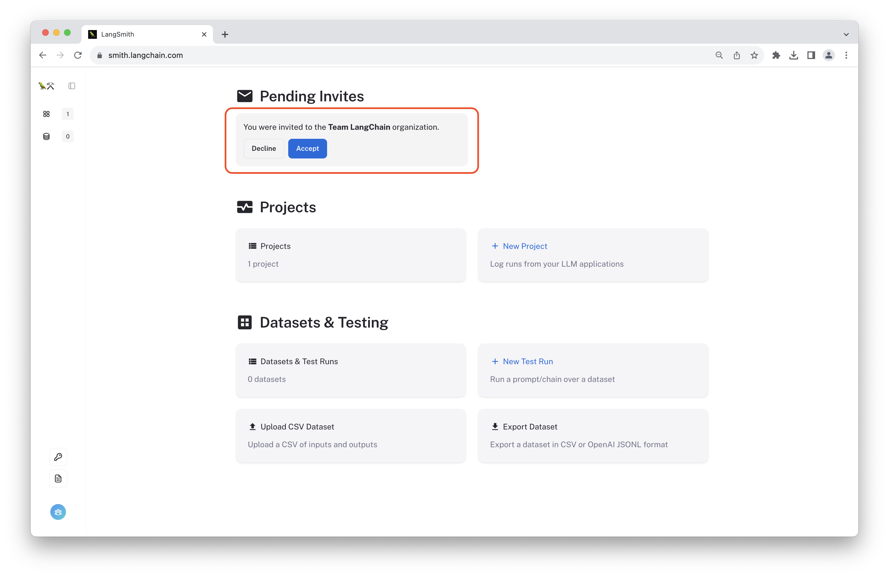

# Organizations

Organizations let you collaborate with your teammates in LangSmith by creating shared projects, datasets, and more. Below, we will walk through setting up your first organization and respond to some frequently asked questions.

:::important Enterprise Support
Organization support in LangSmith is still in early beta. We currently allow up to 5 people per organization. If you want to collaborate in larger teams, or for more dedicated support, please fill out <a href="https://airtable.com/appwQzlErAS2qiP0L/shrGtGaVBVAz7NcV2">this enterprise interest form</a>, and we will reach out to you shortly.

We are actively rolling out more functionality to improve your collaboration experience. If you face issues or have additional feature requests, please reach out to us at  <a href="mailto:support@langchain.dev">support@langchain.dev</a>.

Thank you!
:::


## Create an organization

To start, log in to LangSmith, navigate to the [Organizations](https://smith.langchain.com/organization) page and select "Create Organization". You can also find this page by clicking on the key icon in the left sidebar. All that's required is a team name.



#### Invite teammates

While creating your organization, you can add email addresses for up to four collaborators by typing them in the "invites" field of the creation form. These team members will receive an invitation email once they're added.



You can later invite team members at any time by navigating to the [Organizations](https://smith.langchain.com/organization) page, selecting the desired organization, and clicking "Invite Members".




#### Accept invitation

If your team member already has a LangSmith account, they can join your organization from the [LangSmith homepage](https://smith.langchain.com/) by clicking "Accept" on the invitation dialog. If they do not have a LangSmith account, they will be prompted to create one.



:::important Waitlist
Inviting a teammate does not let them bypass the LangSmith waitlist. If you have immediate need for additional team members, please reach out to us at <a href="mailto:support@langchain.dev">support@langchain.dev</a>.
:::

Once your teammates have joined you can start collaborating!

#### Logging traces to your organization

To start using your organization, navigate to the [Organizations](https://smith.langchain.com/organization) page, select the desired organization, and create a new API key. Use the API key by configuring the environment variables in your application environment or by directly passing it to the LangSmith SDK.

```bash
export LANGCHAIN_TRACING_V2=true
export LANGCHAIN_API_KEY=<your-organizations-api-key>
```

Now all traces will be logged to a project within your new organization.

:::tip API keys
Each API key is scoped to an organization. Logging or reading from a project in a different organization is as easy as changing the API key used to connect to the LangSmith endpoint.
:::

## FAQs

Below are some common questions:

### How do I migrate projects between organizations?

Currently we do not support project migration betwen organizations. While you can manually imitate this by reading and writing runs and datasets using the SDK (see the exporting runs examples [here](/tracing/use-cases/export-runs)), it will be fastest to create a new project within your organization and go from there.

### Why aren't my runs aren't showing up in my project?

If you aren't seeing any warnings when running your application, it may be that you are still using an API key from your "personal" organization. Check your most recent runs there to confirm by selecting your "Personal" organization in the [Organizations](https://smith.langchain.com/organization) page and then viewing your [projects](https://smith.langchain.com/projects).


If you still running into issues, please reach out to us at <a href="mailto:support@langchain.dev">support@langchain.dev</a>.

### My team deals with sensitive data. How can I ensure that only my team can access it?

If you are interested in a private deployment of LangSmith or if you need to self-host, please fill out <a href="https://airtable.com/appwQzlErAS2qiP0L/shrGtGaVBVAz7NcV2">the enterprise support form</a>, and we will do our best to unblock you promptly.