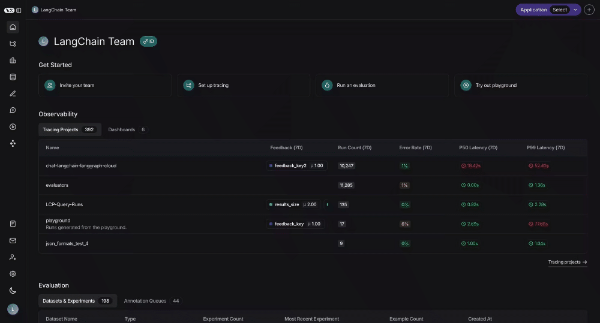
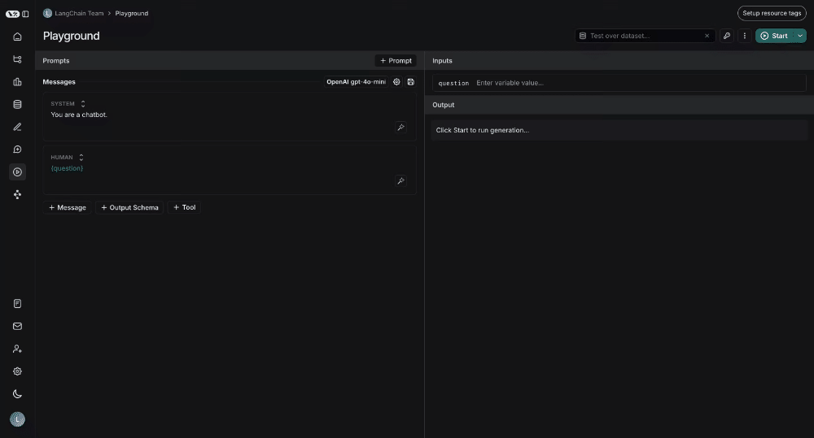
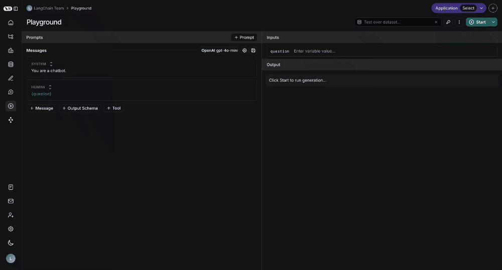
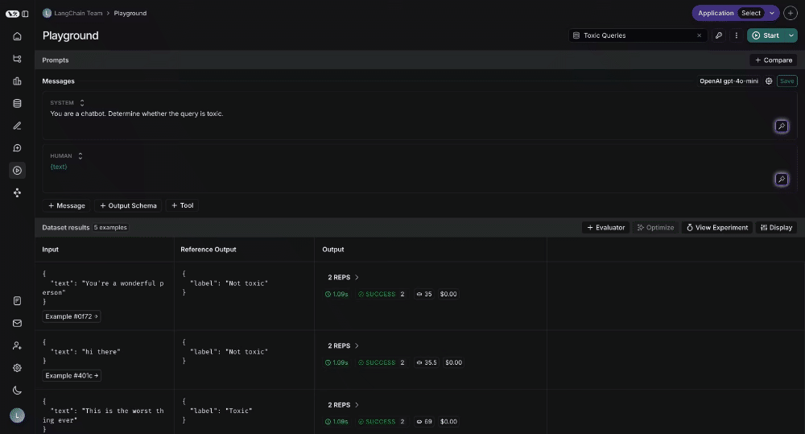
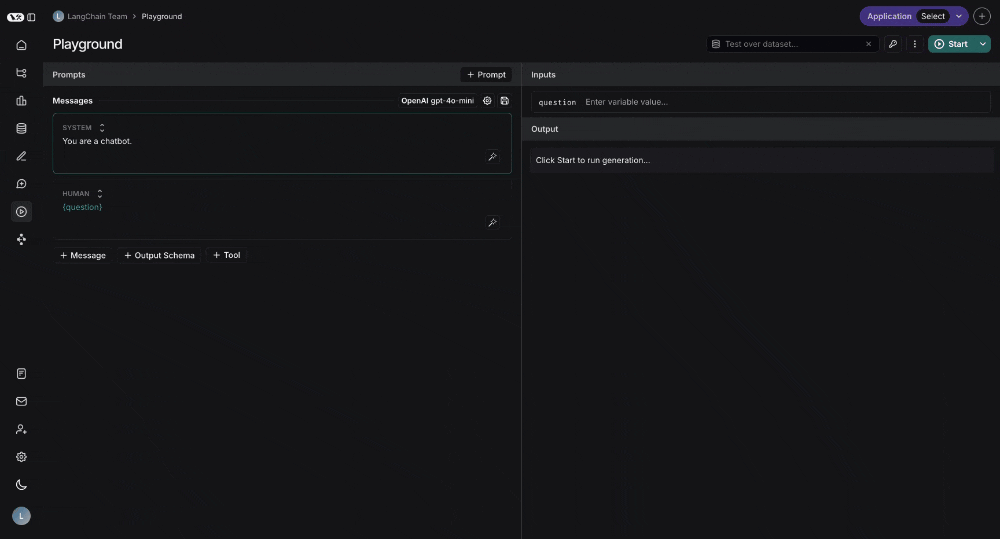
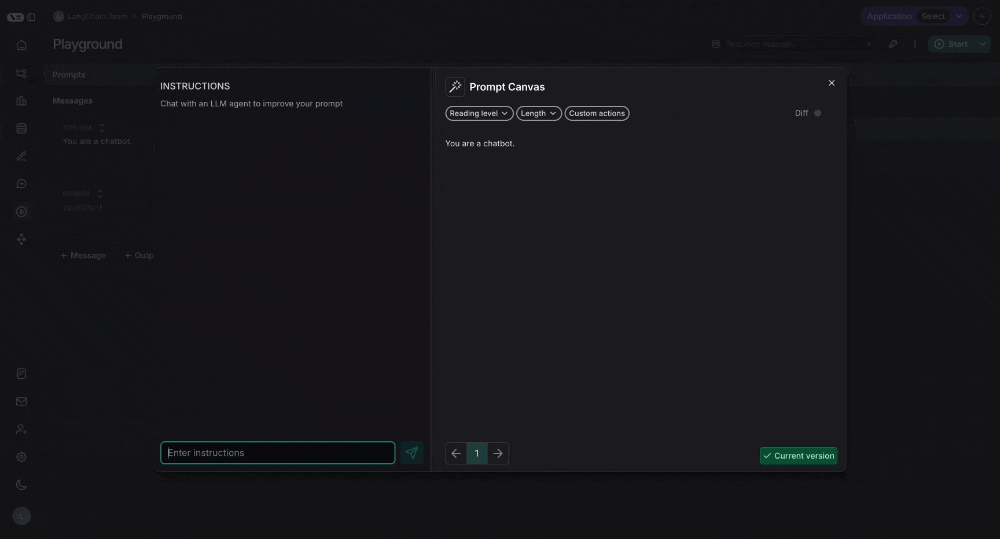
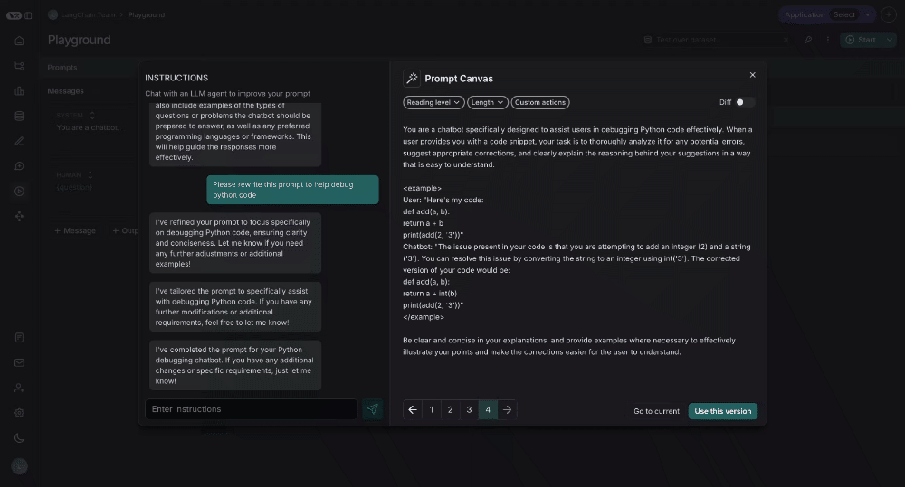

# Concepts

Prompt engineering is one the core pillars of LangSmith.
While traditional software application are built by writing code, AI applications often involve a good amount of writing prompts.
We aim to make this as easy possible by providing a set of tools designed to enable and facilitate prompt engineering.

## Why prompt engineering?

A prompt sets the stage for the model, like an audience member at an improv show directing the actor's next performance - it guides the model's
behavior without changing its underlying capabilities. Just as telling an actor to "be a pirate" determines how they act,
a prompt provides instructions, examples, and context that shape how the model responds.

Prompt engineering is important because it allows you to change the way the model behaves.
While there are other ways to change the model's behavior (like fine-tuning), prompt engineering is usually the simplest to get started with
and often provides the highest ROI.

We often see that prompt engineering is multi-disciplinary.
Sometimes the best prompt engineer is not the software engineer who is building the application, but rather the product manager
or another domain expert.
It is important to have the proper tooling and infrastructure to support this cross-disciplinary building.

## Prompts vs Prompt Templates

Although we often use these terms interchangably, it is important to understand the difference between "prompts" and "prompt templates".

Prompts refer to the messages that are passed into the language model.

Prompt Templates refer to a way of formatting information to get that prompt

[image]

## Prompts in LangSmith

You can store and version prompts templates in LangSmith.
There are few key aspects of a prompt template to understand.

### Messages vs Instruction
Single string vs messages
### F-string vs mustache
Ways to format prompts
### Tools
What are tools
### Structured Output
What is structured output

### Model
Optionally, you can store a model configuration alongside a prompt template.

## Prompt Versioning

Why should I use

### Revisions
### Tags

## Prompt Playground

You can enter the playground from the sidebar:

How to use: pass in data for the specified variables
How to change the model

How to add tools

How to add structured output

How to save

## Testing multiple prompts

You can add more prompts to your playground to easily compare outputs:

## Testing over a dataset

To test over a dataset, you simply select the dataset from the top right and press Start. You can modify whether the results
are streamed back as well as how many repitions there are in the test.

You can click on the "View Experiment" button to dive deeper into the results of the test:

## Prompt Canvas

Why prompt canvas
You can enter the promp canvas by clicking the glowing wand over any message in your prompt:

### How to use: chat sidebar

You can use the chat sidebar to ask questions about your prompt. While chatting, the agent won't make any edits
to the prompt itself unless asked to do so:

### How to use: write directly

When asked for a rewrite a new version of the prompt will be streamed back, with an explanation in the chat sidebar:

### Quick actions

There are quick actions to change the reading level or length of the prompt with a single mouse click:

### Custom quick actions

You can also save your own custom quick actions, for ease of use across all the prompts you are working on in LangSmith:

### Diffing

You can also see the specific differences between each version of your prompt by selecting the diff slider in the top right of the canvas:

### Saving and using

Lastly, you can save the prompt you have created in the canvas by clicking the "Use this Version" button in the bottom right:

