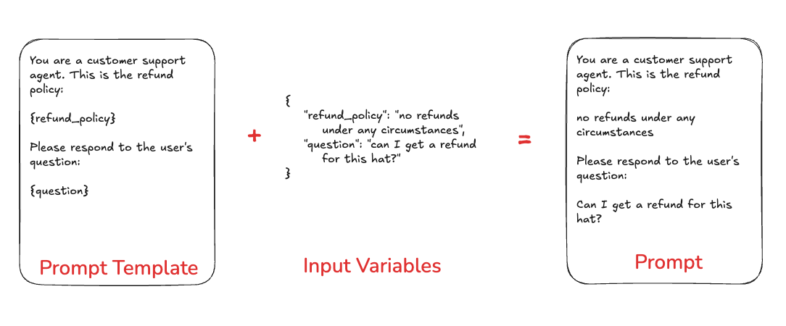
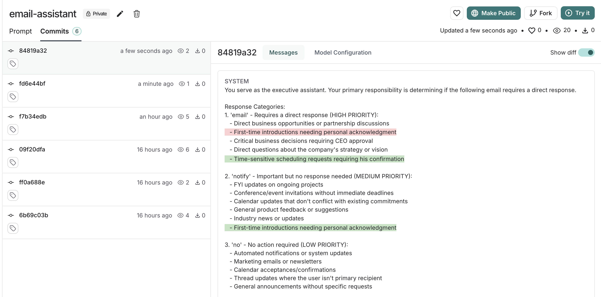
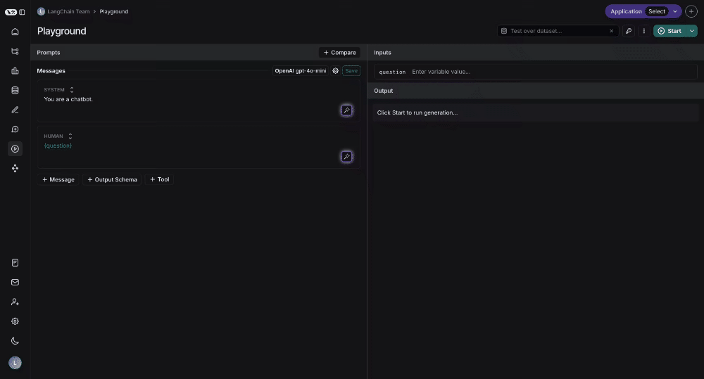

# Concepts

Prompt engineering is one the core pillars of LangSmith.
While traditional software application are built by writing code, AI applications often involve a good amount of writing prompts.
We aim to make this as easy possible by providing a set of tools designed to enable and facilitate prompt engineering.

## Why prompt engineering?

A prompt sets the stage for the model, like an audience member at an improv show directing the actor's next performance - it guides the model's
behavior without changing its underlying capabilities. Just as telling an actor to "be a pirate" determines how they act,
a prompt provides instructions, examples, and context that shape how the model responds.

Prompt engineering is important because it allows you to change the way the model behaves.
While there are other ways to change the model's behavior (like fine-tuning), prompt engineering is usually the simplest to get started with
and often provides the highest ROI.

We often see that prompt engineering is multi-disciplinary.
Sometimes the best prompt engineer is not the software engineer who is building the application, but rather the product manager
or another domain expert.
It is important to have the proper tooling and infrastructure to support this cross-disciplinary building.

## Prompts vs Prompt Templates

Although we often use these terms interchangably, it is important to understand the difference between "prompts" and "prompt templates".

Prompts refer to the messages that are passed into the language model.

Prompt Templates refer to a way of formatting information to get that prompt to hold the information that you want. Prompt templates
can include variables for few shot examples, outside context, or any other external data that is needed in your prompt.



## Prompts in LangSmith

You can store and version prompts templates in LangSmith.
There are few key aspects of a prompt template to understand.

### Chat vs Completion

There are two different types of prompts: `chat` style prompts and `completion` style prompts.

Chat style prompts are a **list of messages**. This is the prompting style supported by most model APIs these days, and so this should generally be preferred.

Completion style prompts are just a string. This is an older style of prompting, and so mostly exists for legacy reasons.

### F-string vs mustache

You can format your prompt with input variables using either [f-string](https://realpython.com/python-f-strings/) or [mustache](https://mustache.github.io/mustache.5.html) format. Here is an example prompt
with f-string format:

```python
Hello, {name}!
```

And here is one with mustache:

```python
Hello, {{name}}!
```

To add a conditional mustache prompt:

```python
{{#is_logged_in}}
  Welcome back, {{name}}!
{{else}}
  Please log in.
{{/is_logged_in}}
```

- For this case, the playground UI will pick up `is_logged_in` variable,
  but you need to manually specify your vairables in inputs, for example,
  paste this into inputs to make above conditional prompt works

```
{
  "name": "Alice"
}
```

:::tip Mustache format
The LangSmith Playground uses `f-string` as the default template format,
but you can switch to `mustache` format in the prompt settings/template format section.
`mustache` gives you more flexibility around conditional variables, loops, and nested keys.
For conditional variables, you'll need to manually add json variables in the 'inputs' section.
Read [the documentation](https://mustache.github.io/mustache.5.html)
:::

### Tools

Tools are interfaces the LLM can use to interact with the outside world. Tools consist of a name, description,
and JSON schema of arguments used to call the tool.

### Structured Output

Structured output is a feature of most state of the art LLMs, wherein instead of producing raw text as output they
stick to a specified schema. This may or may not use [Tools](#tools) under the hood.

:::tip Structured Output vs Tools
Structured outputs are similar to tools, but different in a few key ways. With tools, the LLM choose which tool to call (or may choose not to call any); with structured output, the LLM **always** responds in this format. With tools, the LLM may select **multiple** tools; with structured output, only one response is generate.
:::

### Model

Optionally, you can store a model configuration alongside a prompt template. This includes the name of the model and any other parameters (temperature, etc).

## Prompt Versioning

Verisioning is a key part of iterating and collaborating on your different prompts.

### Commits

Every saved update to a prompt creates a new commit. You can view previous commits, making it easy to review earlier prompt versions or revert to a previous state if needed. In the SDK, you can access a specific commit of a prompt by specifying the commit hash along with the prompt name (e.g. `prompt_name:commit_hash`).

In the UI, you can compare a commit with its previous version by toggling the "diff" button in the top-right corner of the Commits tab.


### Tags

You may want to tag prompt commits with a human-readable tag so that you can refer to it even as new commits are added. Common use cases include tagging a prompt with `dev` or `prod` tags. This allows you to track which versions of prompts are used where.

## Prompt Playground

The prompt playground makes the process of iterating and testing your prompts seamless. You can enter the playground from the sidebar or directly from a saved prompt.

In the playground you can:

- Change the model being used
- Change prompt template being used
- Change the output schema
- Change the tools available
- Enter the input variables to run through the prompt template
- Run the prompt through the model
- Observe the outputs

## Testing multiple prompts

You can add more prompts to your playground to easily compare outputs and decide which version is better:



## Testing over a dataset

To test over a dataset, you simply select the dataset from the top right and press Start. You can modify whether the results
are streamed back as well as how many repitions there are in the test.


You can click on the "View Experiment" button to dive deeper into the results of the test.
