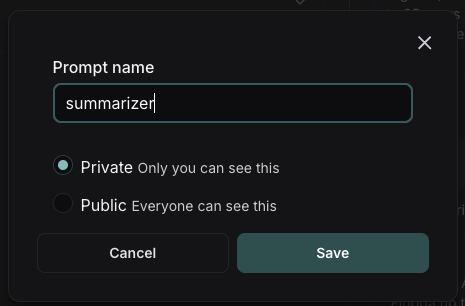

# Create a prompt

Navigate to the **Playground** in the left-hand sidebar or from the application homepage.

## Compose your prompt

On the left is an editable view of the prompt.

The prompt is made up of messages, each of which has a "role" - including `system`, `human`, and `ai`.

### Template format

The default template format is `f-string`, but you can change the prompt template format to `mustache` by clicking on the settings icon next to the model -> prompt format -> template format. Learn more about template formats [here](../concepts#f-string-vs-mustache).

### Structured output

You can add an output schema (which makes your prompt a StructuredPrompt type). Learn more about structured output [here](../concepts#structured-output).

### Tools

You can also add a tool by clicking the `+ Tool` button at the bottom of the prompt editor. See [here](../how_to_guides/use_tools) for more information on how to use tools.

## Add a template variable

The power of prompts comes from the ability to use variables in your prompt. You can use variables to add dynamic content to your prompt.
Add a template variable in one of two ways:

1. Add `{{variable_name}}` to your prompt (with one curly brace on each side for `f-string` and two for `mustache`).
   

2. Highlight text you want to templatize and click the tooltip button that shows up. Enter a name for your variable, and convert.
   

When we add a variable, we see a place to enter sample inputs for our prompt variables. Fill these in with values to test the prompt.

## Run the prompt

Click "Start" to run the prompt.

## Save your prompt

To save your prompt, click the "Save" button, name your prompt, and decide if you want it to be "private" or "public".
Private prompts are only visible to your workspace, while public prompts are discoverable to anyone.

The model and configuration you select in the Playground settings will be saved with the prompt. When you reopen the prompt, the model and configuration will automatically load from the saved version.

:::tip Public Prompts
The first time you create a public prompt, you'll be asked to set a LangChain Hub handle. All your public prompts will be linked to this handle. In a shared workspace, this handle will be set for the whole workspace.
:::

## View your prompts

You've just created your first prompt! View a table of your prompts in the prompts tab.

## Add metadata

To add metadata to your prompt, click the prompt and then click the "Edit" pencil icon next to the name.
This brings you to where you can add additional information about the prompt, including a description, a README, and use cases.
For public prompts this information will be visible to anyone who views your prompt in the LangChain Hub.

# Next steps

Now that you've created a prompt, you can use it in your application code. See [how to pull a prompt programatically](../how_to_guides/manage_prompts_programatically#pull-a-prompt).
