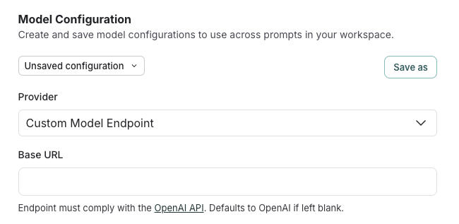
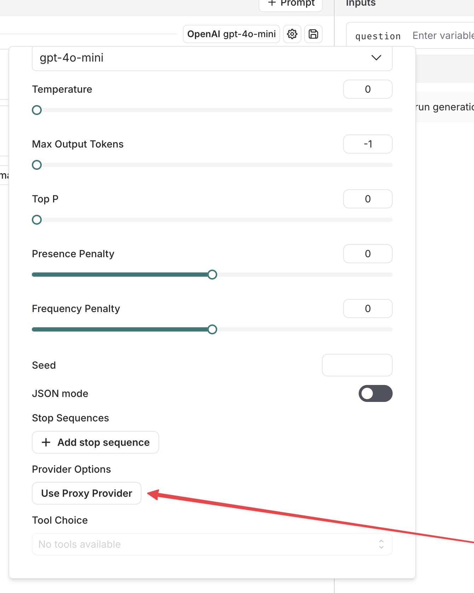

# Run the playground against an OpenAI-compliant model provider/proxy

The LangSmith playground allows you to use any model that is compliant with the OpenAI API. You can utilize your model by setting the Proxy Provider for `OpenAI` in the playground.

## Deploy an OpenAI compliant model

Many providers offer OpenAI compliant models or proxy services. Some examples of this include:

- [LiteLLM Proxy](https://github.com/BerriAI/litellm?tab=readme-ov-file#quick-start-proxy---cli)
- [Ollama](https://ollama.com/)

You can use these providers to deploy your model and get an API endpoint that is compliant with the OpenAI API.

Take a look at the full [specification](https://platform.openai.com/docs/api-reference/chat) for more information.

## Use the model in the LangSmith Playground

Once you have deployed a model server, you can use it in the LangSmith Playground.

### Recommended: Use the `Custom Model Endpoint` provider option

Enter the playground and change the provider to `Custom Model Endpoint`.
Enter in your model endpoint in the `Base URL` field.

Behind the scenes, the playground will use the `ChatOpenAI` from `langchain-openai` and pass in your endpoint as a `base_url`.

### Alternative: Use the `Proxy Provider` option

Note: this is functionally equivalent to the `Custom Model Endpoint` provider option.

Enter the playground and select the `Proxy Provider` inside the `OpenAI` modal.

If everything is set up correctly, you should see the model's response in the playground. You can also use this functionality to invoke downstream pipelines as well.

## Save your model configuration

See how to store your model configuration for later use [here](./managing_model_configurations).
