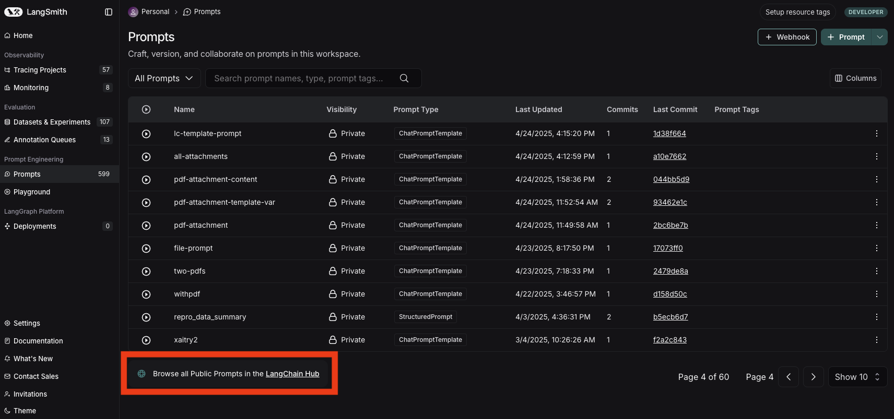

# LangChain Hub

Navigate to the **Prompts** section of the left-hand sidebar and click on the **LangChain Hub** link at the bottom of the page.

Here you'll find all of the publicly listed prompts in the LangChain Hub. Any prompt you mark as **public** will be listed here.

You can search for prompts by name, handle, prompt tags, descriptions, or models. You can fork prompts to your personal organization, view the prompt's details, and run the prompt in the playground.
You can [pull any public prompt into your code](./manage_prompts_programatically.mdx) using the SDK.
