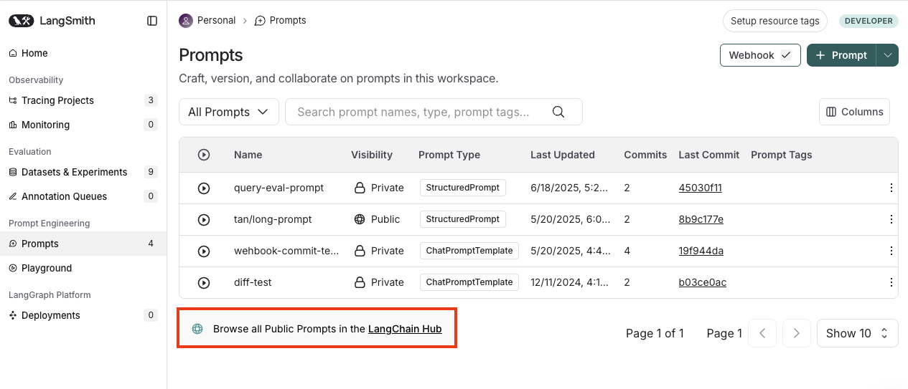
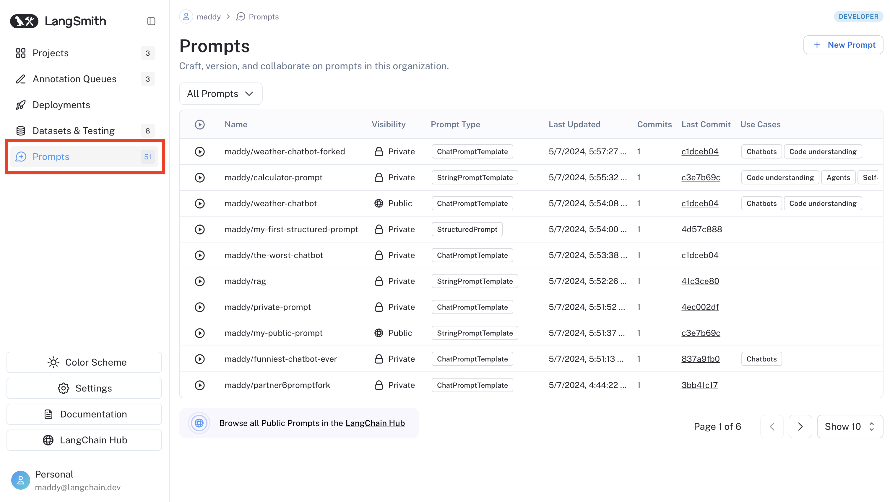

  

    <iframe
      src="https://www.youtube.com/embed/z69cBXTJFZ0"
      title="YouTube video player"
      style={{
        position: "absolute",
        top: 0,
        left: 0,
        width: "100%",
        height: "100%",
        border: 0
      }}
      allow="accelerometer; autoplay; clipboard-write; encrypted-media; gyroscope; picture-in-picture"
      allowFullScreen
    ></iframe>
  

# Public prompt hub

LangSmith's public prompt hub is a collection of prompts that have been created by the LangChain community and can be used for reference.

:::note
Please note that prompts are user-generated and unverified. LangChain does not review or endorse public prompts, use these at your own risk. Use of Prompt Hub is subject to our [Terms of Service](https://www.langchain.com/terms-of-service).
:::

Navigate to the **Prompts** section of the left-hand sidebar and click on **Browse all Public Prompts in the
LangChain Hub**.

{" "}

Here you'll find all of the publicly listed prompts in the LangChain Hub.
You can search for prompts by name, handle, use cases, descriptions, or models. You can fork prompts to your personal organization, view the prompt's details, and run the prompt in the playground.
You can [pull any public prompt into your code](./manage_prompts_programatically.mdx) using the SDK.

To view prompts tied to your workspace, visit the Prompts tab in the sidebar.

