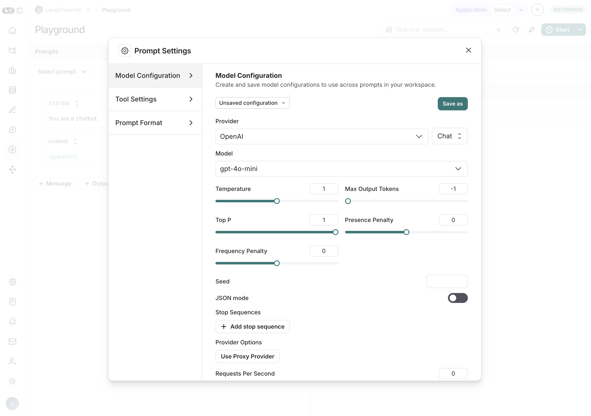
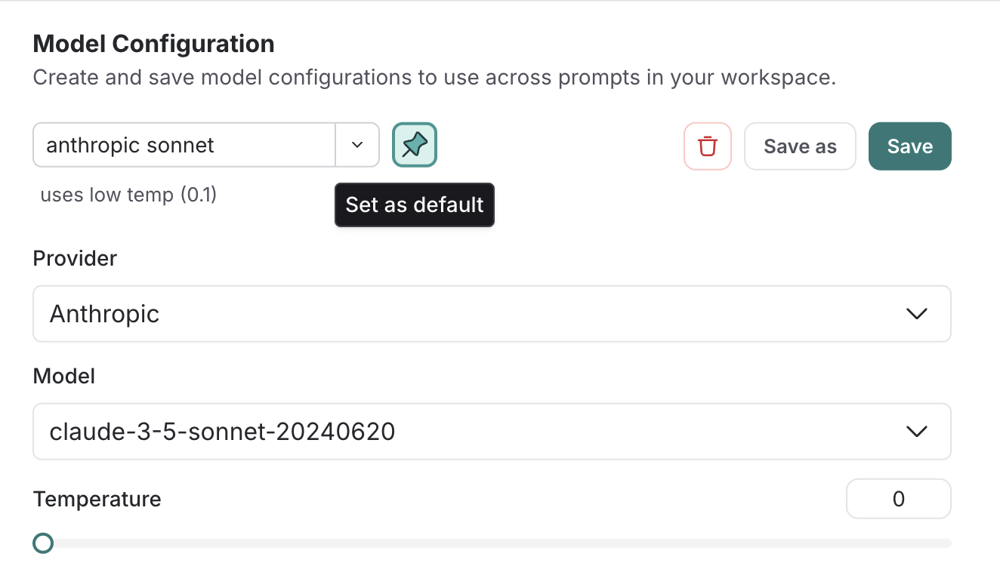

# Managing Prompt Settings

The LangSmith playground enables you to control various settings for your prompt. These include the model configuration, tool settings, and prompt formatting.

## Model Configurations

Model configurations are the set of parameters against which your prompt is run. For example, they include the provider, model, and temperature, among others. The LangSmith playground allows you to save and manage your model configurations, making it easy to reuse preferred settings across multiple prompts and sessions.

### Creating Saved Configurations

1. Adjust the model configuration as desired
2. Click the `Save As` button in the top bar
3. Enter a name and optional description for your configuration and confirm.

import saving_config from "./static/saving_config.mp4";

<video
  controls
  autoPlay
  muted
  style={{ width: "100%", borderRadius: "8px", overflow: "hidden" }}
>
  <source src={saving_config} />
</video>

Your configuration is now saved and ready to be accessed by anyone in your organization's workspace. All saved configurations are available in the `Model configuration` dropdown.

### Default Configurations

Once you have created a saved configuration, you can optionally set it as your default, so any new prompt you create will automatically use this configuration. To set a configuration as your default, click the `Set as default` button next to the dropdown.

### Editing Configurations

- To rename or update the description: Click the configuration name or description and make your changes.

import renamed_config from "./static/renamed_config.mp4";

<video
  controls
  autoPlay
  muted
  style={{ width: "100%", borderRadius: "8px", overflow: "hidden" }}
>
  <source src={renamed_config} />
</video>

- To update the current configuration's parameters: Make any desired to the parameters and click the `Save` button at the top.

### Deleting Configurations

1. Select the configuration you want to remove
2. Click the trash can icon to delete it

## Tool Settings

Tools enable your LLM to perform tasks like searching the web, looking up information, and more. Here you can manage the ways your LLM can utilize and access the tools you have defined in your prompt. Learn more about tools [here](../concepts#tools).

## Prompt Formatting

For information on chat and completion prompts, see [here](../concepts#chat-vs-completion). For information about prompt templating and using variables, see [here](../concepts#f-string-vs-mustache).
