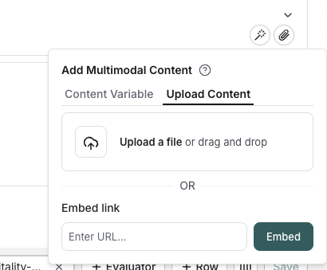
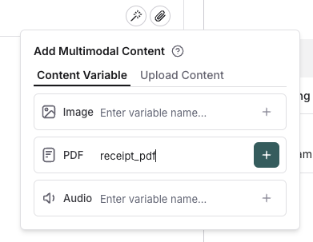
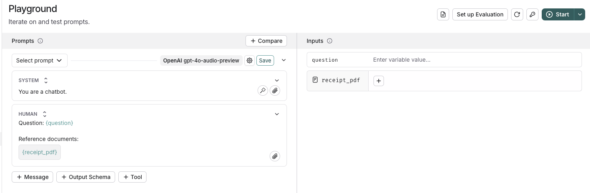

# Include multimodal content in a prompt

Some applications are based around multimodal content, like a chatbot that can answer questions about a PDF or image.
In these cases, you'll want to include multimodal content in your prompt and test the model's ability to answer questions about the content.

The LangSmith Playground supports two methods for incorporating multimodal content in your prompts:

1. Inline content: Embed static files (images, PDFs, audio) directly in your prompt. This is ideal when you want to consistently include the same multimodal content across all uses of the prompt. For example, you might include a reference image that helps ground the model's responses.
2. Template variables: Create dynamic placeholders for attachments that can be populated with different content each time. This approach offers more flexibility, allowing you to:
   - Test how the model handles different inputs
   - Create reusable prompts that work with varying content

:::note
Not all models support multimodal content. Before using multimodal features in the playground, make sure your selected model supports the file types you want to use.
:::

## Inline content

Click the file icon in the message where you want to add multimodal content.
Under the `Upload content` tab, you can upload a file and include it inline in the prompt.

## Template variables

Click the file icon in the message where you want to add multimodal content.
Under the `Template variables` tab, you can create a template variable for a specific attachment type.
Currently, only images, PDFs, and audio files (.wav, .mp3) are supported.

## Populate the template variable

Once you've added a template variable, you can provide content for it using the panel on the right side of the screen. Simply click the `+` button to upload or select content that will be used to populate the template variable.

## Run an evaluation

After testing out your prompt manually, you can [run an evaluation](../../evaluation/how_to_guides/evaluate_with_attachments?mode=ui) to see how the prompt performs over a golden dataset of examples.
