# Using the prompt canvas to improve your prompts

This guide will walk you through how you can use the prompt canvas to quickly and easily iterate on your prompts,
all while ensuring that performance of your appliation is actually improving.

## Initial Experiment

For this how-to we will be using a logic puzzle dataset (which you can access [here](https://smith.langchain.com/public/fdf16166-1edd-418f-b777-3af82034931d)) where each answer is either "Yes" or "No". To get started
To get set up, let's head over to the playground and load up our dataset:

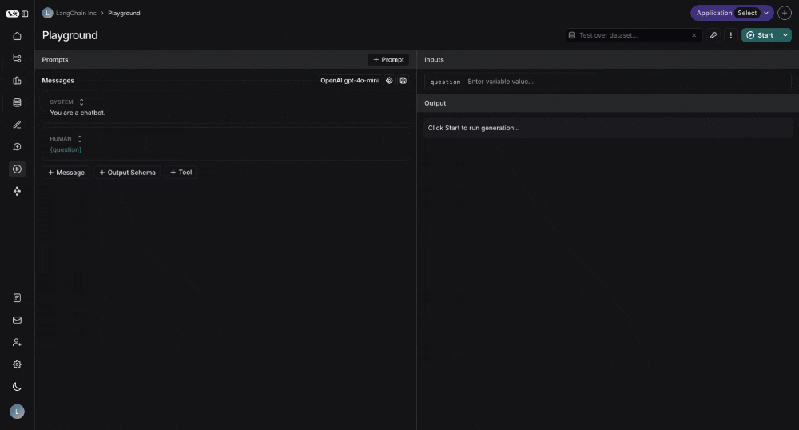

Next let's set an initial prompt that informs the LLM of the context for the question:

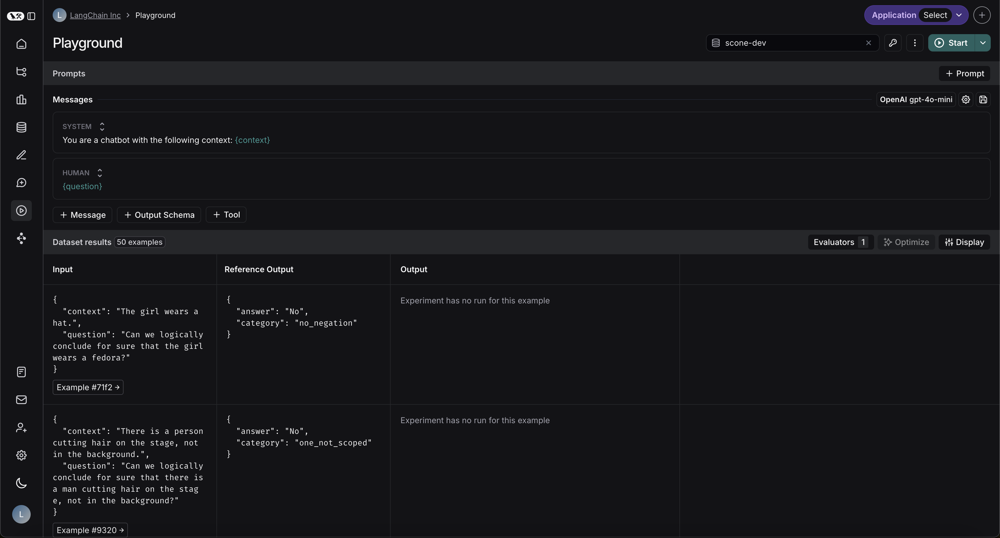

Let's also make sure our model always produces an answer of either "Yes" or "No", by providing it with a structured output.
We can set the structured output by clicking the `+ Output Schema` button underneath the prompt. Your output should look
something like the following screenshot, with the important thing being that there is an "answer" key with the allowed
values of "Yes" and "No"

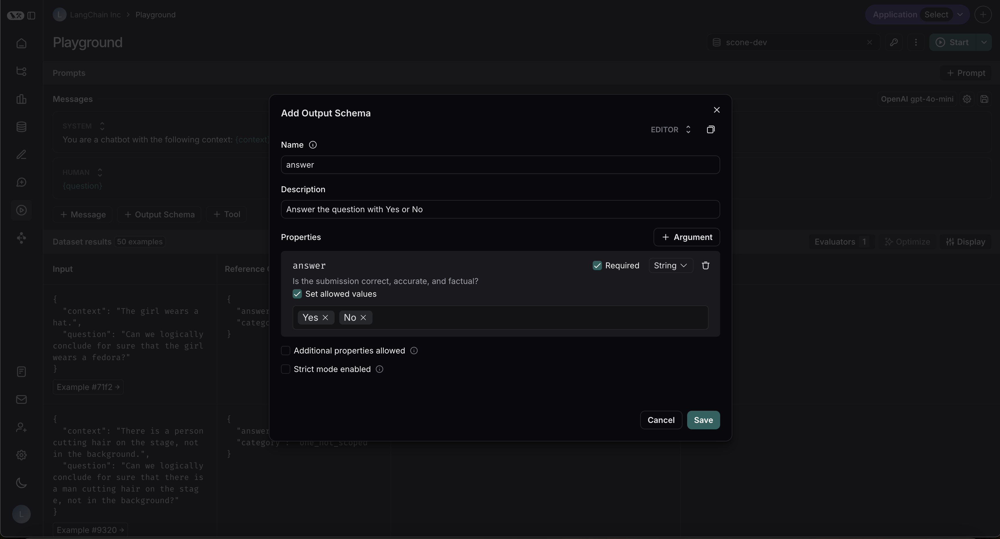

Next, let's set up our custom code evaluator to determine correctness:

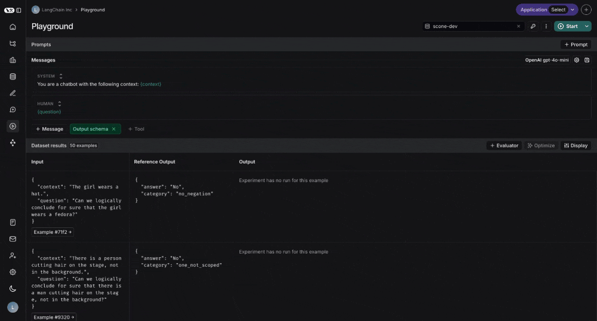

The code for this evaluator is below:

```python
def perform_eval(run, example):
  
  return { "correctness": int(run['outputs']['answer'] == example['outputs']['answer']) }
```

We can then click start and let our experiment run.
Once it is done running we can go to our dataset and head over to the experiments tab to check the performance. 

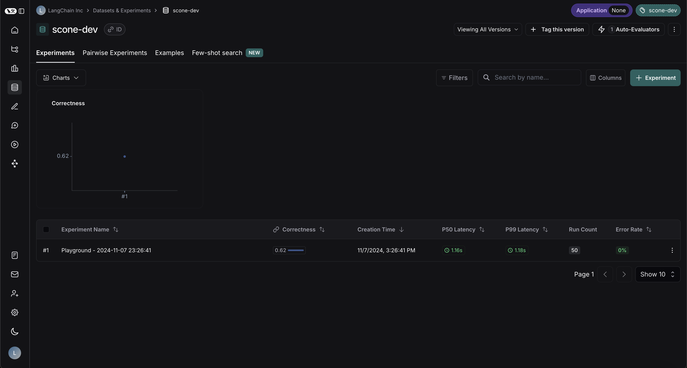

Our correctness was only 62% - a perfect opportunity to improve performance using the prompt canvas. Let's dive into how to do so.

## Using the canvas 

To use the prompt canvas, all you have to do is click the magic wand next to the message you want to optimize.
In our case, that is the system message:

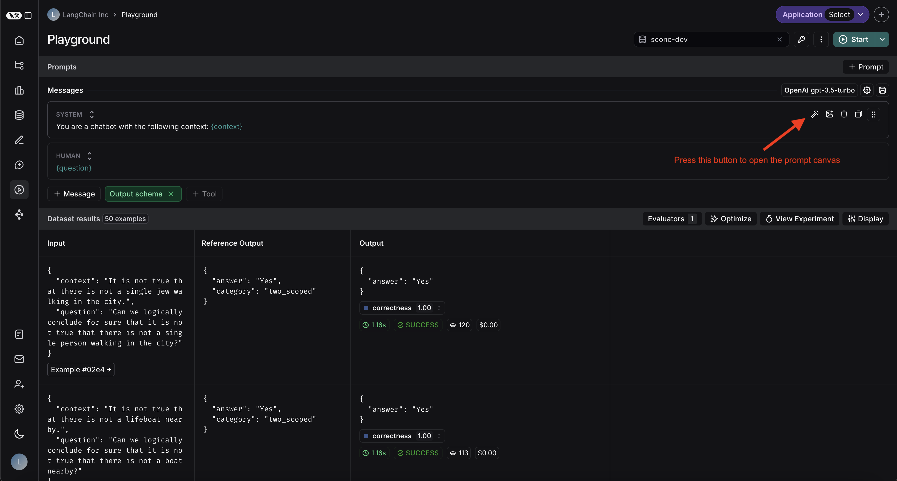

The prompt canvas has a few features which are described in the following screenshot:

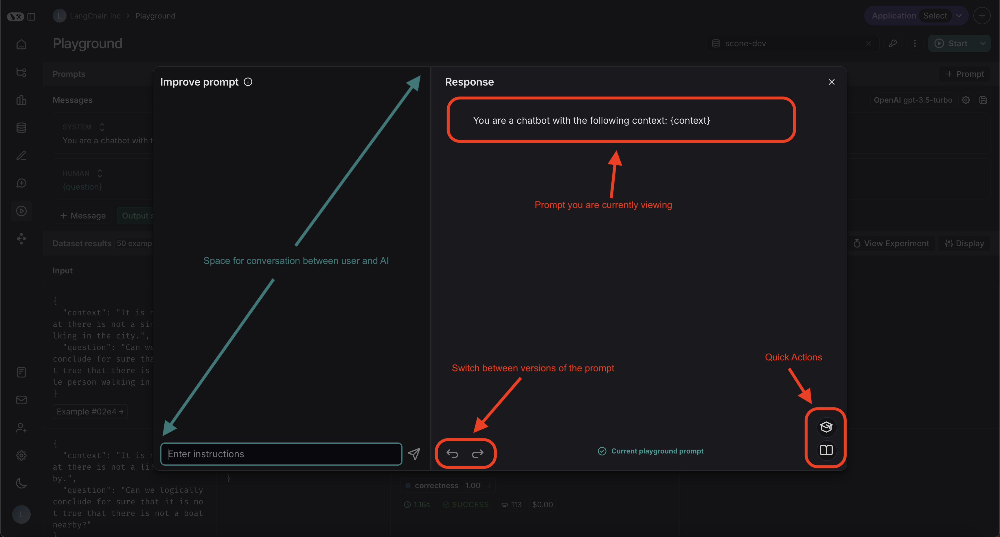

To start off with, we can describe our problem and ask for general tips on how to improve our prompt.
Asking the AI for general advice won't actually edit the prompt, it's only when we actually prompt it to make changes that it makes changes.
As we can see, after asking for general advice, the prompt stays the exact same:

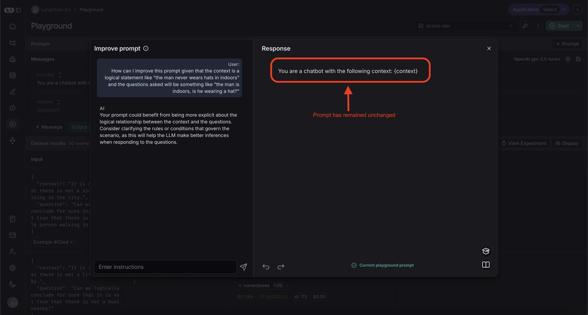

We can then take one of those tips and ask the AI to actually apply it to the prompt:

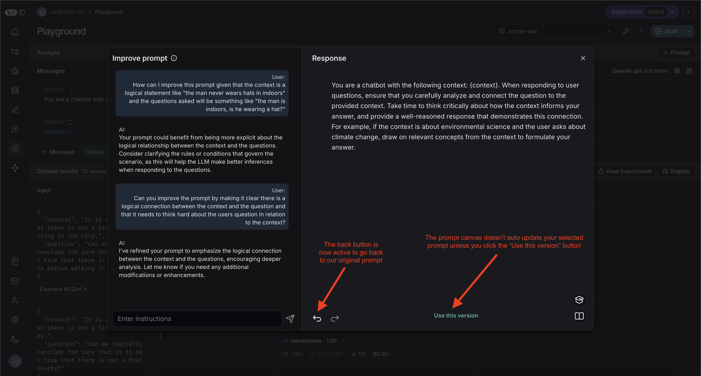

Great, it made the changes we requested. However it's telling the model to "provide a well-reasoned response",
but in our case we just want it to answer "Yes" or "No". Let's highlight that specific part of the prompt and ask it to fix it:

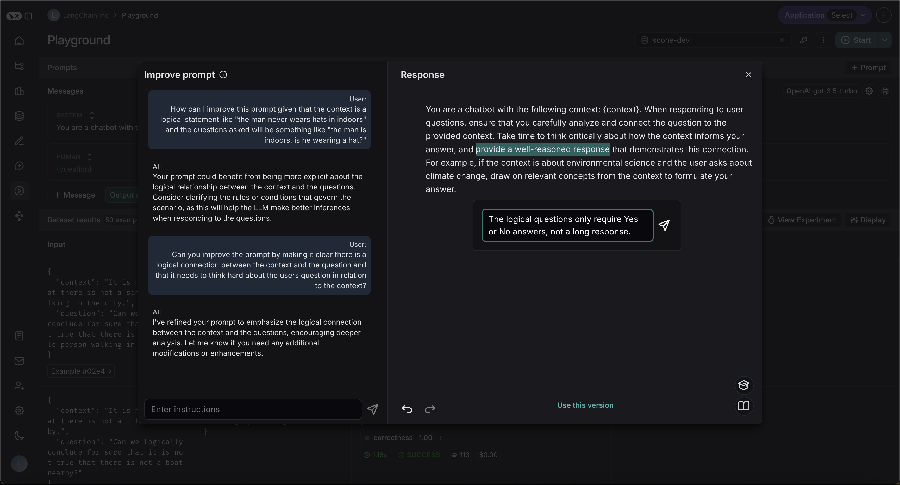

In addition, you can select from a few quick actions to make certain overarching changes to your prompt.
In this example, we will make our prompt slightly shorter:


Although you could spend much more time improving your prompt, for the purposes of this tutorial we are going to stop here.
We'll click the "Use this version" button at the bottom of the canvas which will take us back to our normal playground view:

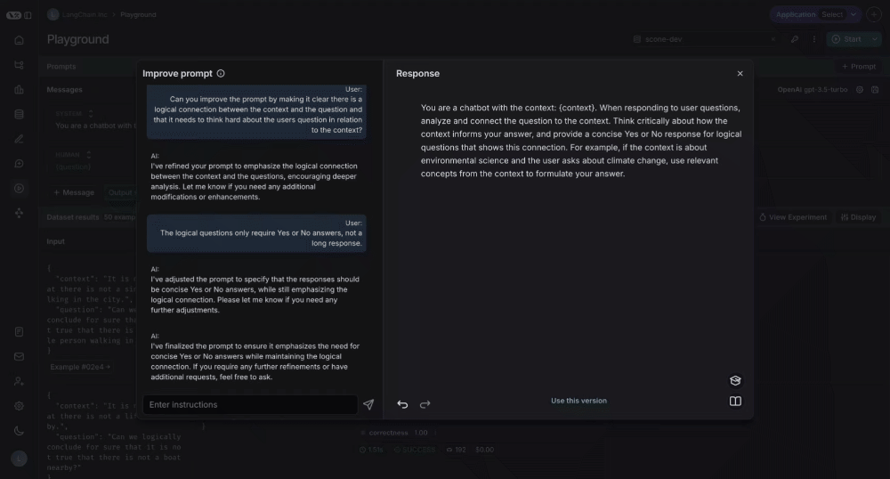

Now, let's click "Start" in the top right again to rerun the experiment. After this is done, let's return to our experiments pane:


Fantastic! The correctness improvde by 12% - a significant improvement.

## Next steps

This tutorial provides a starting point for how to use the prompt canvas to rapidly iterate on and improve your prompts, but is by no means all encompassing.
By interacting more with the canvas, and asking the AI the right questions to improve your prompt you can extract even larger performance gains in your experiments.
