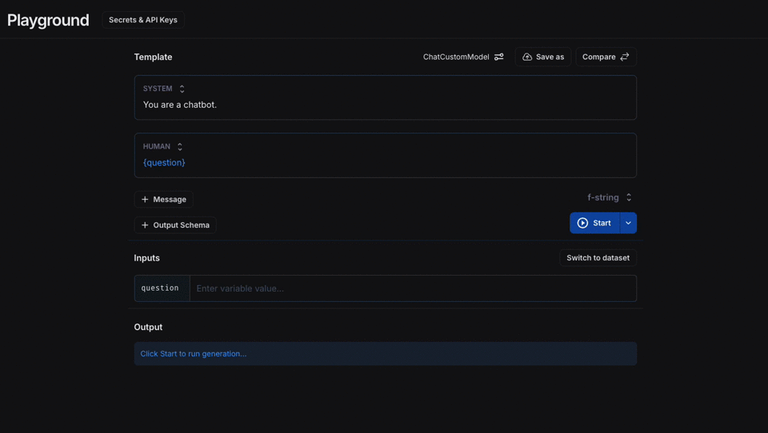

# Save settings configuration

Within the settings of the LangSmith playground, you can save your model configuration for later use.
This helps you quickly apply your frequently-used settings without having to re-enter the details each time.

To save the current playground configuration, click on the `Save` button in the top right corner of settings.
You can name the configuration and easily access it later.

