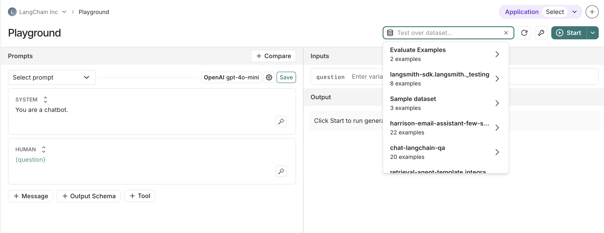
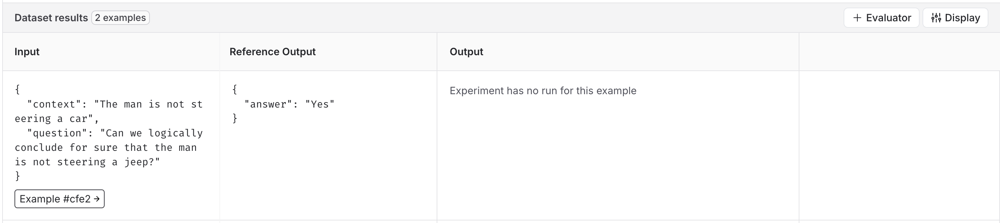
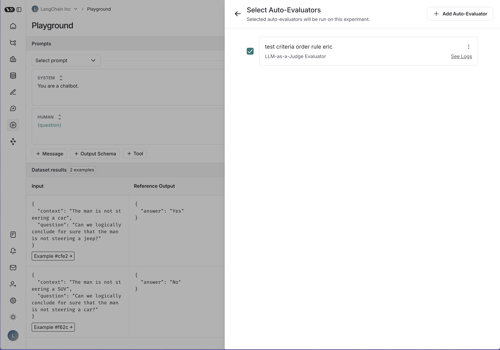

# Testing over a dataset

It's often useful to test your prompts over a dataset to understand how your model will behave in different scenarios. The Playground allows you to easily test your prompts over any of your LangSmith datasets. 

## Running your prompt

1. Select the prompt you want to test. This can either be a saved or unsaved prompt. If you add multiple prompts to the playground, they will all be run over the dataset.
2. In the top right section of the playground, select your dataset from the dropdown.

3. This will load a table with a subset of the examples in the dataset. From here, you can click on "+ Evaluator" to configure evaluators for your experiment.

4. This will open a pane where you can select the evaluators you want to use in this experiment. You can add multiple evaluators to your experiment or remove them by toggling the checkbox.

5. Once you have selected your evaluators, click on the "Start" button in the playground to run your experiment.  While all of the examples in the dataset will be run in your experiment, in the playground we only show a subset of the examples. To view the full experiment results, you can click on the "View experiment" button in the results table.