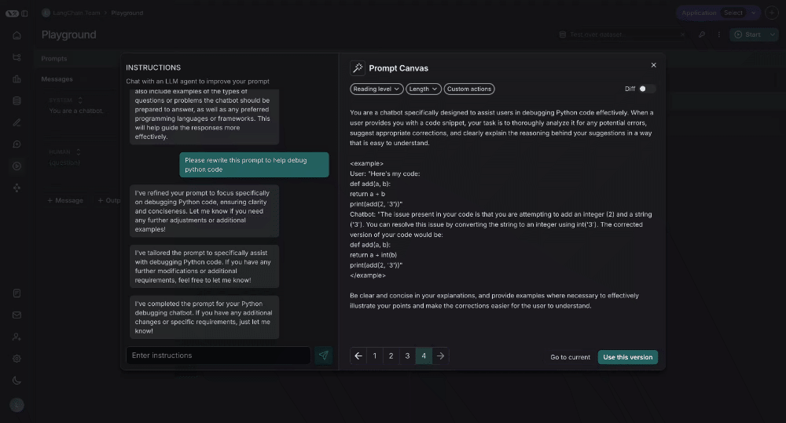

# Prompt Canvas

The prompt canvas makes it easy to edit a prompt with the help of an LLM. This allows you to iterate
faster on long prompts and also makes it easier to make overarching stylisting or tonal changes to your prompt.
You can enter the promp canvas by clicking the glowing wand over any message in your prompt:

## Chat sidebar

You can use the chat sidebar to ask questions about your prompt, or to give instructions in natural language to the LLM for how to rewrite your prompt.

:::note Write Directly
You can also edit the prompt directly - you don't **need** to use the LLM. This is useful if you know what edits you want to make and just want to make them directly
:::

## Quick actions

There are quick actions to change the reading level or length of the prompt with a single mouse click:

## Custom quick actions

You can also save your own custom quick actions, for ease of use across all the prompts you are working on in LangSmith:

## Diffing

You can also see the specific differences between each version of your prompt by selecting the diff slider in the top right of the canvas:

## Saving and using prompts

Lastly, you can save the prompt you have created in the canvas by clicking the "Use this Version" button in the bottom right:

