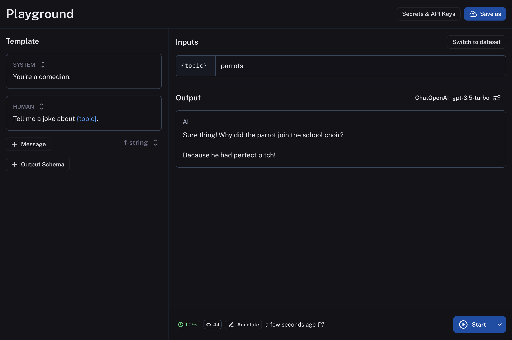
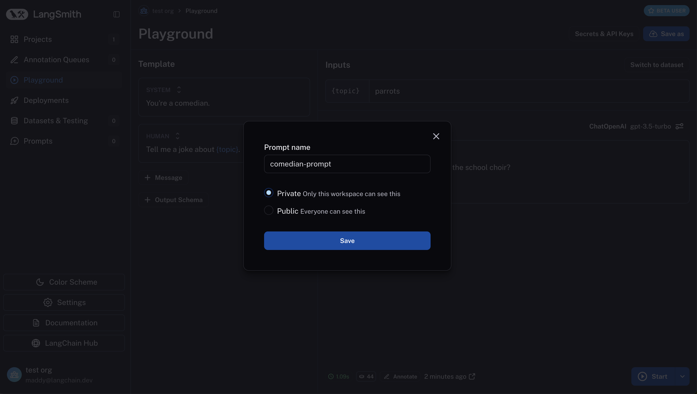
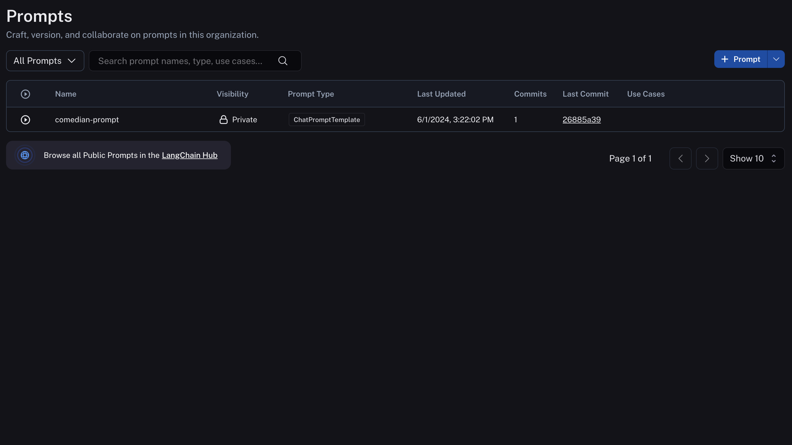

# Create a prompt

Navigate to the **Prompts** section in the left-hand sidebar or from the application homepage.
Click the "+ Prompt" button to enter the Playground. The dropdown next to the button gives you a choice between a chat style prompt and an instructional prompt - chat is the default.

## Compose your prompt

After choosing a prompt type, you're brought to the playground to develop your prompt.
On the left is an editable view of the prompt. You can add more messages, change the template format (f-string or mustache), and add an output schema (which makes your prompt a StructuredPrompt type).

To the right, we can enter sample inputs for our prompt variables and then run our prompt against a model.

(If you haven't yet, you'll need to enter an API key for whichever model you want to run your prompt with.)

To see the response from the model, click "Start".

## Save your prompt

To save your prompt, click the "Save as" button, name your prompt, and decide if you want it to be "private" or "public".
Private prompts are only visible to your workspace, while public prompts are discoverable to anyone in the LangChain Hub.
Click save to create your prompt.

The model and configuration you select in the Playground settings will be saved with the prompt. When you reopen the prompt, the model and configuration will automatically load from the saved version.

:::tip Public Prompts
The first time you create a public prompt, you'll be asked to set a LangChain Hub handle. All your public prompts will be linked to this handle. In a shared workspace, this handle will be set for the whole workspace.
:::

## View your prompts

You've just created your first prompt! View a table of your prompts in the prompts tab.

## Add metadata

To add metadata to your prompt, click the prompt and then click the "Edit" pencil icon next to the name.
This brings you to where you can add additional information about the prompt, including a description, a README, and use cases.
For public prompts this information will be visible to anyone who views your prompt in the LangChain Hub.

